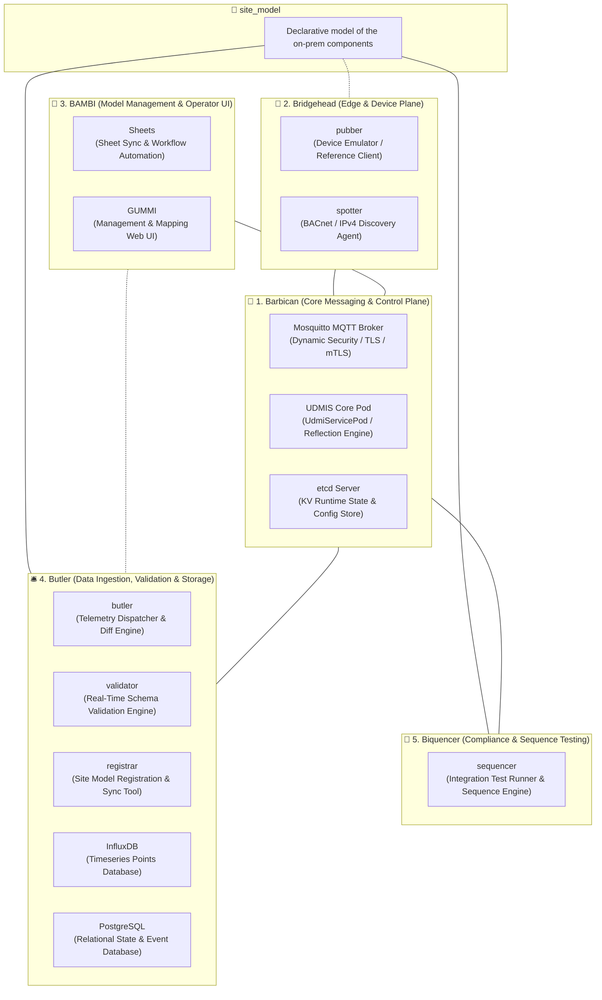

# UDMI System Architecture

This document provides a high-level architectural overview of the UDMI (Universal Device Management Interface) ecosystem, detailing the core components, their responsibilities, sub-components, and runtime interactions.

---

## High-Level Architecture Diagram

```text
┌──────────────────────────────────────────────────────────────────────────────────────────────────┐
│                                            site_model                                            │
│                           Declarative model of the on-prem components                            │
└──────────────────────────────────────────────────────────────────────────────────────────────────┘
  │                                               ┆                                              │
  │                                               ┆                                              │
  │                                               ┆                                              │
  │   ┌───────────────────────┐       ┌───────────────────────┐       ┌───────────────────────┐  │
  │   │       Barbican        │───────│      Bridgehead       │       │         BAMBI         │  │
  │   │                       │       │                       │       │                       │  │
  │   │  • Mosquitto          │       │  • pubber             │       │  • Sheets             │  │
  │   │  • UDMIS              │       │  • spotter            │       │  • GUMMI              │  │
  │   │  • etcd               │       └───────────────────────┘       └───────────────────────┘  │
  │   └───────────────────────┘                                                   │       ┆      │
  │         │           │   │                                                     │       ┆      │
  │         │           │   └─────────────────────────────────────────────────┐   │       ┆      │
  │         │           └─────────────────────────────────────────────────┐   │   │       ┆      │
  │         │                                                             │   │   │       ┆      │
  │         │                                                             │   └───┼───────┘      │
  │         │                                                             │       │              │
  │   ┌─────┴─────────────────────────────────────────┐             ┌─────┴─────────────────┐    │
  └───│                    Butler                     │┄┄┄┄┄┄┄┄┄┄┄┄┄│       Biquencer       │────┘
      │                                               │             │                       │
      │  • butler      • validator     • registrar    │             │  • sequencer          │
      │  • InfluxDB    • PostgreSQL                   │             │                       │
      └───────────────────────────────────────────────┘             └───────────────────────┘
```



---

## Core Components

*   **Barbican**: The central messaging and control plane for the system, handling message routing, security enforcement, and configuration distribution.
    *   **UDMIS**: Core backend service that processes incoming device messages, handles system queries and handshakes, and routes resolved device configurations.
    *   **Mosquitto**: MQTT message broker providing authenticated and encrypted communication across device and service channels.
    *   **etcd**: Key-value store used by UDMIS for runtime configuration and service coordination.
*   **Bridgehead**: Edge-facing device emulation and on-premise network discovery plane.
    *   **pubber**: Reference client-side IoT device implementation simulating telemetry, state, and configuration handling.
    *   **spotter**: On-premise network discovery agent that scans fieldbuses (BACnet, IPv4) and reports raw discovery observations.
*   **BAMBI**: Site model management, workflow automation, and operator interfaces.
    *   **Sheets**: Backend service automating site model synchronization, spreadsheet ingestion, and change proposals.
    *   **GUMMI**: Web management interface and API server for visual device onboarding, topology inspection, and mapping reconciliation.
*   **Butler**: Data ingestion, schema validation, and storage engine.
    *   **butler**: Ingestion service and CLI mapper routing telemetry streams and merging discovery diffs into site models.
    *   **validator**: Real-time schema validation engine checking telemetry, state, and config messages against UDMI schemas.
    *   **registrar**: Utility for synchronizing site model configurations and registering devices.
    *   **InfluxDB**: Timeseries database storing sensor telemetry point values.
    *   **PostgreSQL**: Relational database storing structured device state tables, message logs, and discovery events.
*   **Biquencer**: Compliance verification and test orchestration engine.
    *   **sequencer**: Automated integration test harness executing DUT sequence validation and trace assertions.
*   **site_model**: Declarative model of the on-prem components.
