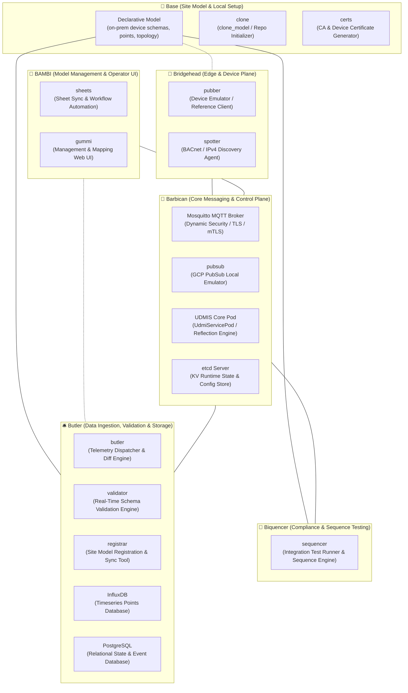

[**UDMI**](./) / [Architecture](#)

# UDMI System Architecture

This document provides a high-level architectural overview of the UDMI (Universal Device Management Interface) ecosystem, detailing the core components, their responsibilities, sub-components, and runtime interactions.

---

## High-Level Architecture Diagram



---

## Core Components & Sub-Services

The UDMI ecosystem is structured around the following core subsystems, ordered by their local development startup sequence:

*   **0. MCP Server** (Tool: `bin/tmux_mcp`, Session: `udmi_mcp`): Test infrastructure orchestration and AI agent tool gateway.
    *   **`server`** *(Default: Enabled)*: JSON-RPC 2.0 / CLI test setup supervisor managing isolated port allocations, test environments, and log capture (`bin/test_setup`).
*   **1. Base** (Tool: `bin/tmux_base`, Session: `udmi_base`): Declarative site model, repository initialization, and cryptographic baseline.
    *   **`clone`** *(Optional / Setup)*: Clones and initializes site model repositories from templates or version control (`clone_model`).
    *   **`certs`** *(Default: Enabled)*: Generates root CA and device certificate pairs (`ca.crt`, `rsa_private.crt`) on disk from site model definitions.
*   **2. Barbican** (Tool: `bin/tmux_barbican`, Session: `udmi_barbican`): The central messaging and control plane for the system, handling message routing, security enforcement, and configuration distribution.
    *   **`etcd`** *(Default: Enabled)*: Key-value store for runtime service coordination (port `2379`).
    *   **`mosquitto`** *(Default: Enabled)*: MQTT message broker providing authenticated and encrypted communication across device and service channels with dynamic security ACLs (port `8883`).
    *   **`pubsub`** *(Optional: `++pubsub`)*: Local GCP Pub/Sub emulator for cloud messaging integration tests.
    *   **`udmis`** *(Default: Enabled)*: Java `UdmiServicePod` reflection core that processes incoming device messages, handles system queries, and routes resolved device configurations.
*   **3. Butler** (Tool: `bin/tmux_butler`, Session: `udmi_butler`): Data persistence, stream ingestion services, and schema validation engine.
    *   **`postgres`** *(Default: Enabled)*: PostgreSQL relational database storing structured device state tables, message logs, and discovery events (port `5432`).
    *   **`influxdb`** *(Default: Enabled)*: InfluxDB timeseries database storing sensor telemetry point values (port `8086`).
    *   **`butler`** *(Default: Enabled)*: Python ingestion daemon and CLI mapper routing telemetry streams and merging discovery diffs into site models.
    *   **`validator`** *(Optional: `++validator`)*: Real-time schema validation engine checking on-the-wire telemetry, state, and config messages against UDMI schemas.
    *   **`registrar`** *(Optional: `++registrar`)*: Utility for synchronizing site model configurations and registering devices and gateway bindings into the broker.
*   **4. Bridgehead** (Tool: `bin/tmux_bridgehead`, Session: `udmi_bridgehead`): Edge-facing device emulation and on-premise network discovery plane.
    *   **`pubber`** *(Default: Enabled, disable with `!pubber`)*: Reference client-side IoT device implementation simulating telemetry, state, and configuration handling as a Device Under Test (DUT).
    *   **`spotter`** *(Optional: `++spotter`)*: On-premise network discovery agent scanning BACnet and IPv4 fieldbuses and reporting raw discovery observations.
*   **5. BAMBI**: Site model management, workflow automation, and operator interfaces.
    *   **`sheets`**: Backend service automating site model synchronization, spreadsheet ingestion, and change proposals.
    *   **`gummi`**: Web management interface and API server for visual device onboarding, topology inspection, and mapping reconciliation.
*   **6. Biquencer**: Compliance verification and test orchestration engine.
    *   **`sequencer`**: Automated integration test harness executing DUT sequence validation and trace assertions.

---

## Local Development Startup & Service Control

When bringing up a local development or CI environment via `bin/udmi start` or the modular `bin/tmux_*` tools, services initialize across the sequential phases corresponding directly to the subsystem tools:

```text
Phase 0: bin/tmux_mcp        ──►  MCP Server: Test setup orchestrator & agent tool gateway
Phase 1: bin/tmux_base       ──►  Base:       Prepares repository clone, certificates, and keys on disk
Phase 2: bin/tmux_barbican   ──►  Barbican:   Brings up messaging, KV store, and reflection core
Phase 3: bin/tmux_butler     ──►  Butler:     Brings up databases, telemetry ingestion, and optional registration
Phase 4: bin/tmux_bridgehead ──►  Bridgehead: Brings up edge device emulation / discovery
```

### Service Filter Modifiers

*   **`+<service>`**: Run **only** this service (e.g. `bin/tmux_barbican start +mosquitto`).
*   **`!<service>`**: Exclude this service from startup (e.g. `bin/udmi start !influxdb !postgres`).
*   **`++<service>`**: Include an otherwise **optional** service (e.g. `bin/udmi start ++validator`, `bin/udmi start ++pubsub`, `bin/tmux_butler start ++registrar`, `bin/tmux_bridgehead start ++spotter`).


