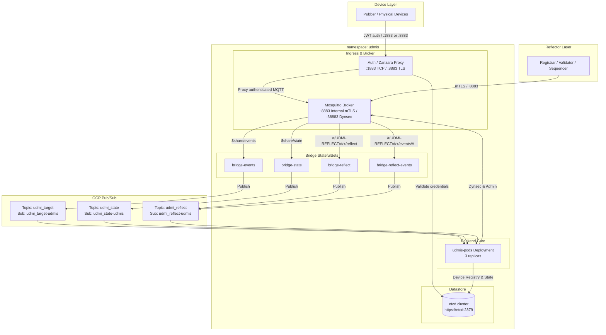

[**UDMI**](./) / [Dev Deployment](#)

# UDMI Dev Deployment Architecture & Verification Guide

This document details the architecture, component topology, authentication mechanisms, build/deployment workflows, verification procedures, and configuration migration steps required for development and production deployments (e.g., `bos-platform-dev` and `bos-platform-prod`).

---

## 1. System Architecture

The `bos-platform-dev` environment in Google Cloud Platform runs on Google Kubernetes Engine (GKE) under the `udmis` namespace. It replicates the Mosquitto-based architecture used in `bos-platform-prod`.



---

## 2. Component Topology & Ports

| Component | Workload Type | Ports / Protocol | Role & Function |
| :--- | :--- | :--- | :--- |
| **Mosquitto** | `StatefulSet/mosquitto` | `8883` (mTLS)<br/>`38883` (Dynsec TCP) | Core MQTT broker. Port 8883 handles internal backend components with client certificate authentication (`require_certificate true`). Port 38883 provides basic auth dynamic security. |
| **Auth (Zanzara)** | `Deployment/auth` | `1883` (TCP)<br/>`8883` (TLS) | Device ingress reverse proxy. Intercepts `CONNECT` requests, authenticates device credentials against `etcd`, and proxies traffic to Mosquitto port 8883 using internal mTLS certs. |
| **etcd** | `StatefulSet/etcd` | `2379`, `2380` (mTLS) | Distributed keystore for device registry configuration, device metadata, key bindings, and state persistence. |
| **Bridge** | `StatefulSet/bridge-*` | Outbound MQTT + Pub/Sub | Bridges MQTT topics (`$share/events`, `$share/state`, `/r/UDMI-REFLECT/...`) to GCP Pub/Sub topics (`udmi_target`, `udmi_state`, `udmi_reflect`). |
| **UDMIS Pods** | `Deployment/udmis-pods` | Pub/Sub Consumers | Main UDMI processing service. Ingests messages from Pub/Sub subscriptions, performs validation, manages device configuration/state, and emits reflector updates. |

---

## 3. Authentication & Credential Models

1. **Reflector Tools (`registrar`, `validator`, `sequencer`)**:
   - Connect directly to Mosquitto on port `8883` via mTLS.
   - Requires client certificate (`rsa_private.crt`), private key (`rsa_private.pem` / `rsa_private.pkcs8`), and Root CA certificate (`ca.crt`) signed by the cluster root authority (available in secret `udmis-tls`).
   - Uses the reflector device registry format: `/r/UDMI-REFLECT/d/<SITE_NAME>/reflect`.

2. **Edge Devices (`pubber`, physical hardware)**:
   - Connect via the `auth` (Zanzara) proxy on port `1883` (TCP) or `8883` (TLS).
   - Use IoT Core client identifier format: `projects/<PROJECT_ID>/locations/<REGION>/registries/<REGISTRY_ID>/devices/<DEVICE_ID>`.
   - Authenticate with RS256/ES256 JSON Web Tokens (JWT) signed by the device private key (`rsa_private.pkcs8` / `ec_private.pkcs8`).

---

## 4. Build and Deployment Workflow

### 4.1. Building JARs and Docker Images

```bash
# 1. Build udmis fat jar
udmis/bin/build

# 2. Build and tag udmis container image
docker build -t us-central1-docker.pkg.dev/bos-platform-artifacts/udmi/udmis:zanzarafix \
             -f udmis/Dockerfile.udmis udmis

# 3. Build and tag bridge2 container image
docker build -t us-central1-docker.pkg.dev/bos-platform-artifacts/udmi/bridge2:zanzarafix \
             -f - . <<EOF
FROM gcr.io/distroless/java21-debian12
WORKDIR /app
COPY udmis/build/libs/udmis-1.0-SNAPSHOT-all.jar /app/bridge.jar
ENTRYPOINT ["java", "-cp", "/app/bridge.jar", "com.google.bos.udmi.service.bridge.MqttToPubSubBridge"]
