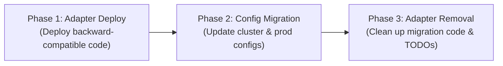

[**UDMI**](./) / [Zanzara Migration](#)

# Zanzara Roll-Out & Migration Plan

This document describes the phased rollout and migration strategy for transitioning UDMI deployments (e.g., `bos-platform-dev` and `bos-platform-prod`) from legacy IoT access providers (`implicit` / `clearblade`) to the `zanzara` authentication reverse proxy and access provider architecture.

---

## Background & Architecture Context

In the legacy architecture, device connections and IoT access configurations relied on direct provider implementations (such as `clearblade` or the early `implicit` broker provider). The updated architecture introduces **Zanzara** as an ingress authentication proxy in front of Mosquitto, using `etcd` for credential validation and device registry metadata.

For detailed component topology and network flows, see [UDMI Dev Deployment Guide](docs/cloud/gcp/dev_deployment.md).

---

## 3-Phase Rollout Plan

To ensure zero downtime and avoid breaking existing running clusters whose configurations still reference legacy provider keys, the rollout follows a three-stage migration:



### Phase 1: Deploy with Backward-Compatible Adapters (Non-Breaking)

* **Objective**: Deploy updated UDMIS container images containing the `zanzara` provider without breaking existing environments that still pass legacy configuration files.
* **Mechanism**: An in-memory migration adapter, `adaptImplicitToZanzara(PodConfiguration config)`, is integrated into [`UdmiServicePod.java`](udmis/src/main/java/com/google/bos/udmi/service/pod/UdmiServicePod.java):
  * Checks if `config.iot_access` contains the legacy key `"implicit"`.
  * Transparently adapts the configuration:
    1. Removes `"implicit"` and maps or merges it into `"zanzara"`.
    2. Updates dynamic routing strings under `iot-access` (e.g., replacing `"implicit"` with `"zanzara"` in `dynamic.project_id`).
  * Emits an explicit, non-fatal warning to standard error:
    ```
    WARNING: Temporary migration employed - adapting legacy 'implicit' iot_access configuration to 'zanzara'
    ```
* **Status**: Implemented in UDMIS core. Existing deployments can upgrade container images immediately.

### Phase 2: Migrate Production & Cluster Configurations

* **Objective**: Update production, development, and local pod configuration files to explicitly declare the `zanzara` provider format.
* **Tasks**:
  1. **Update Pod Configurations**: Update [`udmis/etc/prod_pod.json`](udmis/etc/prod_pod.json) and corresponding Kubernetes ConfigMaps:
     ```json
     "iot_access": {
       "iot-access": {
         "provider": "dynamic",
         "project_id": "zanzara, pubsub"
       },
       "zanzara": {
         "provider": "zanzara",
         "profile_sec": 10
       },
       "pubsub": { ... }
     }
     ```
  2. **Update Deployment Manifests**: Ensure cluster deployment specs and helm/k8s configurations specify `zanzara` as the active provider.
  3. **Verification**: Deploy and verify that UDMIS pods start up and process messages without emitting the Phase 1 adaptation warning.

### Phase 3: Remove Adapters & Deprecate Legacy Code

* **Objective**: Remove technical debt and migration shims once all clusters and configurations are migrated.
* **Tasks**:
  1. Remove `adaptImplicitToZanzara(PodConfiguration config)` and its invocation from [`UdmiServicePod.java`](udmis/src/main/java/com/google/bos/udmi/service/pod/UdmiServicePod.java).
  2. Resolve the in-code `TODO`:
     ```java
     // TODO: Temporary migration adapter to map legacy 'implicit' provider configuration to 'zanzara'.
     // This should be removed after fully migrating all cluster configs and deployments to zanzara.
     ```
  3. Clean up any remaining legacy test cases or references to the deprecated `implicit` provider identifier.

---

## Related Files & References

* **Adapter Implementation**: [`udmis/src/main/java/com/google/bos/udmi/service/pod/UdmiServicePod.java`](udmis/src/main/java/com/google/bos/udmi/service/pod/UdmiServicePod.java)
* **Production Pod Configuration**: [`udmis/etc/prod_pod.json`](udmis/etc/prod_pod.json)
* **Zanzara Provider**: [`udmis/src/main/java/com/google/bos/udmi/service/access/ZanzaraIotAccessProvider.java`](udmis/src/main/java/com/google/bos/udmi/service/access/ZanzaraIotAccessProvider.java)
* **Deployment Guide**: [`docs/cloud/gcp/dev_deployment.md`](docs/cloud/gcp/dev_deployment.md)
