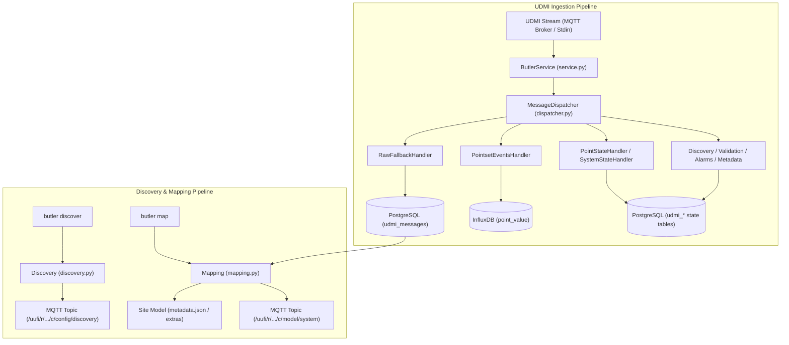

# Butler (UDMI Mapping & Data Ingestion Service)

**Butler** is a unified Python service and CLI tool in the UDMI support ecosystem. It provides two major functions:
1. **Device Discovery & Mapping**: Dispatches discovery scans across BACnet, IPv4, and Vendor networks, correlates discovered device addresses with site models, and publishes model diff updates.
2. **Database Ingestion Service**: Subscribes to UDMI telemetry and state streams (over MQTT / PubSub or stdin JSON streams) and persists structured records into PostgreSQL and InfluxDB.

---

## Architecture Overview



---

## Directory Structure

```
butler/
├── bin/
│   └── butler              # CLI executable wrapper
├── src/
│   ├── connection.py       # MQTT connection & token generation
│   ├── discovery.py        # Discovery config generator & publisher
│   ├── mapping.py          # Discovery event parser & model diff merger
│   ├── service.py          # Butler ingestion service
│   ├── dispatcher.py       # Message router & handler registry
│   └── handlers/           # Specialized database payload handlers
│       ├── base.py
│       ├── pointset_events.py
│       ├── point_state.py
│       ├── system_state.py
│       ├── discovery.py
│       ├── validation.py
│       ├── alarms.py
│       ├── metadata.py
│       └── raw_fallback.py
├── tests/                  # Unit and integration test suites
│   ├── test_dispatcher.py
│   └── test_handlers.py
├── SCHEMAS.md              # Database schemas (PostgreSQL & InfluxDB)
└── README.md
```

---

## CLI Usage

### 1. Ingestion Service (Daemon & Stdin)

Run as standalone ingestion daemon connecting to MQTT:
```bash
bin/butler sites/udmi_site_model //mqtt/localhost:46432
```

Start/stop as background daemon via `bin/start_butler`:
```bash
bin/start_butler sites/udmi_site_model //mqtt/localhost:46432
bin/start_butler stop
```

Stream messages from stdin:
```bash
cat messages.jsonl | bin/butler --stdin
bin/pull_files tests/traces/simple | bin/butler --stdin --always-save-raw
```

### 2. Discovery & Mapping

Trigger device discovery for a gateway:
```bash
bin/mapper sites/udmi_site_model //mqtt/localhost:46432 GAT-1 discover bacnet
```

Execute mapping reconciliation against database discovery events:
```bash
bin/mapper sites/udmi_site_model //mqtt/localhost:46432 GAT-1 map
```

---

## Testing

Run unit and integration tests:
```bash
bin/test_butler
```
