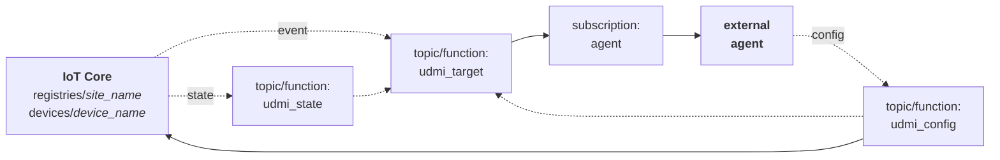

[**UDMI**](../../../) / [**Docs**](../../) / [**Cloud**](../) / [**GCP**](./) / [Functions](#)

# Cloud Functions

## Deploy

Run `udmis/deploy_udmis_gcloud ${project_id}`

## Basic Architecture

The basic UDMI function architecture allows for data flow through the system and integration
with cloud-based agents.

External Components
* **Agent**: External (to UDMI core) agent that processes messages and updates config. Could be
  something like a ML Agent for setpoint optimization, or a Discovery Mapping agent. Each agent will
  typically have its own dedicated PubSub subscription.
* **IoT Core**: Primary connection point for external (on-site) devices. Represents an authentication
  point and (nominally) MQTT connect endpoint. Devices particular to a given site are grouped
  a dedicated _site registry_.

Cloud Topics/Functions
* _udmi\_target_: Core tap point for all transactions.
* _udmi\_state_: Simple shunt for adding attributes to state messages.
* _udmi\_config_: Configuration update handling.

(solid lines are direct API calls, dashed lines are PubSub messages)

## Reflector Architecture

The UDMI reflector setup is designed to allow an external (to the GCP project) _utility_ to interact
with the system through a channel authenticated as an IoT Device. This is functionally equivalent
to an _agent_ connected over PubSub, but has a different authentication/connection paradigm. Specifically,
a PubSub connection will rely on a GCP-based IAM auth to provide access to PubSub resources,
while a _reflector_ connection relies on a device-specific credential and connects over MQTT.

Utilities connect to the `UDMS-REFLECT` IoT Core registry, backed by the _udmi__reflect_ topic/function.
The 'device' within the `UDMS-REFLECT` registry is actually the _site\_name_ of the site (so not
an actual device), corresponding to the IoT Core _registry_ containing the actual device connections.
