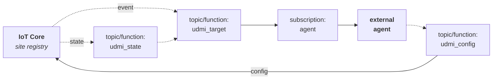
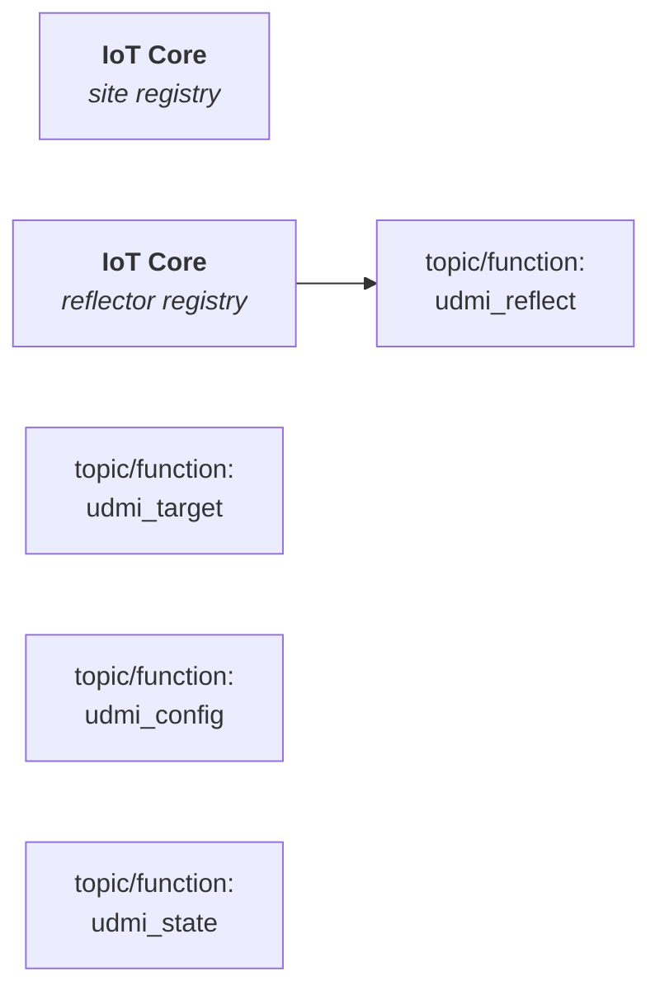

[**UDMI**](../../../) / [**Docs**](../../) / [**Cloud**](../) / [**GCP**](./) / [Functions](#)

# Cloud Functions

## Deploy

Run `dashboard/deploy_dashboard_gcloud`

## Basic Architecture

The basic UDMI function architecture allows for data flow through the system and integration
with cloud-based agents.

External Components
* **Agent**: External (to UDMI core) agent that processes messages and updates config. Could be
  something like a ML Agent for setpoint optimization, or a Discovery Mapping agent. Each agent will
  typically have its own dedicated PubSub subscription.
* **IoT Core**: Primary connection point for external (on-site) devices. Represents an authentication
  point and (nominally) MQTT connect endpoint. Devices particular to a given site are grouped
  a dedicated _site registry_.

Cloud Topics/Functions
* _udmi__target_: Core tap point for all transactions.
* _udmi__state_: Simple shunt for adding attributes to state messages.
* _udmi__config_: Configuration update handling.

## Reflector Architecture

The UDMI reflector setup is designed to allow an external entity to interact with the system
through a channel authenticated as an IoT Device. This is functionally equivalent to an _agent_,
but has a different authenticaiton/connection paradigm. Specifically, an _agent_ connection
will rely on a GCP-based IAM auth to provide access to PubSub resources, while a _reflector_
connection relies on a device-specific credential and connects over MQTT.

The flowchard for _reflector_ based interactions is the same as for the functions, with the
addition of a _reflector_ IoT Core registry and _udmi__reflect_ topic/function.

