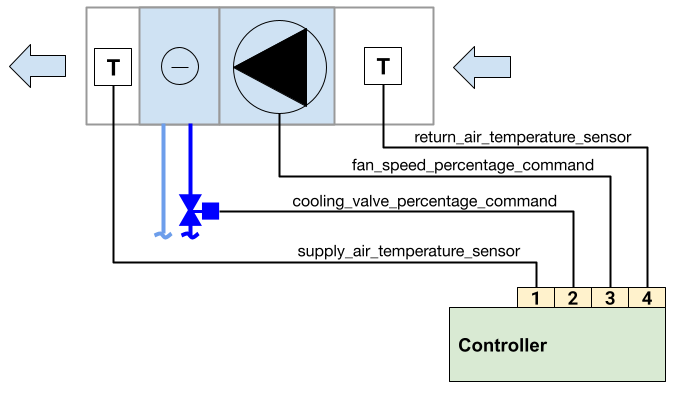
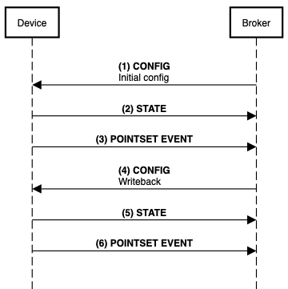

[**UDMI**](../../) / [**Docs**](../) / [**Guides**](./) / [Example](#)

# Minimal HVAC UDMI Tutorial

## Contents

- [Introduction](#introudction)
- [Physical Setup](#physical-setup)
- [Message Flow](#message-flow)

## Introduction

**Recommended reading**

- [Tech primer](../tech_primer.md)
- [UDMI documentation ](../)
- [Compliance](../specs/compliance.md)
- [Connecting Devices to Cloud](../specs/connecting.md)

This document describes a real world basic implementation of UDMI using a fan coil unit
system as an example. Only basic messaging functionality is demonstrated and not complete functionality. 

## Physical Setup

For this example, the sample fan coil unit system comprises:
- Fan
- Cooling coil and valve
- Supply & return air temperature sensors
- Fan coil unit controller



UDMI is implemented at the fan coil unit controller, which has an internet connection, and an MQTT
client which supports UDMI.

The system has the following physical points, represented as analogue inputs/outputs on the controller
- `cooling_valve_percentage_command`
- `supply_air_temperature_sensor`
- `return_air_temperature_sensor`
- `fan_speed_percentage_command`

The system additionally comprises the following virtual points
- `zone_air_temperature_setpoint`

These points have been named according to [Digital Buildings Ontology (DBO)](../tech_primer.md) at
the controller. Conversely it is also possible and valid to represent each component as a [logical
device](../tech_primer.md) subject to project requirements

In practice the system may comprise additional components and points not shown in this limited
example, however these can be incorporated in the same way. There are different ways and
connectivity options to achieve the same functionality e.g. using [gateways](../specs/gateway.md)

## Site Model & Metadata

Metadata file saved as a `FCU-001/metadata.json` within the [site model](../specs/site_model.md). 

<!--example:metadata/tutorial_hvac_min.json-->
```json
{
  "version": 1,
  "timestamp": "2018-08-26T21:39:29.364Z",
  "system": {
    "location": {
      "site": "US-SFO-XYY",
      "section": "NW-2F"
    },
    "physical_tag": {
      "asset": {
        "guid": "bim://04aEp5ymD_$u5IxhJN2aGi",
        "site": "US-SFO-XYY",
        "name": "FCU-001"
      }
    }
  },
  "cloud": {
    "auth_type": "ES256"
  },
  "pointset": {
    "points": {
      "cooling_valve_percentage_command": {
        "units": "Percent"
      },
      "supply_air_temperature_sensor": {
        "units": "Degrees-Celsius"
      },
      "return_air_temperature_sensor": {
        "units": "Degrees-Celsius"
      },
      "fan_speed_percentage_command": {
        "units": "Percent"
      },
      "zone_air_temperature_setpoint": {
        "writeable": true,
        "units": "Degrees-Celsius"
      }
    }
  }
}
```

Additional fields, such as baseline values and testing targets omitted as well as optional
descriptive fields. It is suggested these are filled in where available.

## Message Flow



### Initialization 

#### (1) Initial Configuration

Using the registrar tool, a configuration message is sent to the device based on metadata file
<!--example:config/tutorial_hvac_min_1.json-->
```json
{
  "version": 1,
  "timestamp": "2021-12-21T13:00:00.131Z",
  "system": {
    "min_loglevel": 600
  },
  "pointset": {
    "sample_limit_sec": 15,
    "sample_rate_sec": 60,
    "points": {
      "cooling_valve_percentage_command": {
      },
      "supply_air_temperature_sensor": {
      },
      "return_air_temperature_sensor": {
      },
      "fan_speed_percentage_command": {
      },
      "zone_air_temperature_setpoint": {
      }
    }
  }
}
```

#### (2) State

After receiving a config message, the device sends a [state](../messages/state.md) message as
defined by [config and state sequence](../specs/sequences/config.md)
<!--example:state/tutorial_hvac_min_1.json-->
```json
{
  "version": 1,
  "timestamp": "2021-12-21T13:00:01.215Z",
  "system": {
    "make_model": "ACME FCU Controller", 
    "firmware": {
      "version": "3.2a"
    },
    "serial_no": "182732142",
    "last_config": "2021-12-21T13:00:00.131Z", // Matches the timestamp of the last config message
    "operational": true
    },
  "pointset": {
    "points": {
      "cooling_valve_percentage_command": {
      },
      "supply_air_temperature_sensor": {
      },
      "return_air_temperature_sensor": {
      },
      "fan_speed_percentage_command": {
      },
      "zone_air_temperature_setpoint": {
      }
    }
  }
}
```

### Operation

#### (3) Telemetry (Pointset Event)

The telemetry will send data at an interval according to the `sample_limit_sec` and
`sample_rate_sec` from the [config](../messages/config.md) message.

In this example with the following parameters:
* `sample_rate_sec`: 15
* `sample_limit_sec`: 60
The telemetry will be nominally sent every 15 seconds
<!--example:event_pointset/tutorial_hvac_min_1.json-->
```json
{
  "version": 1,
  "timestamp": "2021-12-21T13:00:02.053Z",
  "points": {
    "cooling_valve_percentage_command": {
      "present_value": 50
    },
    "supply_air_temperature_sensor": {
      "present_value": 22.3
    },
    "return_air_temperature_sensor": {
      "present_value": 26.1
    },
    "fan_speed_percentage_command": {
      "present_value": 50
    },
    "zone_air_temperature_setpoint": {
      "present_value": 26.0
    }
  }
}
```

[Partial updates and CoV](../messages/pointset.md#incremental-updates-and-cov) can be implemented
into the telemetry where appropriate.

### Writeback

[Writeback](../specs/sequences/writeback.md) is the process of cloud to device control by sending
[config](../messages/config.md) messages to the device

#### (4) Config

The temperature setpoint `zone_air_temperature_setpoint` is updated from the cloud by applying a
`set_value` to the point in the [pointset](../messages/pointset.md)
<!--example:config/tutorial_hvac_min_2.json-->
```json
{
  "version": 1,
  "timestamp": "2021-12-21T13:00:21.413Z",
  "system": {
    "min_loglevel": 600
  },
  "pointset": {
    "sample_limit_sec": 2,
    "sample_rate_sec": 500,
    "points": {
      "cooling_valve_percentage_command": {
      },
      "supply_air_temperature_sensor": {
      },
      "return_air_temperature_sensor": {
      },
      "fan_speed_percentage_command": {
      },
      "zone_air_temperature_setpoint": {
        "set_value": 18.0 // Update this point to 18.0
      }
    }
  }
}
```

#### (5) State

A [state](../messages/state.md) message is sent when the [device receives a config message.](../specs/sequences/config.md) 

If the [writeback](../specs/sequences/writeback.md) was successfully applied, the
[`value_state`](../specs/sequences/writeback.md#value-state-and-state) is set to applied.

The `last_config` matches the value of the last config message received as described in the [state
and config sequences](../specs/sequences/config.md) 

<!--example:state/tutorial_hvac_min_2.json-->
```json
{
  "version": 1,
  "timestamp": "2021-12-21T13:00:22.113Z",
  "system": {
    "make_model": "ACME FCU Controller", 
    "firmware": {
      "version": "3.2a"
    },
    "serial_no": "182732142",
    "last_config": "2021-12-21T13:00:00.131Z", // Matches last config message
    "operational": true
    },
  "pointset": {
    "points": {
      "cooling_valve_percentage_command": {
      },
      "supply_air_temperature_sensor": {
      },
      "return_air_temperature_sensor": {
      },
      "fan_speed_percentage_command": {
      },
      "zone_air_temperature_setpoint": {
        "value_state": "applied" // Value was successfully updated
      }
    }
  }
}
```

#### (6) Telemetry

The device continues to send the telemetry within the sample interval. The telemetry reflects the
values set by the cloud
<!--example:event_pointset/tutorial_hvac_min_2.json-->
```json
{
  "version": 1,
  "timestamp": "2021-12-21T13:00:03.053Z",
  "points": {
    "cooling_valve_percentage_command": {
      "present_value": 100 // Example of system reaction to the cloud writeback command represented in the telemetry, e.g. cooling valve has been opened up to increase cooling capacity
    },
    "supply_air_temperature_sensor": {
      "present_value": 17.1
    },
    "return_air_temperature_sensor": {
      "present_value": 25.9
    },
    "fan_speed_percentage_command": {
      "present_value": 100
    },
    "zone_air_temperature_setpoint": {
      "present_value": 18.0 // The setpoint has been updated in the system
    }
  }
}
```

Generated using <https://sequencediagram.org>
```
participant Device
participant Broker
participantspacing 10
Broker->Device: **(1) CONFIG**\nInitial config
Device->Broker: **(2) STATE**
Device->Broker: **(3) POINTSET EVENT**
Broker->Device: **(4) CONFIG**\nWriteback
Device->Broker: **(5) STATE**
Device->Broker: **(6) POINTSET EVENT**
```