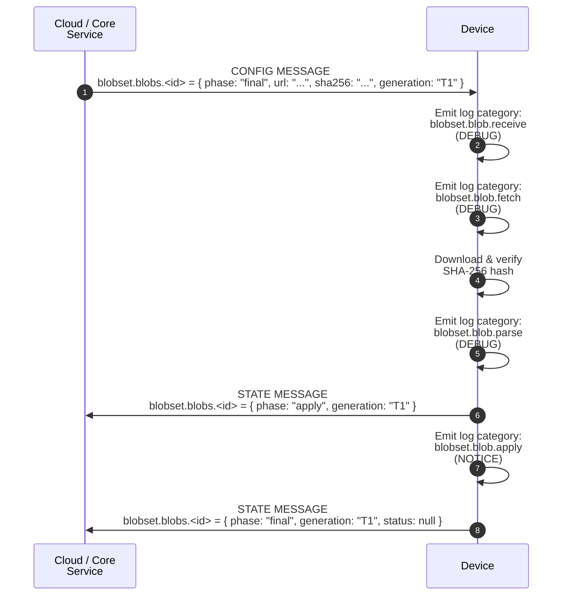

[**UDMI**](../../) / [**Docs**](../) / [**Specs**](./) / [Blob Updates](#)

# Blob Updates Specification

The _Blob Updates API_ defines a standard mechanism for delivering data blobs to a device via the UDMI configuration channel. This mechanism is commonly utilized for firmware updates, software module installations, security keys, or large configuration packages that are too large to fit directly into standard JSON configuration messages.

A device indicates its supported data blobs through discovery mechanisms, and the cloud controls the download, validation, and application of these blobs through the `blobset` block in the device configuration.

---

## Architecture & Data Models

The blob update mechanism splits operations into individual named blob targets within a `blobs` map under the `blobset` object.

### Config Structure

The [`blobset` block in configuration](../../schema/config_blobset.json) contains a `blobs` object where each key represents a unique blob identifier (e.g., `_iot_endpoint_config`, `manufacturer_proprietary_module`). Each blob configuration object specifies:

* **`phase`**: The desired management phase of the blob. Supported value:
  * `final`: The cloud expects the device to fully download, verify, and apply this blob version.
* **`url`**: The location from which the device can fetch the blob payload. This could be an external URL (HTTP/HTTPS), a cloud storage URI, or inline base64 data encoded via a data URI schema (e.g., `data:application/json;base64,...`).
* **`sha256`**: A 64-character lowercase hexadecimal string representing the expected SHA-256 cryptographic checksum of the unencoded blob payload. This ensures tamper protection and validation.
* **`generation`**: An RFC 3339 UTC timestamp indicating when this version of the blob was generated. This serves as a unique version identifier.

### State Structure

The [`blobset` block in state](../../schema/state_blobset.json) reflects the processed condition of each blob. For each blob target, the device must report:

* **`phase`**: The current operational phase or result. Supported values:
  * `apply`: (Optional/Intermediate) The device is actively processing or applying the blob payload.
  * `final`: The device has completed processing the blob (successfully or with terminal failure).
* **`generation`**: The generation timestamp of the configuration blob currently active or processed.
* **`status`**: A standard [Entry status object](../../schema/entry.json) providing the success or failure results of the last processing attempt, including error levels, categories, and descriptive messages.

---

## Update Sequence Flow

> [!IMPORTANT]
> **Observable Update Process**
> Devices are required to emit standard hierarchical log categories at each distinct operational milestone. This systematic telemetry creates a fully observable update pipeline, allowing cloud management platforms and automated testing frameworks to trace payload downloads, verification steps, and installation progress in real-time.

A standard successful blob update execution flows as follows:



### Idempotency & Optimization
Devices **must** check the `generation` or cryptographic `sha256` hash of a newly received blob configuration against the currently active blob. If they match, the device **must not** re-fetch or re-apply the blob, and no duplicate lifecycle log messages should be emitted.

---

## Error Handling & Log Categories

Granular observability relies on consistent telemetry. When tracking the lifecycle of blob updates or reporting processing failures, the device must use hierarchical log categories and status entries under the `blobset.blob` namespace.

| Category | Level | Description / Failure Scenarios |
| :--- | :--- | :--- |
| **`blobset.blob.update`** | `INFO` | Information: General category for processing a blob update. |
| **`blobset.blob.receive`** | `DEBUG` | Emitted when a new or updated blob configuration block is received. |
| **`blobset.blob.fetch`** | `DEBUG` | Emitted when starting a network fetch or reading inline data payload. |
| **`blobset.blob.fetch.oversize`** | `ERROR` | Terminal failure: Insufficient local storage or memory to download or unpack the blob. |
| **`blobset.blob.fetch.failure`** | `ERROR` | Terminal failure: Resource unreachable, network connection timed out, or HTTP 404 returned. |
| **`blobset.blob.parse`** | `DEBUG` | Emitted when beginning the verification, checksum calculation, or format parsing. |
| **`blobset.blob.parse.corrupt`** | `ERROR` | Terminal failure: The computed SHA-256 hash of the downloaded resource does not match the expected `sha256` parameter. |
| **`blobset.blob.parse.invalid`** | `ERROR` | Terminal failure: The format or structure of the payload is invalid or structurally malformed. |
| **`blobset.blob.parse.incompatible`**| `ERROR` | Terminal failure: The content is valid but target version/architecture is incompatible with this hardware model. |
| **`blobset.blob.apply`** | `NOTICE`| Emitted when applying or executing the validated update block. |
| **`blobset.blob.apply.failure`** | `ERROR` | Terminal failure: Unexpected execution exception or internal installer error during setup. |
| **`blobset.blob.apply.dependency`**| `ERROR` | Terminal failure: Required hardware or software prerequisites are missing. |
| **`blobset.blob.apply.restart`** | `NOTICE`| Information: The blob was written successfully, but a device reboot/restart is required to take effect. |
| **`blobset.blob.abort`** | `NOTICE`| Information: The active download or update process was canceled by the cloud or aborted locally. |
| **`blobset.blob.rollback`** | `NOTICE`| Information: A problem was detected post-apply, and the device is rolling back to the previous version. |

---

## Message Examples

### 1. Config Triggering a Module Update
```json
{
  "version": "1.5.2",
  "timestamp": "2026-05-04T13:00:00.000Z",
  "blobset": {
    "blobs": {
      "pubber_module": {
        "phase": "final",
        "url": "https://storage.googleapis.com/udmi-device-blobs/pubber_module_v2.bin",
        "sha256": "e3b0c44298fc1c149afbf4c8996fb92427ae41e4649b934ca495991b7852b855",
        "generation": "2026-05-04T12:30:00.000Z"
      }
    }
  }
}
```

### 2. State Reporting Success
```json
{
  "version": "1.5.2",
  "timestamp": "2026-05-04T13:00:15.000Z",
  "blobset": {
    "blobs": {
      "pubber_module": {
        "phase": "final",
        "generation": "2026-05-04T12:30:00.000Z"
      }
    }
  }
}
```

### 3. State Reporting a Corrupt/Failed Update
```json
{
  "version": "1.5.2",
  "timestamp": "2026-05-04T13:00:08.000Z",
  "blobset": {
    "blobs": {
      "pubber_module": {
        "phase": "final",
        "generation": "2026-05-04T12:30:00.000Z",
        "status": {
          "level": 500,
          "category": "blobset.blob.parse.corrupt",
          "message": "Downloaded payload SHA-256 hash mismatch",
          "timestamp": "2026-05-04T13:00:07.000Z"
        }
      }
    }
  }
}
```
