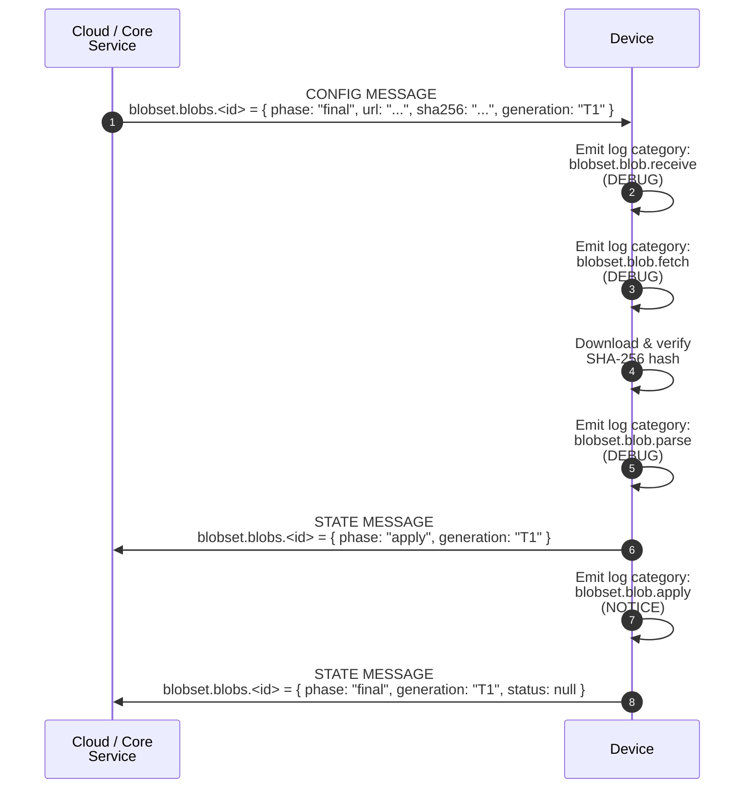

[**UDMI**](../../) / [**Docs**](../) / [**Specs**](./) / [Blob Updates](#)

# Blob Updates Specification

The _Blob Updates API_ defines a standard mechanism for delivering data blobs to a device via the UDMI configuration channel. This mechanism is commonly utilized for firmware updates, software module installations, security keys, or large configuration packages that are too large to fit directly into standard JSON configuration messages.

A device indicates its supported data blobs through discovery mechanisms, and the cloud controls the download, validation, and application of these blobs through the `blobset` block in the device configuration.

---

## Architecture & Data Models

The blob update mechanism splits operations into individual named blob targets within a `blobs` map under the `blobset` object.

### Config Structure

The [`blobset` block in configuration](../../schema/config_blobset.json) contains a `blobs` object where each key represents a unique blob identifier (e.g., `_iot_endpoint_config`, `manufacturer_proprietary_module`). Each blob configuration object specifies:

* **`phase`**: The desired management phase of the blob. Supported value:
  * `final`: The cloud expects the device to fully download, verify, and apply this blob version.
* **`url`**: The location from which the device can fetch the blob payload. This could be an external URL (HTTP/HTTPS), a cloud storage URI, or inline base64 data encoded via a data URI schema (e.g., `data:application/json;base64,...`).
* **`sha256`**: A 64-character lowercase hexadecimal string representing the expected SHA-256 cryptographic checksum of the unencoded blob payload. This ensures tamper protection and validation.
* **`generation`**: An RFC 3339 UTC timestamp indicating when this version of the blob was generated. This serves as a unique version identifier.

### State Structure

The [`blobset` block in state](../../schema/state_blobset.json) reflects the processed condition of each blob. For each blob target, the device must report:

* **`phase`**: The current operational phase or result. Supported values:
  * `apply`: (Optional/Intermediate) The device is actively processing or applying the blob payload.
  * `final`: The device has completed processing the blob (successfully or with terminal failure).
* **`generation`**: The generation timestamp of the configuration blob currently active or processed.
* **`status`**: A standard [Entry status object](../../schema/entry.json) providing the success or failure results of the last processing attempt, including error levels, categories, and descriptive messages.

---

## Update Sequence Flow

> [!IMPORTANT]
> **Observable Update Process**
> Devices are required to emit standard hierarchical log categories at each distinct operational milestone. This systematic telemetry creates a fully observable update pipeline, allowing cloud management platforms and automated testing frameworks to trace payload downloads, verification steps, and installation progress in real-time.

A standard successful blob update execution flows as follows:


```mermaid
%%{wrap}%%
sequenceDiagram
    autonumber
    participant C as Cloud / Core Service
    participant D as Device
    
    C->>D: CONFIG MESSAGE<br/>blobset.blobs.<id> = { phase: "final", url: "...", sha256: "...", generation: "T1" }
    D->>D: Emit log category: blobset.blob.receive (DEBUG)
    D->>D: Emit log category: blobset.blob.fetch (DEBUG)
    D->>D: Download & verify SHA-256 hash
    D->>D: Emit log category: blobset.blob.parse (DEBUG)
    D->>C: STATE MESSAGE<br/>blobset.blobs.<id> = { phase: "apply", generation: "T1" }
    D->>D: Emit log category: blobset.blob.apply (NOTICE)
    D->>C: STATE MESSAGE<br/>blobset.blobs.<id> = { phase: "final", generation: "T1", status: null }
```

### Idempotency & Optimization
Devices **must** check the `generation` or cryptographic `sha256` hash of a newly received blob configuration against the currently active blob. If they match, the device **must not** re-fetch or re-apply the blob, and no duplicate lifecycle log messages should be emitted.

---

## Error Handling & Log Categories

Granular observability relies on consistent telemetry. When tracking the lifecycle of blob updates or reporting processing failures, the device must use hierarchical log categories and status entries under the `blobset.blob` namespace.

| Category | Level | Description / Failure Scenarios |
| :--- | :--- | :--- |
| **`blobset.blob.update`** | `INFO` | Information: General category for processing a blob update. |
| **`blobset.blob.receive`** | `DEBUG` | Emitted when a new or updated blob configuration block is received. |
| **`blobset.blob.fetch`** | `DEBUG`/`ERROR` | Emitted when starting a network fetch or reading inline payload, or when fetching fails (oversize/unreachable URL). |
| **`blobset.blob.parse`** | `DEBUG`/`ERROR` | Emitted when beginning the verification/checksum check, or when verification/parsing fails (corrupt/invalid/incompatible). |
| **`blobset.blob.apply`** | `NOTICE`/`ERROR`| Emitted when applying or executing the update block, or when application fails (dependency/installer failure), or when a restart is required. |
| **`blobset.blob.abort`** | `NOTICE`| Information: The active download or update process was canceled by the cloud or aborted locally. |
| **`blobset.blob.rollback`** | `NOTICE`| Information: A problem was detected post-apply, and the device is rolling back to the previous version. |

---

## Message Examples

### 1. Config Triggering a Module Update
```json
{
  "version": "1.5.2",
  "timestamp": "2026-05-04T13:00:00.000Z",
  "blobset": {
    "blobs": {
      "system": {
        "phase": "final",
        "url": "https://storage.googleapis.com/udmi-device-blobs/system_v2.bin",
        "sha256": "e3b0c44298fc1c149afbf4c8996fb92427ae41e4649b934ca495991b7852b855",
        "generation": "2026-05-04T12:30:00.000Z"
      }
    }
  }
}
```

### 2. State Reporting Success
```json
{
  "version": "1.5.2",
  "timestamp": "2026-05-04T13:00:15.000Z",
  "blobset": {
    "blobs": {
      "system": {
        "phase": "final",
        "generation": "2026-05-04T12:30:00.000Z"
      }
    }
  }
}
```

### 3. State Reporting a Corrupt/Failed Update
```json
{
  "version": "1.5.2",
  "timestamp": "2026-05-04T13:00:08.000Z",
  "blobset": {
    "blobs": {
      "system": {
        "phase": "final",
        "generation": "2026-05-04T12:30:00.000Z",
        "status": {
          "level": 500,
          "category": "blobset.blob.parse",
          "message": "Downloaded payload SHA-256 hash mismatch",
          "timestamp": "2026-05-04T13:00:07.000Z"
        }
      }
    }
  }
}
```

---

## Ephemeral Blobset Downloads (`download/blobset`)

When delivering sensitive credentials, private keys, or ephemeral tokens (`_iot_endpoint_config`, `_bacnet_sc_config`, `_discovery_auth`), embedding secret material inline in `config.blobset` (via `data:` URLs) is undesirable because `config` messages are retained by the MQTT broker and stored in operational databases.

Instead, the cloud can specify a `download://` URL (e.g., `download://_iot_endpoint_config`) in `config.blobset.blobs.<key>.url` and deliver the sensitive payload out-of-band over the `{topic_prefix}/download/blobset` MQTT topic ([`schema/download_blobset.json`](../../schema/download_blobset.json)).

### Transport & Security Guarantees
* **QoS 0 & Non-Retained**: Both the publisher and device subscriber **must** use **MQTT QoS 0** with `retain = false` on `{topic_prefix}/download/blobset` so the broker never persists unacknowledged secret payloads to durable session disk.
* **Direct Broker Delivery**: UDMIS pushes `download/blobset` messages directly to the MQTT broker without routing the secret payload through intermediate Pub/Sub topics.

### System Blobset Keys (`schema/common.json#/definitions/blobsets`)
Standardized UDMI system blob keys use a leading underscore:
* `_iot_endpoint_config`: Primary MQTT broker endpoint configuration and credentials (including automated key/password rotation).
* `_bacnet_sc_config`: BACnet Secure Connect (BACnet/SC) operational certificates, private keys, and CA bundle.
* `_discovery_auth`: Ephemeral local discovery authentication credentials (e.g., vendor controller API username/password or token).

### `EndpointConfiguration` Extensions (`schema/configuration_endpoint.json`)
Each entry in `download/blobset` (`blobs.<key>`) conforms to [`EndpointConfiguration`](../../schema/configuration_endpoint.json), which supports:
* **`expiry`** (`date-time`): Optional RFC 3339 UTC timestamp indicating when an ephemeral credential expires. Once `now >= expiry`, the device must purge the credential from memory and, if the blob is still active in `config.blobset`, transition `state.blobset.blobs.<key>.phase` back to `apply` to request a refreshed credential.
* **`auth_provider.basic`**: `username` and `password`.
* **`auth_provider.jwt`**: `audience` and optional pre-signed `token`.
* **`auth_provider.mtls`**:
  * `private_key`: Client private key PEM for mTLS authentication.
  * `certificate`: Client X.509 certificate PEM for mTLS authentication.
  * `ca_certificate`: Trusted CA certificate bundle PEM for verifying the peer or hub.

### Handshake & Crash Recovery Flow
1. **Config Notification**: Cloud publishes `config.blobset.blobs.<key>` with `phase: "final"`, `generation`, `sha256` of the serialized `EndpointConfiguration`, and `url: "download://<key>"`.
2. **Download Request (`phase: "apply"`)**: Seeing a new `generation` with a `download://` URL (or recovering after a reboot/crash where the ephemeral secret is no longer in memory), the device publishes `state.blobset.blobs.<key>.phase = "apply"` with the matching `generation`.
3. **Ephemeral Delivery**: Upon receiving `state.blobset.blobs.<key>.phase == "apply"`, UDMIS publishes a [`BlobsetDownload`](../../schema/download_blobset.json) message to `{topic_prefix}/download/blobset` containing `blobs.<key>`.
4. **Application & Acknowledgement (`phase: "final"`)**: The device applies the `EndpointConfiguration` and publishes `state.blobset.blobs.<key>.phase = "final"`.

### Coexistence with Inline `data:` URLs
To maintain backward compatibility with existing devices and test sequences:
* **`data:` URLs**: Non-secret endpoint redirections (such as updating `hostname`, `port`, or `client_id` while reusing an existing on-device private key) continue to use `data:application/json;base64,...` inline in `config.blobset.blobs._iot_endpoint_config.url`. Clients decode and apply `data:` URLs immediately upon receiving `config`.
* **`download://` URLs**: Secret-bearing blobs (`basic.password`, `jwt.token`, `mtls.private_key`, `_bacnet_sc_config`, `_discovery_auth`) use `download://...`, triggering the `state` (`phase: "apply"`) → `download/blobset` → `state` (`phase: "final"`) flow.

