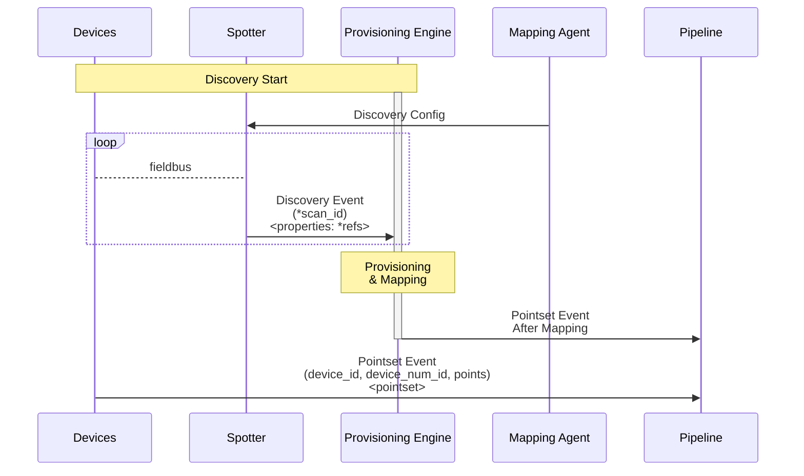

[**UDMI**](../../) / [**Docs**](../) / [**Specs**](./) / [Discovery](#)

# Discovery

Discovery consists of two related processes for describing the 'as built'
state of a system: _scanning_ and _enumeration_. For devices, the overall
[discovery sequence](sequences/discovery.md) describes the exact sequence
of device messages employed in each case. Each process can be
executed independently, or together (known as _scan enumeration_):

* _scanning_ scans for existing devices, and returns information about
their discovered address families. This is
information about how the device is indexed in the world around it.

* _enumeration_ lists the properties of a given target device. Providing
information intrinsic to a device and the capabilities it provides.

Backend services will receive a streaming set of
[_discovery enumeration messages_](../../tests/schemas/events_discovery/enumeration.json) that
follow the appropriate [_discovery event schema_](../../gencode/docs/events_discovery.html).

## Sequence Diagram

The overall discovery sequence involves multiple components that work together to provide the overall flow:
* **Devices**: The target things that need to be discovered, configured, and ultimately communicate point data.
* **Spotter**: Operative node that performs _discovery_, scanning local networks and producing observations.
* **Provisioning Engine**: Cloud-based agent/Provisioning Engine responsible for managing the overall _discovery_ and _mapping_ process (how often, what color, etc...).
* **Mapping Agent**: Used at the spotter to coordinate on-prem discovery.
* **Pipeline**: Ultimate recipient of pointset information, The thing that cares about 'temperature' in a room.

(The `*` prefixing a `*term` means that this id/property is being sourced/created at that step.)

## Scanning

_Scanning_ is the process of scanning a network and identifying the various
entities thereof. Often (but not always), this comes along with a correlation
of various address families (e.g. IPv4 address associated with a particular MAC):

* ethmac (_82:CC:18:9A:45:1C_): Ethernet mac address for low-level networking
* ipv4 (_10.27.38.123_): Assigned IPv4 device network address
* ipv6 (_FE80::8E8C:BC72_): Assigned IPv6 device network address
* bacnet (_92EA09_): The device's BACnet mac-address
* iot (_AHU-32_): Device designation as used in cloud-native processing
* host (_AHU-32.ACME.COM_): DNS hostname for a device

Scanning results can only describe a subset of the complete picture (e.g. only the
_ETHMAC_ and _IPv4_ address), and it is up to the back-end systems to properly link/infer complete
relationships. Some systems may only care about singular entries (e.g. just discovering
what IoT devices are there, but not caring about any association).

Discovery is a process that can be explicitly requested through UDMI for on-prem
devices that support the capability (e.g. an [IoT Gateway](gateway.md)), or it
can be done automatically by a device itself (e.g. on a predefined interval). Depending
on device capabilities and system configuration, the scanning process may also
trigger discovered device enumeration.

## Enumeration

_Enumeration_ is the process for listing  _all_ the parameters available from a device
(rather than just the ones in its designated reporting set). This information can
either come directly from a device (_self_ enumeration) or as the result of a discovery
scan (_scan_ enumeration). Both report the same kind of content, but the mechanism
(and message source) are different: one comes from the device itself, the other by proxy.

Within an enumeration message, there's a number of different kinds of information that can
be reported:
  * `refs`: A listing of all the data points that a device has to offer, indexed by their
  protocol-specific reference. References are curated into named `points`, which forms
  the foundation of the `pointset` messages.
  * `blobs`: A listing of all the data blobs that a device knows how to handle. This could
  be components like firmware updates, key rotation, etc... Some blobs will be standardized
  across the system, while others will be device-specific.
