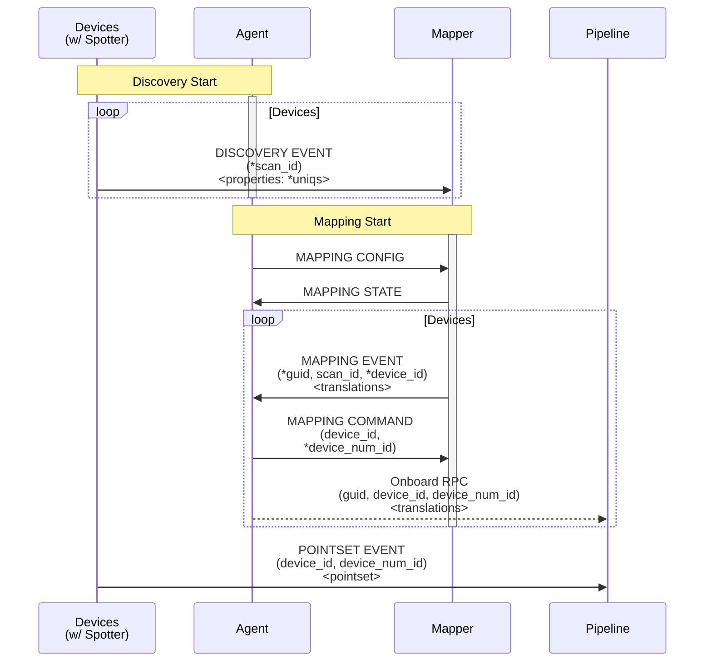

[**UDMI**](../../) / [**Docs**](../) / [**Specs**](./) / [Mapping](#)

# Mapping

The overall "mapping" flow consists of a number of separate subflows stitched together for a complete
end-to-end process to take an "unknown" device and ensure that it's properly integrated with backend services.

At a high-level, the process involves different message subgroups that handle slightly different
scopes of device data:
* **(Native)**: Device communicaiton using some non-UDMI native protocol (e.g. BACnet, Modbus, etc...)
* **[Discovery](discovery.md)**: Messages relating to the discovery (and provisioning) of devices (e.g. messy BACnet info)
* **[Mapping](mapping.md)**: Messages relating to a 'resolved' device type and ID (e.g. the device is an `AHU` called `AHU-1`)
* **[Pointset](../messages/pointset.md)**: Messages relating to actual data flow (e.g. temperature reading), essentially the interesting stuff
* **(Onboard)**: Interactions with an external (non-UDMI) entity of some kind to facilitate onboarding of devices

## Sequence Diagram

The overall mapping sequence involves multiple components that work together to provide the overall flow:
* **Devices**: The target things that need to be discovered, configured, and ultimately communicate point data.
* **Agent**: Cloud-based agent responsible for managing the overall _discovery_ and _mapping_ process (how often, what color, etc...).
* **Mapper**: Mapping engine that uses hueristics, ML, or a UI to convert discovery information into a concrete device/pipeline mapping.
* **Pipeline**: Ultimate recepient of pointset information, The thing that cares about 'temperature' in a room.



1. *(Fieldbus Discovery)* scan for fieldbus _device_ information from devices (e.g. BACnet, format out of scope for UDMI):
  * "I am device `78F936` with points { `room_temp`, `step_size`, and `operation_count` }"
2. **[Discovery Events](../../tests/event_discovery.tests/enumeration.json)** wraps the device info from the discovery
   into a UDMI-normalized format, e.g.:
  * "Device `78F936` has points { }, with a public key `XYZZYZ`"
3. **[Mapping Config](../../tests/config_mapping.tests/mapping.json)** from the _agent_ indicates that the _mapper_ should export responses.
3. **[Mapping Events](../../tests/event_mapping.tests/mapping.json)** from the _mapper_ contain actual calculated point mappings:
  * "Device `78F936` is an `AHU` called `AHU-183`, and `room_temp` is really a `flow_temperatue`"
3. **[Mapping Command](../../tests/command_mapping.tests/mapping.json)** to the _mapper_ contain results of initial provisioning:
  * "Device `78F936` has a numerical id `2198372198752`
4. *(Onboard Info)* are sent to the _pipeline_ to onboard a device (contents are defined by _pipeline_ and out of scope for UDMI).
8. **[Telemetry Events](../../tests/event_pointset.tests/example.json)** are data events from _device_ to _pipeline_... business as usual:
  * "I am `AHU-183`, and my `room_temp` is `73`"

## Example Test Setup

A standlone test-setup can be used to emulate all the requiste parts of the system.

Cloud PubSub subscriptions (the defaults) on the `udmi_target` topic (need to be manually added):
* `mapping-agent`: Used by the agent to coordinate on-prem discovery and mapping engine activities.
* `mapping-engine`: Used by the engine to process discovery and mapping information.

Local environment setup (e.g.):
* <code>project_id=<i>test-gcp-project</i></code>

### Mock Device and Spotter

The `pubber` reference provides for both ther `device` and `spotter` bits of functionality (`AHU-1` in this case).

```
$ bin/pubber sites/udmi_site_model/ $project_id AHU-1 832172
...
INFO daq.pubber.Pubber - 2022-08-30T01:46:29Z Discovery scan starting virtual as 2022-08-30T01:46:29Z
...
INFO daq.pubber.Pubber - 2022-08-30T01:45:57Z Sent 1 discovery events from virtual for Mon Aug 29 18:45:43 PDT 2022
...
```

### Mapping Agent

The mapping `agent` configures the on-prem discovery node (`AHU-1`) to perform periodic discovery runs.

```
$ validator/bin/mapping agent sites/udmi_site_model/ $project_id AHU-1
...
Received new family virtual generation Mon Aug 29 18:47:43 PDT 2022
...
```

### Mock Mapping Engine

The mapping `engine` receives discovery and mapping events to perform the mapping function.

```
$ validator/bin/mapping engine sites/udmi_site_model/ $project_id
...
Received discovery event for generation Mon Aug 29 18:48:43 PDT 2022
...
```
