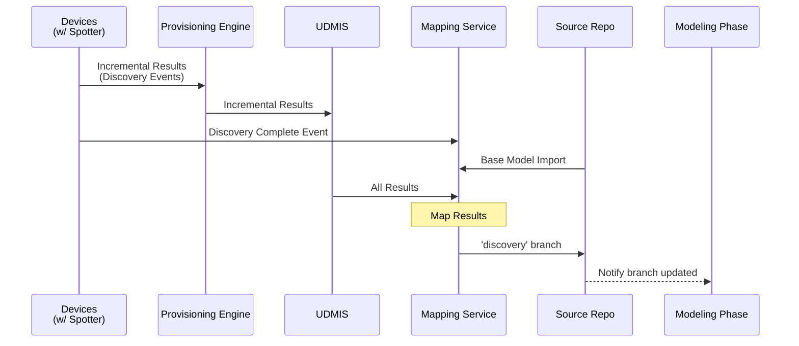

[**UDMI**](../../) / [**Docs**](../) / [**Specs**](./) / [Mapping](#)

# Mapping

The overall "mapping" flow consists of a number of separate subflows stitched together for a complete
end-to-end process to take an "unknown" device and ensure that it's properly integrated with backend services.

At a high-level, the process involves different message subgroups that handle slightly different
scopes of device data:
* **(Native)**: Device communication using some non-UDMI native protocol (e.g. BACnet, Modbus, etc...)
* **[Discovery](discovery.md)**: Messages relating to the discovery (and provisioning) of devices (e.g. messy BACnet info)
* **[Mapping](mapping.md)**: Messages relating to a 'resolved' device type and ID (e.g. the device is an `AHU` called `AHU-1`)

## Sequence Diagram

The overall mapping sequence involves multiple components that work together to provide the overall flow:
* **Devices**: The target things that need to be discovered, configured, and ultimately communicate point data.
* **Provisioning Engine**: Cloud-based agent/Provisioning Engine responsible for managing the overall _discovery_ and _mapping_ process (how often, what color, etc...).
* **UDMIS**: The Universal Device Management Interface Services, or UDMIS, is a cloud-based infrastructure that serves as the foundation for various tools, including the Registrar and Validator.
* **Mapping Service**: Mapping service that uses heuristics, ML, or a UI to convert discovery information into a concrete device/pipeline mapping.
* **Source Repo**: Ultimate source of truth for the particular site, having all the devices and Gateways part of the site in the Cloud Source Repository.
* **Modeling Phase**: Managing and maintaining the site model data, manually or by automated change-detection process.





* **[Discovery Events](../../tests/schemas/events_discovery/enumeration.json)** wraps the device info from the discovery
  into a UDMI-normalized format, e.g.:
  "Device `78F936` has points { }, with a public key `XYZZYZ`"
* **[Discovery Complete Event](../../validator/sequences/scan_single_future/events_discovery.json)** having `event_no` as negative value.


The Mapping Service subscribes to the udmi_target topic. When it receives a Discovery Complete event, it initiates the mapping process.

### Key Workflow Steps
* Device Mapping: The service first checks if the received discovery data corresponds to an existing device in the source repository.
* Handling New Devices: If no matching device is found based on the family (bacnet/vendor, etc.) and address combination, a new device is created. The new device is named using the convention UNK-X, where UNK stands for "Unknown" and X is an increasing number starting from 1.
* Updating Existing Devices: If a match is found, the service updates the existing device. New details from the Pointset Complete event are appended to the device's existing data.
* Pushing Changes: All these updates and new device creations are then pushed to the discovery branch, which triggers the subsequent modeling phase.

## Example Test Setup

A standalone test-setup can be used to emulate all the requisite parts of the system.

Cloud PubSub subscriptions (the defaults) on the `udmi_target` topic (need to be manually added):
* `mapping-service`: To process discovery complete event and complete mapping process.

Local environment setup (e.g.):
* <code>project_id=<i>test-gcp-project</i></code>

### Mock Device and Spotter

The `pubber` reference provides for both the `device` and `spotter` bits of functionality (`AHU-1` in this case).

```
$ bin/pubber sites/udmi_site_model/ $project_id AHU-1 832172
...
INFO daq.pubber.Pubber - 2022-08-30T01:46:29Z Discovery scan starting virtual as 2022-08-30T01:46:29Z
...
INFO daq.pubber.Pubber - 2022-08-30T01:45:57Z Sent 1 discovery events from virtual for Mon Aug 29 18:45:43 PDT 2022
...
```

### Mapping Agent

The mapping `agent` configures the on-prem discovery node (`AHU-1`) to perform periodic discovery runs.

```
$ validator/bin/mapping agent sites/udmi_site_model/ $project_id AHU-1
...
Received new family virtual generation Mon Aug 29 18:47:43 PDT 2022
...
```

### Mapping Service

The mapping `service` receives discovery complete and mapping events to perform the mapping process.

```
$ services/bin/mapping_service //pubsub/bos-platform-dev/namespace //gbos/bos-platform-dev/namespace tmp/udmi/sites/ --local
...
Received discovery event for generation Mon Aug 29 18:48:43 PDT 2022
...
```
