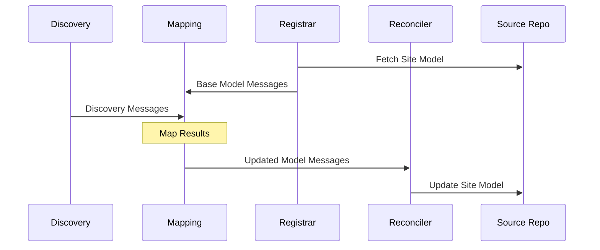
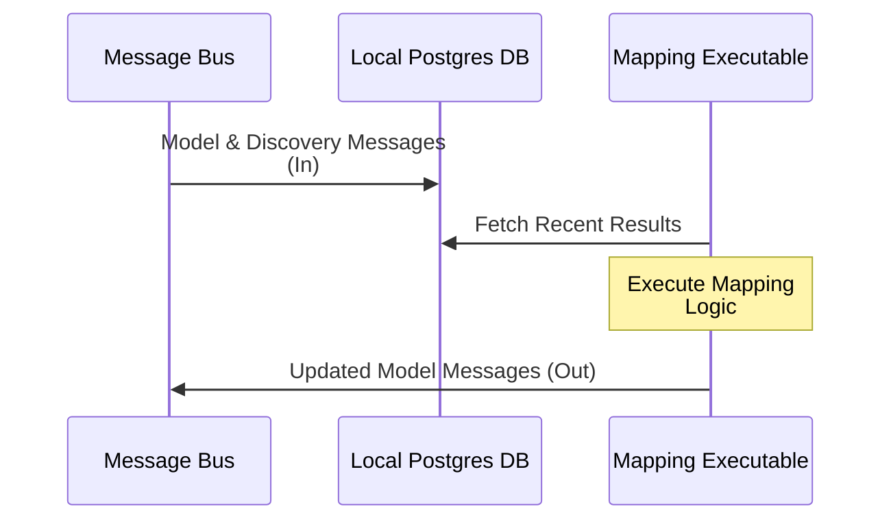

[**UDMI**](../../) / [**Docs**](../) / [**Specs**](./) / [Mapping](#)

# Mapping

The overall "mapping" flow is part of the broader [onboarding](onboarding.md) flow and consists of a number of separate subflows stitched together for a complete
end-to-end process to take an "unknown" device and ensure that it's properly integrated with backend services.

At a high-level, the process involves different message subgroups that handle slightly different scopes of device data:
* **[Discovery](discovery.md)**: Messages relating to the discovery (and provisioning) of devices (e.g. messy BACnet info)
* **[Mapping](mapping.md)**: Messages relating to a 'resolved' device type and ID (e.g. the device is an `AHU` called `AHU-1`)

## Sequence Diagram

The overall mapping sequence involves multiple components that work together to provide the overall flow. The mapping process is entirely message-based, cleanly separating site model file manipulation from the mapping logic itself.

* **Discovery**: Thing that runs on-prem fieldbus discovery and emits discovery messages.
* **Mapping**: Takes model messages (from the Registrar) and discovery messages (from Devices) as input, and outputs updated model messages.
* **Registrar**: Reads the existing site model from the source repository and generates base model messages for the system.
* **Reconciler**: Receives updated model messages from the Mapping Service and performs reconciliation to update the site model files.
* **Source Repo**: Ultimate source of truth for the particular site, containing all the consolidated information.


```mermaid
sequenceDiagram
  %%{wrap}%%
  participant Discovery
  participant Mapping
  participant Registrar
  participant Reconciler
  participant Source Repo
  
  Registrar->>Source Repo: Fetch Site Model
  Registrar->>Mapping: Base Model Messages
  Discovery->>Mapping: Discovery Messages
  Note over Mapping: Map Results
  Mapping->>Reconciler: Updated Model Messages
  Reconciler->>Source Repo: Update Site Model
```

* **[Discovery Events](../../tests/schemas/events_discovery/enumeration.json)** information from local on-prem fieldbus discovery.
* **[Model Events](../../tests/schemas/metadata/bacmodel.json)** comprehensive representation of the device, including all protocols.

### Key Workflow Steps
* **Registrar Model Loading**: The Registrar reads the `Source Repo` and publishes the current site model as messages to the system.
* **Device Mapping**: The Mapping Service processes the incoming discovery and model messages to resolve and compute the desired end-state mapping.
* **Reconciliation**: The Mapping Service outputs the resulting updated model messages. The Reconciler consumes these messages and applies the necessary changes to the `Source Repo`.

### Device Mapping Component
The "Device Mapping" step is a conceptual module that can be served by many different sub-modules, e.g.:
* **Implicit Mapping**: The reference implementation described below that does very simple deterministic mapping flows.
* **Agentic Mapping**: A throw-it-at-the-LLM capability that throws caution to the wind and does everything automagically.
* **External Mapping**: An externally integrated (through UUFI messages) system with proper analytics and user interface.

## Local Implicit Mapping 

While the mapping service is strictly message-in and message-out conceptually, a concrete internal implementation may utilize an intermediary database for state management. The internal reference implementation captures incoming discovery and model messages into a local PostgreSQL database. A separate mapping executable then reads from this database, performs its mapping logic, and outputs the updated model messages.

This design satisfies the "message in, message out" guideline while using the database as a robust intermediary. Other external implementations may employ different storage mechanisms, provided they adhere to the same external message contracts.


```mermaid
sequenceDiagram
  %%{wrap}%%
  participant MessageBus as Message Bus
  participant Postgres as Local Postgres DB
  participant Logic as Mapping Executable
  
  MessageBus->>Postgres: Model & Discovery Messages (In)
  Logic->>Postgres: Fetch Recent Results
  Note over Logic: Execute Mapping Logic
  Logic->>MessageBus: Updated Model Messages (Out)
```

### Reference Mapping Logic

The mapping logic itself (the "Execute Mapping Logic" step) executes something like the following rules when computing the mappings:
* **Device Matching**: The Mapping Service checks if the received discovery data corresponds to an existing device based on the ingested model state.
* **Handling New Devices**: If no matching device is found based on the family (bacnet/vendor, etc.) and address combination, a new device representation is created. The new device is named using the convention UNK-X, where UNK stands for "Unknown" and X is an increasing number starting from 1.
* **Updating Existing Devices**: If a match is found, the Mapping Service updates the existing device representation. New details from the Pointset Complete event are appended.

## Example Test Setup

*(Note: Test setup sections may need updates in the future as implementation shifts to the new Registrar/Reconciler workflows)*

A standalone test-setup can be used to emulate all the requisite parts of the system.

Cloud PubSub subscriptions on the target topics (need to be manually added):
* `mapping-service`: To process discovery complete events and model messages, and complete mapping process.

Local environment setup (e.g.):
* <code>project_id=<i>test-gcp-project</i></code>

### Mock Device and Spotter

The `pubber` reference provides for both the `device` and `spotter` bits of functionality (`AHU-1` in this case).

```
$ bin/pubber sites/udmi_site_model/ $project_id AHU-1 832172
...
INFO daq.pubber.Pubber - 2022-08-30T01:46:29Z Discovery scan starting virtual as 2022-08-30T01:46:29Z
...
INFO daq.pubber.Pubber - 2022-08-30T01:45:57Z Sent 1 discovery events from virtual for Mon Aug 29 18:45:43 PDT 2022
...
```

### Mapping Agent

The mapping `agent` configures the on-prem discovery node (`AHU-1`) to perform periodic discovery runs.

```
$ validator/bin/mapping agent sites/udmi_site_model/ $project_id AHU-1
...
Received new family virtual generation Mon Aug 29 18:47:43 PDT 2022
...
```

### Mapping Service

The mapping `service` receives discovery complete and mapping events to perform the mapping process.

```
$ services/bin/mapping_service //pubsub/bos-platform-dev/namespace //gbos/bos-platform-dev/namespace tmp/udmi/sites/ --local
...
Received discovery event for generation Mon Aug 29 18:48:43 PDT 2022
...
```
