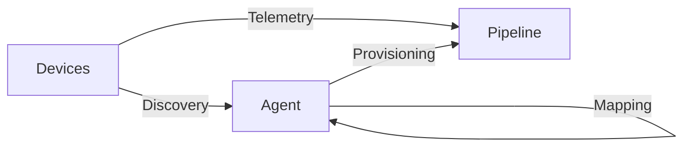
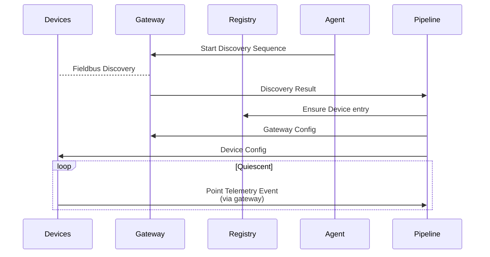

[**UDMI**](../../) / [**Docs**](../) / [**Specs**](./) / [Onboarding](#)

# Onboarding

_Onboarding_ is defined as the overal flow required to have on-prem building devices
properly feeding telemetry into a backend data pipeline. This consists of three main
separable phases, each with a distinct role and function:

* [Discovery](discovery.md): Discovering what devices are actually on-prem, and what
  capabilities they have.
* [Mapping](mapping.md): Figuring out how actual on-prem components should be mapped
  into higher-level semantic concepts.
* [Provisioning](provisioning.md): Setting up various system registries and device
  configuration to operate properly within the target system.

As an analogy, these phases correspond to biological _eyes_ (discovery), _brain_ (mapping), and
_arms_ (provisioning), and fall into the simple _see_, _think_, _do_ adage:
**First you see something, then you think about it, and then you do something about it.**

Each of these steps can be applied individually, and the continuous application of
all of them together constitutes _automation_, which is a key step towards enabling
highligy maintainable systems. The absense of each is also indicative of certain
specific failure modes:

* Without _discovery_, the backend system might not actually reflect reality. The on-prem
devices and capabilities might be different than what is expected to be there!
* Without _mapping_, the whole system is formulaic and is only exactly what it's told
to be. This means at some point, _somebody_ needs to type in exactly what everything is.
* Without _provisioning_, nothing can change in the system, and essentially requires
again _somebody_ to go around and manually do things to make it all work.

## Terms and Definitions

Throuought the UDMI (and beyond) framework, there are several different key concepts
that tie everything together. Unfortunately, due to cross-systems and legacy reasons
there aren't _unqiue_ terms for everything (sometimes the same thing has multiple names),
but they do ultimately constitute a coherent system.

* **site** (e.g. `US-MTV-BRX423`):
  * Standardized [location-code](https://unece.org/trade/cefact/unlocode-code-list-country-and-territory)
  * `site_name` (UDMI): term for the building
  * `registryId` (IoT Core): Convention (although not universal) of having the regsitry be the designated site
* **entity** (e.g. `AHU-1`): Identifier that nominally refers to the device across the entire 'IoT' domain, from
  physical device through to a virtual back-end representation.
  * `deviceId` (IoT Core)
  * `entity` ([DBP](https://google.github.io/digitalbuildings/))
  * `deviceId` (UDMI)
* **subsystem**: Subsystem identifiers are generally created/managed by various individual subsystems, and often
  only have significance with a limited scope. E.g., a cloud-based pipline does/should not care about the
  local IP address of a device.
  * `localnet` (UDMI): Specifies various local addresses (IP, bacnet, etc...) for a device
    * `bacnet`:
    * `IPv4`:
    * `macaddr`:
    * `iot`: Entity type as per above.
  * `deviceNumId` (IoT Core): Generated by IoT core when a device is instantiated
  * `cloud_device_id` (DBP): How the DBP refers to the deviceNumId
  * `guid` (DBP): Uniquely defines an entitty within the scope of the data pipeline
* **points** (e.g. `room_temp_sensor`): Names a specific data point for the device. Ideally the names would
  be the same, and a _translation_ is needed/required when they are not.
  * _local_ point name: The name used by the physical device itself
  * _iot_ point name: The name used by the cloud for structurally defined data
  * point _reference_:

## Legacy IoT Gateway Discovery

Actors:
* **Devices**: On-prem IoT devices (e.g. AHU)
* **Gateway**: On-prem node, acting as both a discovery node and gateway
* **Registry**: Cloud-based device registry
* **Agent**: Controlling agent (either manual or programmatic)
* **Pipeline**: Cloud-based data pipeline

The `device id` used in this mode is in an implicit form of `bacnet-ABCDEF` that encodes
both the _iot_ id (as seen in the cloud), and the _fieldbus_ id (as used by bacnet).

