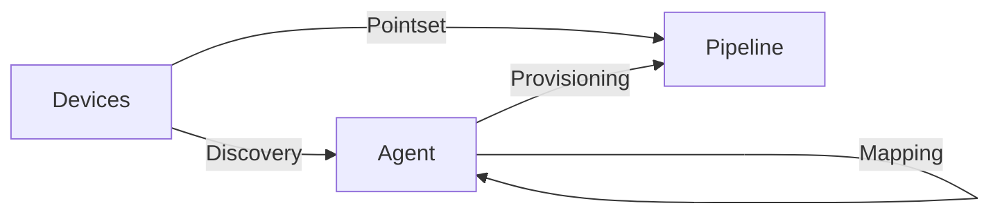

[**UDMI**](../../) / [**Docs**](../) / [**Specs**](./) / [Onboarding](#)

# Onboarding

_Onboarding_ is defined as the overall flow required to have on-prem building devices
properly feeding telemetry into a backend data pipeline. This consists of three main
separable phases, each with a distinct role and function:

* [Discovery](discovery.md): Discovering what devices are actually on-prem, and what
  capabilities they have.
* [Mapping](mapping.md): Figuring out how actual on-prem components should be mapped
  into higher-level semantic concepts.
* [Provisioning](provisioning.md): Setting up various system registries and device
  configuration to operate properly within the target system.

As an analogy, these phases correspond to biological _eyes_ (discovery), _brain_ (mapping), and
_arms_ (provisioning), and fall into the simple _see_, _think_, _do_ adage:
**First you see something, then you think about it, and then you do something about it.**

Once completed, Onboarding enables the flow of [Pointset](../messages/pointset.md) data, the 'phase' of actually sending pointset telemetry from the on-prem devices to the actual pipeline. The ultimate goal!

## Architectural Flow

Each of these steps can be applied individually, and the continuous application of
all of them together constitutes _automation_, which is a key step towards enabling
highly maintainable systems. The absence of each is also indicative of certain
specific failure modes:

```mermaid
flowchart LR
  D[Devices]
  A[Agent]
  P[Pipeline]
  D -- Pointset --> P
  D -- Discovery --> A
  A -- Provisioning --> P
  A -- Mapping --> A
```

* Without _discovery_, the backend system might not actually reflect reality. The on-prem
devices and capabilities might be different than what is expected to be there!
* Without _mapping_, the whole system is formulaic and is only exactly what it's told
to be. This means at some point, _somebody_ needs to type in exactly what everything is.
* Without _provisioning_, nothing can change in the system, and essentially requires
again _somebody_ to go around and manually do things to make it all work.
