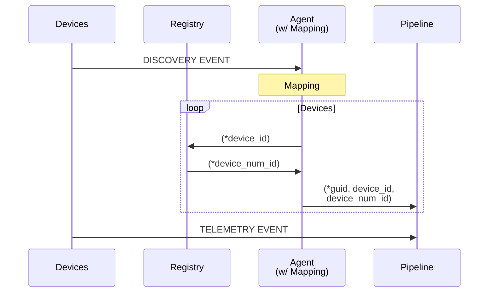

[**UDMI**](../../) / [**Docs**](../) / [**Specs**](./) / [Provisioning](#)

# Provisioning

Provisioning is the process of setting up various parts of the system to make them
functional in a given integration: for example, assigning authentication keys to
an IoT device.

Part of the overall [onboarding](onboarding.md) process.

## Sequence Diagram

