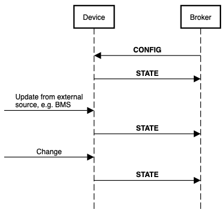

[**UDMI**](../../../) / [**Docs**](../../) / [**Specs**](../) / [**Sequences**](./) 
/ [Config](#)

# Config & State Sequence

* The `state` and `config` messages work together to represent a transactional state between the cloud and device.
* When any `config` is received, a `state` update should be generated with a corresponding last_update.
* The state message should be sent within 5 seconds
  * If additional processing is required, then the `updating` flag should be set `true`.
  * `updating` should be returned to `false` (or absent) once the device is done updating.
* The device can asynchronously update `state` if some other condition changes independent of
  `config` message, including when:
  * There is an update from an external source, e.g. a BMS or local controller
  * There is an update from internal logic 
* Other [sequences](./) such as [writeback](writeback.md) may have specific behaviors relating to
  state messages 



## Config Message

- [Definition](../../messages/config.md)
- [🧬Schema](../../../gencode/docs/config.html)

Example:
```JSON
{
  "version": 1,
  "timestamp": "2018-08-26T21:49:29.364Z",
  "system": {
    "min_loglevel": 500
  },
  "pointset": {
    "sample_limit_sec": 2,
    "sample_rate_sec": 500,
    "points": {
      "return_air_temperature_sensor": {
      }
    }
  }
}
```

## State Message

- [Definition](../../messages/state.md)
- [Schema](../../../gencode/docs/config.html)

Example:
```json
{
  "version": 1,
  "timestamp": "2018-08-26T21:49:30.364Z",
  "system": {
    "make_model": "ACME Bird Trap",
    "firmware": {
      "version": "3.2a"
    },
    "serial_no": "182732142",
    "last_config": "2018-08-26T21:49:29.364Z",  // Matches the timestamp of the config message
    "operational": true,
    "statuses": {
      "base_system": {
        "message": "Tickity Boo",
        "category": "device.state.com",
        "timestamp": "2018-08-26T21:39:30.364Z",
        "level": 600
      }
    }
  },
  "pointset": {
    "points": {
      "return_air_temperature_sensor": {
      }
    }
  }
}

```


```
participant Device
participant Broker
participantspacing 5
Broker->Device: **CONFIG**
Device->Broker: **STATE**
[->Device:Update from external\nsource, e.g. BMS 
Device->Broker: **STATE**
[->Device:Change
Device->Broker: **STATE**
```