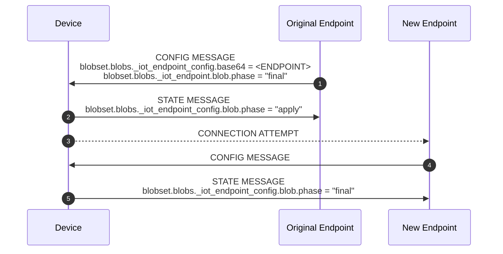
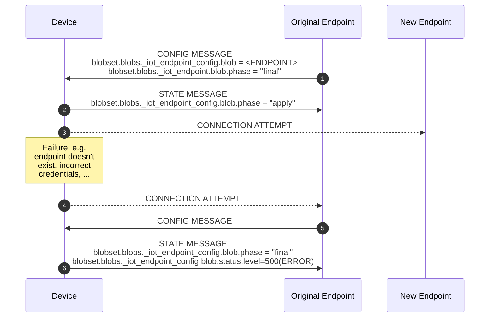

[**UDMI**](../../../) / [**Docs**](../../) / [**Specs**](../) / [**Sequences**](./) / [Endpoint Reconfiguration](#)

# Endpoint Reconfiguration

Endpoint reconfiguration is the reconfiguration of the UDMI endpoint through the
UDMI blob delivery mechanisms via UDMI config messages.

The [endpoint configuration blob](https://github.com/faucetsdn/udmi/blob/master/tests/configuration_endpoint.tests/simple.json) is a JSON object defined by
[configuration_endpoint.json](https://faucetsdn.github.io/udmi/gencode/docs/configuration_endpoint.html), which is base64 encoded in the config message.


## Tests

### Valid Endpoint (Successful) Reconfiguration

Note - `<ENDPOINT>` is a **base64** encoded endpoint object



### Invalid Endpoint (Unsuccessful Reconfiguration)



## Message Examples

Config message to initiate Reconfiguration (sequence #1 in diagrams above)
<!--example:config/endpoint_reconfiguration.json-->
```json
{
  "version": 1,
  "blobset": {
    "blobs": {
      "_iot_endpoint_config": {
        "phase": "final",
        "content_type": "application/json",
        "base64": "ewogICJwcm90b2NvbCI6ICJtcXR0IiwKICAiY2xpZW50X2lkIjogInByb2plY3RzL2Jvcy1zbm9yay1kZXYvbG9jYXRpb25zL3VzLWNlbnRyYWwxL3JlZ2lzdHJpZXMvWlotVFJJLUZFQ1RBL2RldmljZXMvQUhVLTEiLAogICJob3N0bmFtZSI6ICJtcXR0Lmdvb2dsZWFwaXMuY29tIgp9"
      }
    }
  },
  "timestamp": "2022-07-13T12:00:00.000Z"
}
```

The base64 encoded value decodes to:
<!--example:configuration_endpoint/simple.json-->
```json
{
  "protocol": "mqtt",
  "client_id": "projects/bos-snork-dev/locations/us-central1/registries/ZZ-TRI-FECTA/devices/AHU-1",
  "hostname": "mqtt.googleapis.com"
}
```

Example successful state message sent to the new endpoint from device following
a successful reconfiguration
<!--example:state/endpoint_reconfiguration.json-->
```json
{
  "version": 1,
  "timestamp": "2022-07-13T12:00:10.000Z",
  "system": {
    "hardware": {
      "make": "ACME",
      "model": "Bird Trap"
    },
    "software": {
      "firmware": "1.2"
    },
    "serial_no": "000000",
    "last_config": "2022-07-13T12:00:00.000Z",
    "operational": true
  },
  "blobset": {
    "blobs": {
      "_iot_endpoint_config": {
        "phase": "final"
      }
    }
  }
}
```

This is an example of the state message sent to the original endpoint after a failure
<!--example:state/endpoint_reconfiguration_failed.json-->
```json
{
  "version": 1,
  "timestamp": "2022-07-13T12:00:11.000Z",
  "system": {
    "hardware": {
      "make": "ACME",
      "model": "Bird Trap"
    },
    "software": {
      "firmware": "1.2"
    },
    "serial_no": "000000",
    "last_config": "2022-07-13T12:00:00.000Z",
    "operational": true
  },
  "blobset": {
    "blobs": {
      "_iot_endpoint_config": {
        "phase": "final",
        "status": {
          "message": "Could not connect to new endpoint",
          "category": "blobset.blob.fail",
          "timestamp": "2022-07-13T12:00:11.000Z",
          "level": 500
        }
      }
    }
  }
}
```
