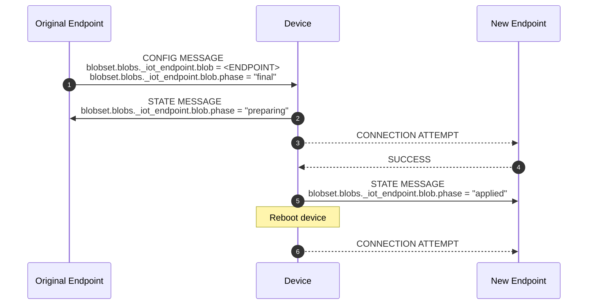
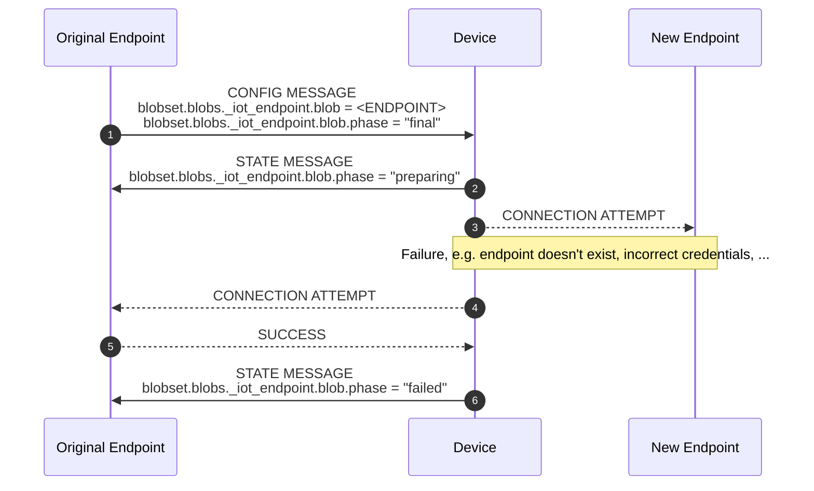

[**UDMI**](../../../) / [**Docs**](../../) / [**Specs**](../) / [**Sequences**](./) / [Endpoint Reconfiguration](#)

# Endpoint Reconfiguration

Endpoint reconfiguration is the reconfiguration of the UDMI endpoint through the
UDMI blob delivery mechanisms via UDMI config messages.

The [endpoint configuration blob](https://github.com/faucetsdn/udmi/blob/master/tests/configuration_endpoint.tests/simple.json) is a JSON object defined by
[configuration_endpoint.json](https://faucetsdn.github.io/udmi/gencode/docs/configuration_endpoint.html), which is base64 encoded in the config message.

## Tests

### Valid Endpoint (Successful) Reconfiguration

### Invalid Endpoint (Unsuccessful Reconfiguration)

