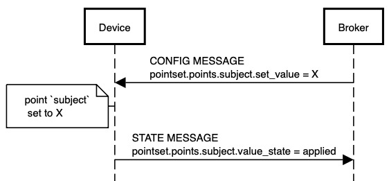
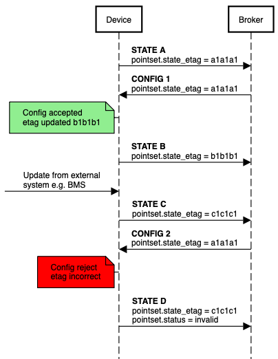

[**UDMI**](../../../) / [**Docs**](../../) / [**Specs**](../) / [**Sequences**](./) / [Writeback](#)

# Writeback

This file documents UDMI's specification for cloud to device control i.e. writeback. At a high level, the cloud controls a device by writing to the [pointset block](../messages/pAointfdsSset.md) in the device [config](../../messages/config.md). After receiving the config, the device updates its state to reflect the status of the writeback attempt e.g. success, failure, etc.



```
participant Device
participant Broker
entryspacing 0.1
Broker->Device: CONFIG MESSAGE\npointset.points.subject.set_value = X
note left of Device: point `subject`\n set to X
Device->Broker: STATE MESSAGE\npointset.points.subject.value_state = applied
space -2
```


## Cloud Behavior

To write to a point, the cloud sets three fields in the device config:
* `set_value`, which specifies the value for a given point in the device's current units. 
* [`state_etag`](#state-etag) value which uniquely represents the state. Specifically, `state_etag` is used to avoid race conditions where the incoming config is based off an obsolete state.
* [`set_value_expiry`](#value-expiration), which contains the RFC 3339 timestamp at which all `set_value` values expire.

## Device Behavior

After receiving the config message, the device attempts to write the value to the point. Depending
on the status of the write, the device should populate the `value_state`

### `value_state` 

The `value_state` field is an enumeration within a state message representing
the status of a point's writeback attempt.

Possible states for `value_state`:
*  \<missing\> -- The `value_state` field is missing from this point. This means one of two things:
      * The device is sending telemetry specified by the device as per normal operation. This is the more likely case.
      * The point’s config does not follow the UDMI spec for writeback. E.g. instead of specifying `set_value`, the config misspelled as , which isn’t a valid field in UDMI, and is ignored by the device.
* applied -- The cloud value is applied to the device point. The point should now be reporting as telemetry the value defined in the device’s config.
* updating -- The system is working to make the device state match the requested config. If the system hasn’t reconciled the config within 5 seconds or before the next telemetry message (whichever comes first), then the system should send a state message with `value_state` set to updating.
While the system should never abort trying to reconcile the config, after 1 minute of attempting to reconcile, the system should set `value_state` to failure.
* overridden -- The device point has been superseded by another system/user with a higher priority. 
* invalid -- The system failed to write the value to the point because the requested value cannot be applied to the point. This state indicates an error on the cloud side. Some examples:
  * Point is not writable
  * Requested value is out of the operating bounds of the point
  * The `state_etag` on the device doesn't match the `state_etag` from the incoming config
* failure -- The system failed to apply the cloud value to the point because an error occurred on the device side.

In the case of any of the error states (failure, invalid, overridden), the [status](../../messages/status.md) field for the point should be populated to provide additional debugging information about the error.

### `state_etag`

The `state_etag` field is meant to prevent a race condition where the device could apply a config
change based off an obsolete device state. The `state_etag` is a hash value of point units, config
set values echo and value_states in the points block. The `state_etag` must be updated to reflect
any updates in the pointset block. The specific calculation of `state_etag` is left up to
implementation, but the value should be a unique hash of the state's pointset. The `state_etag`
should be included by state and config. When the device receives a new config with a valid
`state_etag`, regardless of update success or failure. 




#### Example

An example of how the `state_etag` works and the race condition this field prevents:
1) The device is in state A. For example, it specifies units Fahrenheit for some writable point P.
2) The cloud sends a config update to write the value 70 to point P.
3) The device state changes state B, where point P is now using units Celsius. This change can happen manually through the BMS, or through other mechanisms.
4) The device receives the cloud's config update, and sets the value of point P to 70 Celsius, instead of the intended 70 Fahrenheit.

`state_etag` prevents this race condition by ensuring that the device state doesn't change between when the config was sent and received. i.e. in the previous example, the cloud's config update would include a `state_etag` uniquely representing state A. Upon receiving the update, the device would detect that the current `state_etag` (uniquely representing state B) is not the same as the one in the config, and therefore set the `value_state` as invalid.

### Value Expiration

When the device receives a config, it should check that `set_value_expiry` exists and is greater than the timestamp field in the config, sending an invalid `value_state` if not. 

If the `set_value_expiry` has already passed, then there’s no write to perform, and a state should be sent with a missing `value_state`.

If the config passes these checks, then the device should 
1) perform the write
2) set a timer to trigger at the given `set_value_expiry`, overwriting any existing timer. 

When the timer expires, the device reverts to its operational state, and sends a state update to notify the cloud of the state change.

