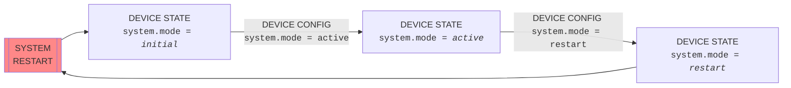

[**UDMI**](../../) / [**Docs**](../) / [**Specs**](./) / [System Mode](#)

# System Mode

The system 'mode' controls the high-level operating mode of the entire system.
    
## Restart Sequence

  
Notes:
* The _active_/_restart_ config modes are explicitly to prevent restart loops.
* Conceptually, _restart_ could be other operating modes (e.g. _shutdown_).
* Initial device would be _undefined_ if capability is not supported (legacy).
