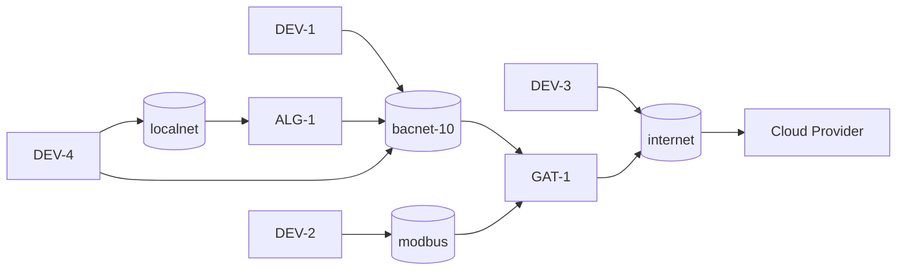

[**UDMI**](../../) / [**Docs**](../) / [**Specs**](./) / [Topology](#)

# Topology

* Building _site_, encapsulated in a UDMI _site model_
  * Designated by a _site code_, such as `ZZ-TRI-DEVTA`
  * Unique global namespace (e.g. there is only _one_ `ZZ-TRI-FECTA` site globally).
  * Logical construct that _usually_ maps to a physical building.
* Site _networks_
  * Designated by a _network id_, such as `bacnet-10`
  * Unique namespace within a building.
  * Associated with a _family_, which is a kind of communicaiton protocol (e.g. _IPv4_ or _BACnet_)
  * Defines properties of that group, e.g. _IPv4 subnet_ or _BACnet network number_.
  * Specific network addresses (properties of _devices_), are unique within that _network_.
  * The _IoT network_ referrs to an external (outside the site) namespace of on-prem entities.
* _IoT gateway_
  * Construct to managing linking devices on a _network_ to the site _IoT network_.
  * There can be other _gateways_ in a building, but an _IoT gateway_ specifically means cloud connected.
  * Is optional if a device can directly connet to the IoT connection.
* _IoT Device_
  * Unique _IoT ID_ within a _site_, as a cloud logical entity.
  * May map to various configuraiton of physical on-site things (e.g. multiple controllers).
  * May be _directly_ connected to the IoT provider or _proxied_ through an IoT gateway.
* Point
  * Logical entity within a _device_ that provides enapsulation for a particular value.

# Site topology

* network IDs
  * `bacnet-10`
    * family: _bacnet_
    * properties:
      * network-number: _10_
  * `modbus`
    * family: _modbus_
    * properties:
      * baud: _9600_
  * `localnet`
    * family: _ipv4_
* proxy devices
  * `DEV-1`
    * gateway: `GAT-1`
    * network: `bacnet-10`
      * address: _0x827323_
    * network: `modbus`
  * `DEV-2`
    * gateway: `GAT-1`
    * network: `modbus`
      * address: _9_
  * `ALG-1`
    * gateway: `GAT-1`
    * netowrk: `bacnet-10`
      * address: _0x712387_
    * network: `localnet`
      * address: _192.168.1.1_
  * `DEV-4`
    * gateway: `ALG-1`
    * network: `bacnet-10`
      * address: _0x281799_
    * network: `localnet`
      * address: _192.168.1.2_
* logical devices
  * `DEV-1`
    * points (_ref_ for `GAT-1` on `bacnet-10`)
      * abstract_air_handler
        * ref: AV10.present_value
      * fixator_resonant_structure
        * ref: BV2.present_value
  * `DEV-2`
    * points (_ref_ for `GAT-1` on `modbus`)
      * abstract_air_handler
        * ref: 10
      * fixator_resonant_structure
        * ref: 21
  * `DEV-3`
    * points
      * master_frambibulator
  * `DEV-4` (_ref_ for `ALG-1` on `localnet`)
    * points
      * figurating_flambing
        * ref: points.json#.points.figurating_flambing.present_value
