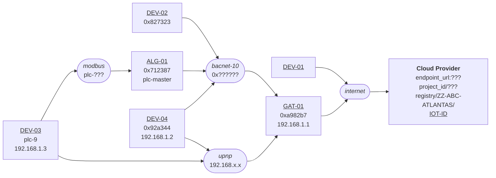

[**UDMI**](../../) / [**Docs**](../) / [**Specs**](./) / [Topology](#)

# Topology

* Building _site_, encapsulated in a UDMI _site model_
  * Designated by a _site code_, such as `ZZ-TRI-DEVTA`
  * Unique global namespace (e.g. there is only _one_ `ZZ-TRI-FECTA` site globally).
  * Logical construct that _usually_ maps to a physical building.
* Site _networks_
  * Designated by a _network id_, such as `bacnet-10`
  * Unique namespace within a building.
  * Associated with a _family_, which is a kind of communicaiton protocol (e.g. _IPv4_ or _BACnet_)
  * Defines properties of that group, e.g. _IPv4 subnet_ or _BACnet network number_.
  * Specific network addresses (properties of _devices_), are unique within that _network_.
  * The _IoT network_ referrs to an external (outside the site) namespace of on-prem entities.
* _IoT gateway_
  * Construct to managing linking devices on a _network_ to the site _IoT network_.
  * There can be other _gateways_ in a building, but an _IoT gateway_ specifically means cloud connected.
  * Is optional if a device can directly connet to the IoT connection.
* _IoT Device_
  * Unique _IoT ID_ within a _site_, as a cloud logical entity.
  * May map to various configuraiton of physical on-site things (e.g. multiple controllers).
  * May be _directly_ connected to the IoT provider or _proxied_ through an IoT gateway.
* Point
  * Logical entity within a _device_ that provides enapsulation for a particular value.

# Site topology

Site topology for `ZZ-ABC-ATLANTAS`

* network IDs
  * `bacnet-10`: family: _bacnet_, network-number: _10_
  * `modbus`: family: _modbus_, baud: _9600_
  * `upnp`: family: _upnp_
* mqtt devices
  * `DEV-01`:
  * `GAT-01`:
    * network `bacnet-10`: address _0xa982b7_
    * network `upnp`: address: _192.168.1.1_
* proxy devices
  * `DEV-02`
    * gateway `GAT-01`
    * network `bacnet-10`: address _0x827323_
  * `DEV-03`
    * gateway `ALG-01`
    * network `modbus`: address _plc-9_
    * network `ipnp`: address _192.168.1.3_
  * `DEV-04`
    * gateway `GAT-01`
    * network `bacnet-10`: address _0x92a344_
    * network `upnp`: address _192.168.1.2_
  * `ALG-01`
    * gateway `GAT-01`
    * netowrk `bacnet-10`: address _0x712387_
    * network `modbus`: address _plc-master_
* pointset mapping
  * `DEV-01`
    * points: _master\_frambibulator_
  * `DEV-02`
    * points (_ref_ for `GAT-01` on `bacnet-10`)
      * abstract_air_handler: ref _AV10.present_value_
      * fixator_resonant_structure: ref _BV2.present_value_
  * `DEV-03`
    * points (_ref_ for `ALG-01` on `modbus`)
      * abstract_air_handler: ref _reg-10_
      * fixator_resonant_structure: ref _reg-21_
  * `DEV-04` (_ref_ for `ALG-01` on `upnp`)
    * points
      * figurating_flambing: ref _points.json#.points.figurating\_flambing.present\_value_
