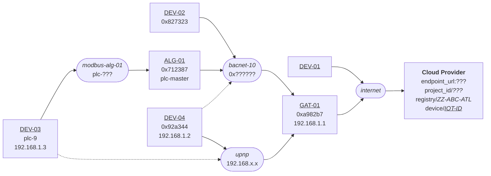

[**UDMI**](../../) / [**Docs**](../) / [**Specs**](./) / [Topology](#)

# Topology

## Terminology

* **local networks**: grouped communication patterns for on-prem systems
  * _family_: network property that defines things about the network (e.g. that an address should be of the form XXX.XXX.XXX.XXX)
  * _properties_: parameterization of the network, meanings defined by the network _family_
* **iot devices**: devices that have a representation in the cloud model
  * _networks_: optional list of _local networks_ the device connects to
  * **direct devices**: devices that have a direct (e.g.) MQTT connection without an intervening gateway
    * _credentials_: connection parameters for connecting to the intended cloud endpoint
  * **proxy devices**: devices that are proxied through a gateway to connect to the cloud
    * _gateway_: which gateway the device is proxied through
    * _through_: if multiple networks are present, indicates which one is used for proxying
* **pointset mapping**: how devices represent the mapping from the semantic cloud names to on-prem local network references
  * _ref_: point-to-source mapping, format defined by the network type of the indicated gateway (only for proxy devices)

## Example Topology

Example `ZZ-ABC-ATL` site topology. The solid lines form a communication tree, where there is exactly one path to the root (cloud).
Dashed lines indicate "alternate" connections that might exist due to various on-prem redundancies. Specifically, if a node
is connected to multiple networks there there is _one_ primary connection, and the others would be represented as dotted lines.

The corresponding encoded information provides all the details necessary to define the topology:
* local networks
  * `bacnet-10`: family `bacnet`, network-number `10`
  * `modbus-alg-01`: family `modbus`, baud `9600`
  * `upnp`: family `upnp`
* direct devices
  * `DEV-01`:
  * `GAT-01`:
    * network `bacnet-10`: address `0xa982b7`
    * network `upnp`: address `192.168.1.1`
* proxy devices
  * `DEV-02`
    * gateway `GAT-01`
    * network `bacnet-10`: address `0x827323`
  * `DEV-03`
    * gateway `ALG-01` (through `modbus-alg-01`)
    * network `modbus-alg-01`: address `plc-9`
    * network `upnp`: address `192.168.1.3`
  * `DEV-04`
    * gateway `GAT-01` (through `upnp`)
    * network `bacnet-10`: address `0x92a344`
    * network `upnp`: address `192.168.1.2`
  * `ALG-01`
    * gateway `GAT-01` (through `bacnet-10`)
    * network `bacnet-10`: address `0x712387`
    * network `modbus-alg-01`: address `plc-master`
* pointset mapping
  * `DEV-01`
    * points
      * `master_frambibulator`
  * `DEV-02`
    * points (meaningful to `GAT-01`)
      * `abstract_air_handler`: ref `AV10.present_value`
      * `fixating_resonant_structure`: ref `BV2.present_value`
  * `DEV-03`
    * points (meaningful to `ALG-01`)
      * `reticulating_reticulator`: ref `reg-10`
      * `running_rabbit_speed`: ref `reg-21`
  * `DEV-04`
    * points (meaningful to `GAT-01`)
      * `figure_flambing`: ref `points.json#.points.figure_flambing.present_value`
