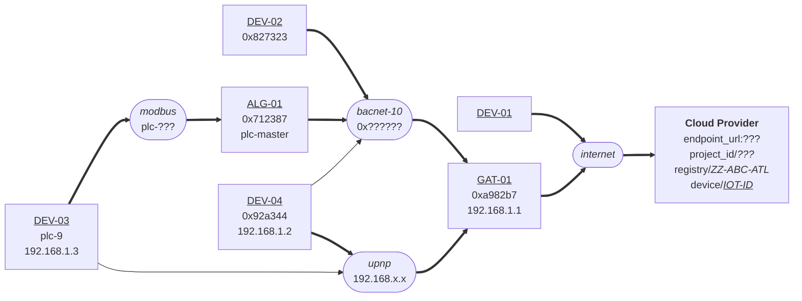

[**UDMI**](../../) / [**Docs**](../) / [**Specs**](./) / [Topology](#)

# Topology

## Terminology

* local networks
  * properties
* direct devices
  * networks
  * credentials
* proxy devices
  * gateway
  * networks
  * through
* pointset mapping
  * ref

## Example Topology

Example `ZZ-ABC-ATL` site topology:

The corresponding `encoded information` provides all the details necessary to define the topology:
* local networks
  * `bacnet-10`: family _bacnet_, network-number _10_
  * `modbus`: family _modbus_, baud _9600_
  * `upnp`: family _upnp_
* direct devices
  * `DEV-01`:
  * `GAT-01`:
    * network `bacnet-10`: address _0xa982b7_
    * network `upnp`: address _192.168.1.1_
* proxy devices
  * `DEV-02`
    * gateway `GAT-01`
    * network `bacnet-10`: address _0x827323_
  * `DEV-03`
    * gateway `ALG-01` (through `modbus`)
    * network `modbus`: address _plc-9_
    * network `upnp`: address _192.168.1.3_
  * `DEV-04`
    * gateway `GAT-01` (through `upnp`)
    * network `bacnet-10`: address _0x92a344_
    * network `upnp`: address _192.168.1.2_
  * `ALG-01`
    * gateway `GAT-01` (through `bacnet-10`)
    * netowrk `bacnet-10`: address _0x712387_
    * network `modbus`: address _plc-master_
* pointset mapping
  * `DEV-01`
    * points
      * _master\_frambibulator_
  * `DEV-02`
    * points (for `GAT-01`/`bacnet-10`)
      * _abstract\_air\_handler_: ref _AV10.present_value_
      * _fixator\_resonant\_structure_: ref _BV2.present_value_
  * `DEV-03`
    * points (for `ALG-01`/`modbus`)
      * _reticulating\_reticulator_: ref _reg-10_
      * _running\_rabbit\_speed_: ref _reg-21_
  * `DEV-04`
    * points (for `GAT-01`/`upnp`)
      * _figurating\_flambing_: ref _points.json#.points.figurating\_flambing.present\_value_
