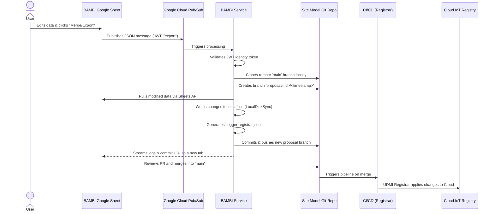

[**UDMI**](../../) / [**Docs**](../) / [**Tools**](./) / [BAMBI Tool Workflow](#)

# BAMBI Workflow: Site Model Update Process

This document outlines the end-to-end workflow of how changes submitted through the BAMBI (BOS Automated Management Building Interface) Google Sheet ultimately end up in the active site model and the production Cloud IoT Registry.

## Workflow Overview

BAMBI acts as an automated bridge between a user-friendly Google Sheet interface and standard GitOps procedures. Instead of modifying the production environment directly, BAMBI translates spreadsheet changes into a Git branch and a Pull Request.

## Step-by-Step Breakdown

1. **User Submission (Google Sheet)**
   A user makes changes to devices or site configurations within the BAMBI Google Sheet. When they trigger an update (via a Google Apps Script button), the sheet sends a JSON message to a Google Cloud Pub/Sub topic. This message contains an authentication token (JWT), the spreadsheet ID, the user's email, and an `export` (or `merge`) command.

2. **Message Processing**
   The BAMBI backend service (`bambi_service`) listens to the Pub/Sub topic, picks up the message, and verifies the identity token to ensure the request is authorized.

3. **Repository Setup & Branching**
   The service clones the `main` branch of the target remote site model Git repository into a temporary local directory. It then creates and checks out a new proposal branch strictly named using the format `proposal/<spreadsheet_id>/<timestamp>`.

4. **Data Synchronization**
   The service executes a synchronization process (`LocalDiskSync`) that pulls the structured data out of the Google Sheet and writes those changes directly into the local clone of the site model files.

5. **Trigger File Generation**
   BAMBI generates a special file named `trigger-registrar.json` in the root of the site model. This file logs the user's email and spreadsheet ID, serving as an indicator for later CI/CD steps that the registrar needs to be run.

6. **Commit & Push**
   The service commits all the synchronized changes with an automated commit message (e.g., *"Changes from [user] via BAMBI spreadsheet..."*) and pushes the new `proposal/...` branch to the remote Git repository.

7. **Real-time User Feedback**
   Throughout steps 3-6, BAMBI streams its execution logs back to a newly created tab in the Google Sheet (e.g., `bambi_log.merge.<timestamp>`). This log includes the final Git commit URL so the user can easily track their submission.

8. **Review and Merge (Pull Request)**
   At this stage, the changes are safely isolated in Git on the `proposal` branch. A reviewer (or an automated CI process) evaluates the branch as a standard Pull Request and merges it into the `main` branch.

9. **Registrar Application (Deployment)**
   Once the changes land in `main`, the CI/CD pipeline detects the changes (and the `trigger-registrar.json` file) and runs the UDMI `registrar` tool. This tool applies the updated site model to the active Cloud IoT registry, fully realizing the change in the production system.
