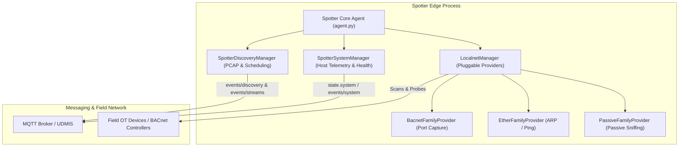

[**UDMI**](../../) / [**Docs**](../) / [**Tools**](./) / [Spotter](#)

# Spotter Reference Edge Node

The **UDMI Spotter Agent** is the reference edge node for Operational Technology (OT) building automation networks within the UDMI ecosystem. Spotter consolidates field network discovery, automated point mapping, remote ephemeral packet captures (PCAP), and host observability telemetry into a single unified edge process.

---

## Technical Architecture

Spotter runs as a single unified process using the UDMI Python Client Library (`clientlib`), managing three core managers under a single device identity (such as `DSN-1`):

1. **`LocalnetManager` & Pluggable Family Providers**:
   - **`BacnetFamilyProvider`**: Performs active BACnet Who-Is / I-Am discovery, object enumeration, and UDP port extraction.
   - **`EtherFamilyProvider`**: Performs Layer-2 Ethernet / ARP, nmap XML host parsing, and ICMP ping sweeps.
   - **`PassiveFamilyProvider`**: Listens for passive broadcast network traffic and extracts discovered device metadata.
2. **`SpotterDiscoveryManager`**:
   - Manages scheduled and on-demand discovery sweeps.
   - Streams live remote packet capture traces (`events/streams`) buffered in volatile memory with circuit-breaker protection (zero-disk streaming).
3. **`SpotterSystemManager`**:
   - Collects host metrics (CPU load, memory, OS distribution) and emits periodic telemetry (`events/system`).
   - Evaluates memory usage against safety thresholds (`check_safety_circuit_breaker`), throttling active discovery and packet captures to protect edge devices from kernel OOM termination.



---

## Ephemeral PCAP & Streaming MQTT Pipeline

Spotter processes diagnostic packet capture triggers sent declaratively over the UDMI discovery configuration channel (`config.discovery.families.<family>` with `depth: "trace"`):

1. **Capture Worker ([pcap.py](../../edge/spotter/src/pcap.py))**: Spawns `tcpdump` with configurable interface filters, enforcing strict execution bounds (maximum duration and byte quotas).
2. **Streaming MQTT Egress Transport**:
   - **Zero-Disk Streaming**: Packets are buffered dynamically in volatile memory (RAM) and sequentially published as reliable base64 chunks (`StreamsEvents`) over the universal streaming MQTT event topic (`events/streams`).
   - **Zero Secret Distribution**: Leverages the existing mTLS hardware key/certificate connection directly, avoiding external network credentials or outbound HTTP rules at the edge.
3. **Ad-hoc PCAP Reassembly ([bin/reassemble_pcap](../../edge/spotter/bin/reassemble_pcap))**:
   Reassembles chunked `events/streams` messages (from JSON, JSONL, or `mosquitto_sub`) back into a valid `.pcap` binary capture file:
   ```bash
   # Reassemble stream events file into a pcap file:
   ./edge/spotter/bin/reassemble_pcap stream_events.json capture.pcap

   # Or stream directly from mosquitto subscriber:
   mosquitto_sub -h $BROKER -t '/r/+/d/+/events/streams' | ./edge/spotter/bin/reassemble_pcap - live.pcap
   ```

---

## Quick Start & Running Spotter

Use the unified orchestrator script [bin/spotter](../../bin/spotter) located in the project root:

### 1. Launch Spotter

* **Local Development (against UDMI Local Orchestrator)**:
  ```bash
  # 1. Start local UDMI infrastructure (Barbican & Butler services)
  bin/udmi start sites/udmi_site_model //mqtt/localhost:46432

  # 2. Launch Spotter targeting the local broker
  ./bin/spotter sites/udmi_site_model //mqtt/localhost:46432 AHU-1
  ```
* **Container Mode (using Configuration File)**:
  ```bash
  ./bin/spotter edge/spotter/spotter_config.json 1234 --mode container
  ```

### 2. Connection Resilience & Startup Probing

Spotter incorporates built-in broker readiness probing and connection retry loops:
* Probes target MQTT broker reachability via TCP socket probing for up to 30 seconds (`mqtt.connect_timeout_sec`).
* Automatically performs retry backoff upon transient disconnects during broker TLS initialization (`mqtt.connect_retries` and `mqtt.connect_retry_delay_sec`).

### 3. Stop Running Instances

```bash
# Stop all background Spotter processes
./bin/spotter stop

# Stop a specific instance by serial number
./bin/spotter stop 1234
```

### 4. Logging & Diagnostics

When running in local or container mode, logs are automatically routed to `out/spotter/agent.log`.

---

## Verification & Testing Standards

Spotter includes a comprehensive suite of unit and integration tests located in [edge/spotter/tests/](../../edge/spotter/tests) and [edge/spotter/bin/](../../edge/spotter/bin). Use the unified test orchestrator [run_spotter_tests](../../edge/spotter/bin/run_spotter_tests) for consistent execution across environments:

```bash
# Run logical unit tests (fast, no external dependencies)
./edge/spotter/bin/run_spotter_tests unit

# Run container lifecycle, PCAP streaming, circuit breakers, and differential discovery parity
./edge/spotter/bin/run_spotter_tests integration

# Run the complete test suite (unit and integration)
./edge/spotter/bin/run_spotter_tests all
```

### Key Integration Tests

- **`test_container`**: Validates container lifecycle isolation, volume mounting of runtime configs, clean signal termination, and exit code propagation inside Docker.
- **`test_pcap`**: Validates remote-triggered PCAP packet capture diagnostics over MQTT streaming and verifies binary reassembly via `reassemble_pcap`.
- **`test_resource_contention`**: Validates process CPU, memory consumption, `/proc/PID/fd` file descriptor stability under load, and memory safety circuit breaker tripping.
- **`test_fault_injection`**: Validates network fault tolerance, streaming MQTT backoff recovery, and socket reconnect logic under simulated broker resets.
- **`test_parity`**: Runs co-existence integration testing against a simulated BACnet device on an isolated bridge network, confirming functional discovery parity with legacy discovery nodes.
- **`compare_field_parity`**: Automated CLI utility to run sequential discovery parity scans or diff event logs on live field testbeds without manual comparison.
