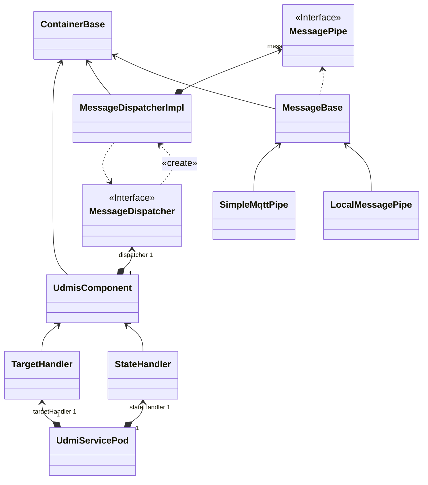

[**UDMI**](../../) / [**Docs**](../) / [UDMIS](.) / [Class Diagram](#)

```mermaid
classDiagram
direction BT
class ContainerBase
class LocalMessagePipe
class MessageBase
class MessageDispatcher {
<<Interface>>

}
class MessageDispatcherImpl
class MessagePipe {
<<Interface>>

}
class SimpleMqttPipe
class StateHandler
class TargetHandler
class UdmiServicePod
class UdmisComponent

LocalMessagePipe  -->  MessageBase 
MessageBase  -->  ContainerBase 
MessageBase  ..>  MessagePipe 
MessageDispatcher  ..>  MessageDispatcherImpl : «create»
MessageDispatcherImpl  -->  ContainerBase 
MessageDispatcherImpl  ..>  MessageDispatcher 
MessageDispatcherImpl "1" *--> "messagePipe 1" MessagePipe 
SimpleMqttPipe  -->  MessageBase 
StateHandler  -->  UdmisComponent 
TargetHandler  -->  UdmisComponent 
UdmiServicePod "1" *--> "stateHandler 1" StateHandler 
UdmiServicePod "1" *--> "targetHandler 1" TargetHandler 
UdmisComponent  -->  ContainerBase 
UdmisComponent "1" *--> "dispatcher 1" MessageDispatcher 
```
