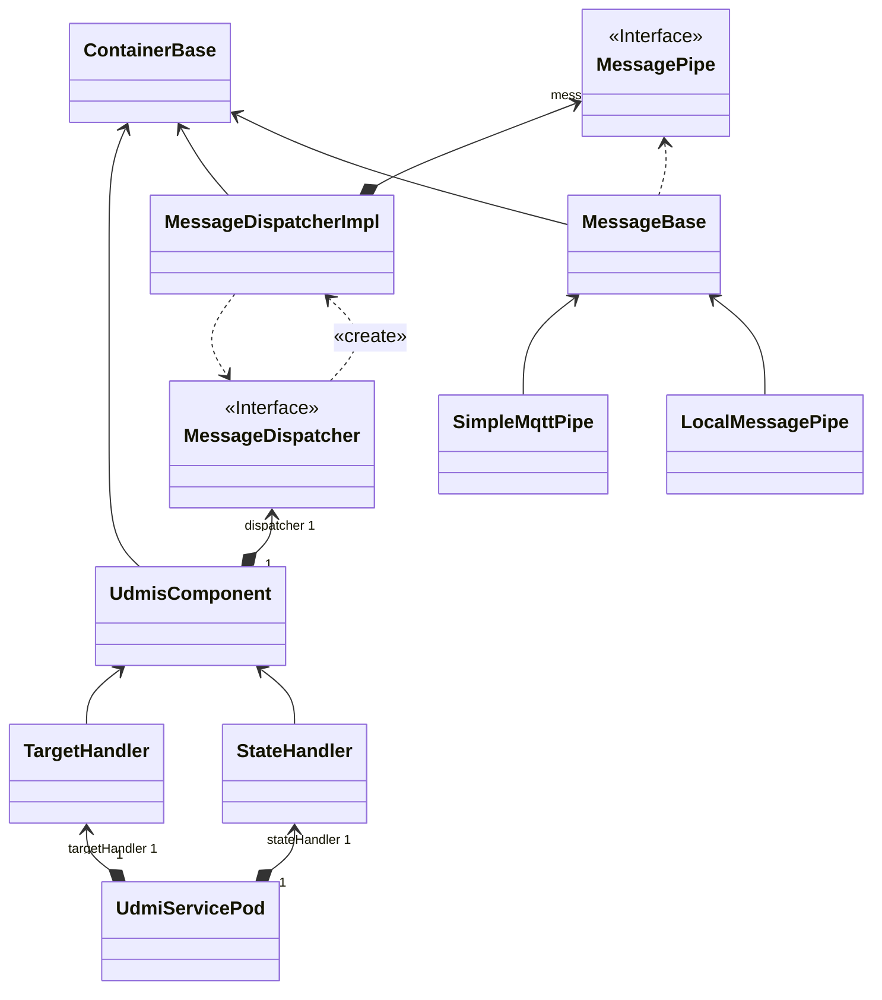

[**UDMI**](../../) / [**Docs**](../) / [UDMIS](.) / [Class Diagram](#)

## UDMIS Class Architecture

The class structure of the UDMIS subsystem layers a set of business-logic (i.e. the UDMIS part) on top of
common foundations for message handling and basic system facilities. This structure is not about the
_functionality_ (e.g. what the system does from the outside), but rather the underlying foundation of how
things are structures to provide testability, monitoring, diagnostics, etc...

* `ContainerBase`: Abstract class that provides system-wide common functionality for generic components, e.g. logging.
* `MessagePipe`: Interface for other components that require a message pipe of some kind.
  * `MessageBase`: Abstract class providing common functionality for all message pipe implementations.
    * `LocalMessagePipe`: Simple in-process pipe implementation primarily designed for testing.
    * `SimpleMqttPipe`: Message pipe implementation that uses a local MQTT broker for communication.
    * (`CloudMqttPipe`: A more involved version of the simple pipe that works with cloud endpoint. Might be the same as the simple version.)
    * (`PubSubPipe`: Eventually, there will also be a PubSub pipe available for GCP deployments.)
* `MessageDispatcher`: Interface for type-savy message handling, rather than handling raw strings or JSON messages.
  * `MessageDispatcherImpl`: Implementation of the message dispatcher interface.
* `UdmisComponent`: Base class for common functionality implementing higher-level functions.
  * `StateHandler`: Specific handler for dealing with UDMIS _state_ message updates (business logic).
  * `TargetHandler`: Specific handler for dealing with UDMIS _target_ messages (business logic).
* `UdmiServicePod`: Container main class that instantiates subcomponents according to configuraiton parameters.
