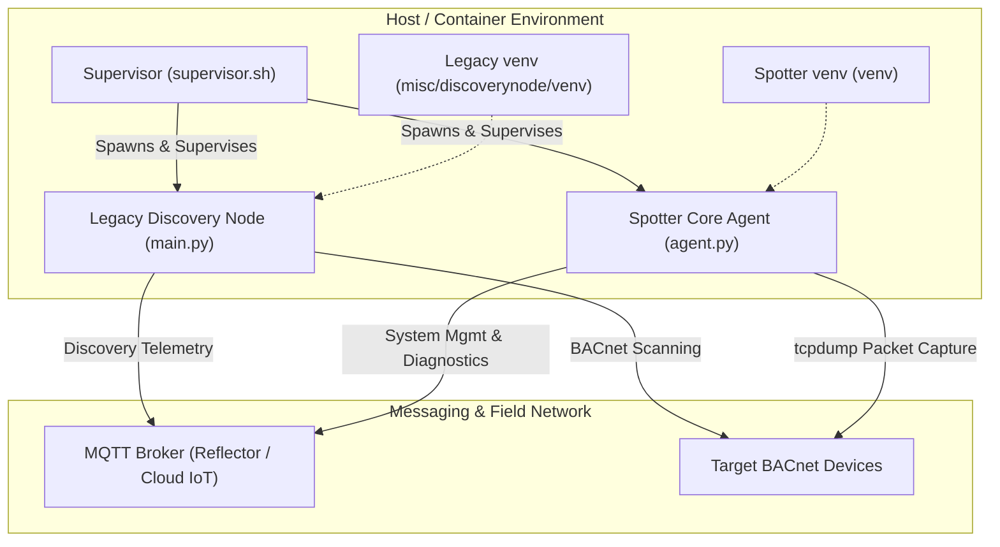
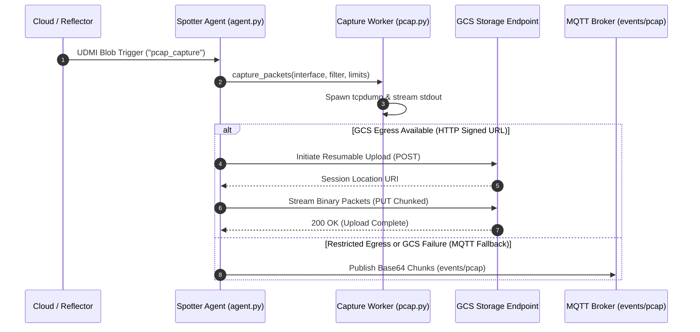

# UDMI Spotter Agent

The **UDMI Spotter Agent** is the next-generation edge node for Operational Technology (OT) building automation networks within the UDMI ecosystem. Designed as an all-in-one edge platform, Spotter consolidates field network discovery, automated point mapping, remote ephemeral packet captures (PCAP), and Over-The-Air (OTA) updates into a single unified node.

---

## Technical Architecture

To facilitate a seamless transition toward a fully unified edge node, Spotter currently employs a **dual-process supervised runtime model**. This architecture guarantees immediate functional parity with existing discovery deployments while expanding advanced diagnostic capabilities:

### 1. Dual-Process Supervisor & Co-Existence Model

A lightweight Bash process supervisor ([supervisor.sh](container/supervisor.sh)) orchestrates two isolated Python execution environments within a single container or host deployment:

* **Legacy Discovery Node ([main.py](../../misc/discoverynode/src/main.py))**: Executes core BACnet network scanning, BACnet object point mapping (`DiscoveryPoint`), and discovery event publishing (`events/discovery`) during the transition phase.
* **Spotter Core Agent ([agent.py](src/agent.py))**: Handles UDMI `SystemManager` state, device health & resource metrics (`spotter_cpu_usage_ratio`, `spotter_memory_bytes`), remote diagnostic jobs (`pcap_capture`), and OTA staging via `clientlib`.



### 2. Ephemeral PCAP & Dual-Transport Pipeline

Spotter processes diagnostic packet capture triggers sent declaratively over the UDMI config channel (`pcap_capture` blob handler):

1. **Capture Worker ([pcap.py](src/pcap.py))**: Spawns `tcpdump` with configurable interface filters, enforcing strict execution bounds (maximum duration and byte quotas).
2. **Dual Egress Transport**:
   - **Primary (GCS Resumable Upload)**: Streams packets over HTTP/HTTPS directly to a Cloud Storage signed URL via [uploader.py](src/uploader.py).
   - **Fallback (MQTT Event Stream)**: If GCS egress is unavailable or fails, chunked base64 payloads are automatically transmitted over the MQTT event topic (`events/pcap`).



---

## Directory Structure

| Path | Description |
| :--- | :--- |
| **[bin/spotter](../../bin/spotter)** | Unified CLI orchestrator for starting (local/container) and stopping instances |
| **[src/agent.py](src/agent.py)** | Main Spotter agent entry point, blob registration, and dispatcher |
| **[src/pcap.py](src/pcap.py)** | Safe `tcpdump` wrapper yielding binary streams with duration and size caps |
| **[src/uploader.py](src/uploader.py)** | Resumable GCS streaming HTTP client |
| **[container/supervisor.sh](container/supervisor.sh)** | Dual-process supervisor script managing process signaling and cleanup |
| **[container/Dockerfile](container/Dockerfile)** | Multi-stage Docker image build specification |
| **[spotter_config.json](spotter_config.json)** | Sample configuration file for endpoint and BACnet parameters |
| **[GEMINI.md](GEMINI.md)** | Detailed testing standards, execution matrices, and triage guidelines |
| **[spotter_plan.md](spotter_plan.md)** | Phase-by-phase engineering plan and technical parity specification |

---

## Quick Start & Usage

Use the unified orchestrator script [bin/spotter](../../bin/spotter) located in the project root:

### 1. Launch Spotter

* **Local Development (from Site Model)**:
  ```bash
  ./bin/spotter sites/udmi_site_model //mqtt/localhost AHU-1
  ```
* **Container Mode (using Configuration File)**:
  ```bash
  ./bin/spotter edge/spotter/spotter_config.json 1234 --mode container
  ```

### 2. Stop Running Instances

```bash
# Stop all background Spotter processes (both containers and local supervisors)
./bin/spotter stop

# Stop a specific instance by serial number
./bin/spotter stop 1234
```

---

## Verification & Testing

Spotter includes a comprehensive suite of unit and integration tests located in [tests/](tests) and [bin/](bin):

```bash
# Run unit tests
python3 -m unittest discover -s edge/spotter/tests

# Run local supervisor integration test
./edge/spotter/bin/test_supervisor

# Run container lifecycle integration test
./edge/spotter/bin/test_container

# Run BACnet co-existence parity test
./edge/spotter/bin/test_parity
```

For complete testing procedures and guidelines, see [GEMINI.md](GEMINI.md).
