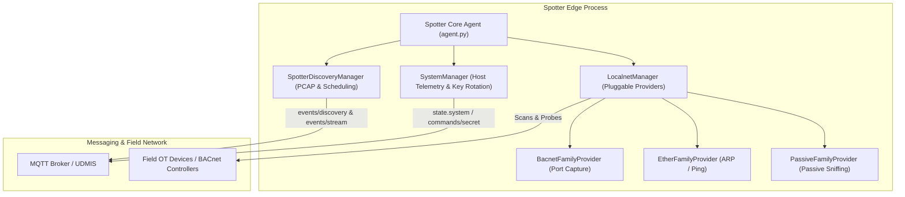

# UDMI Spotter Edge Reference Node

The **UDMI Spotter Agent** is the reference edge node for Operational Technology (OT) building automation networks within the UDMI ecosystem. Spotter consolidates field network discovery, automated point mapping, remote ephemeral packet captures (PCAP), host observability telemetry, and automated key rotation into a single unified edge process.

---

## Technical Architecture

Spotter runs as a single unified process using the UDMI Python Client Library (`clientlib`), managing three core managers under a single device identity:

1. **`LocalnetManager` & Pluggable Family Providers**:
   - **`BacnetFamilyProvider`**: Performs active BACnet Who-Is / I-Am discovery, object enumeration, and UDP port extraction ([b/549909773](https://b.corp.google.com/issues/549909773)).
   - **`EtherFamilyProvider`**: Performs Layer-2 Ethernet / ARP and ping discovery.
   - **`PassiveFamilyProvider`**: Listens for passive broadcast network traffic and extracts discovered device metadata.
2. **`SpotterDiscoveryManager`**:
   - Manages scheduled and on-demand discovery sweeps.
   - Streams live remote packet capture traces (`events/stream`) safely buffered in RAM.
3. **`SystemManager`**:
   - Collects host metrics (CPU load, memory, OS distribution) without SSH.
   - Implements automated zero-downtime key rotation with automated rollback.
   - Handles ephemeral secrets over non-persisted MQTT command channels (`commands/secret`).



---

## Ephemeral PCAP & Streaming MQTT Pipeline

Spotter processes diagnostic packet capture triggers sent declaratively over the UDMI discovery configuration channel (`config.discovery.families` with `depth: "trace"`):

1. **Capture Worker ([pcap.py](src/pcap.py))**: Spawns `tcpdump` with configurable interface filters, enforcing strict execution bounds (maximum duration and byte quotas).
2. **Streaming MQTT Egress Transport**:
   - **Zero-Disk Streaming**: Packets are buffered dynamically in volatile memory (RAM) and sequentially published as reliable base64 chunks (`StreamEvents`) over the universal streaming MQTT event topic (`events/stream`).
   - **Zero Secret Distribution**: Leverages the existing mTLS hardware key/certificate connection directly, avoiding external network credentials or outbound HTTP rules at the edge.

---

## Directory Structure

| Path | Description |
| :--- | :--- |
| **[bin/spotter](../../bin/spotter)** | Unified CLI orchestrator for starting (local/container) and stopping instances |
| **[bin/run_spotter_tests](bin/run_spotter_tests)** | Unified verification test runner for unit and integration suites |
| **[src/agent.py](src/agent.py)** | Main Spotter agent entry point, manager wiring, and command dispatcher |
| **[src/providers/](src/providers/)** | Modular protocol discovery providers (BACnet, Ether, Passive) |
| **[src/host_telemetry.py](src/host_telemetry.py)** | Zero-SSH host OS and performance telemetry probes |
| **[src/pcap.py](src/pcap.py)** | Safe `tcpdump` wrapper yielding binary streams with duration and size caps |
| **[src/metrics.py](src/metrics.py)** | Observability metrics exporter (Prometheus & UDMI telemetry) |
| **[src/logger.py](src/logger.py)** | Structured single-line JSON log formatter & W3C traceparent context generator |
| **[container/Dockerfile](container/Dockerfile)** | Multi-stage Docker image build specification |
| **[spotter_config.json](spotter_config.json)** | Sample configuration file for endpoint and BACnet parameters |
| **[GEMINI.md](GEMINI.md)** | Detailed testing standards, execution matrices, and triage guidelines |

---

## Quick Start & Usage

Use the unified orchestrator script [bin/spotter](../../bin/spotter) located in the project root:

### 1. Launch Spotter

* **Local Development (from Site Model)**:
  ```bash
  ./bin/spotter sites/udmi_site_model //mqtt/localhost AHU-1
  ```
* **Container Mode (using Configuration File)**:
  ```bash
  ./bin/spotter edge/spotter/spotter_config.json 1234 --mode container
  ```

### 2. Stop Running Instances

```bash
# Stop all background Spotter processes
./bin/spotter stop

# Stop a specific instance by serial number
./bin/spotter stop 1234
```

---

## Verification & Testing

Spotter includes a comprehensive suite of unit and integration tests located in [tests/](tests) and [bin/](bin). Use the unified test orchestrator [run_spotter_tests](bin/run_spotter_tests) for consistent execution across environments:

```bash
# Run logical unit tests (fast, no external dependencies)
./edge/spotter/bin/run_spotter_tests unit

# Run container lifecycle, PCAP streaming, circuit breakers, and differential discovery parity
./edge/spotter/bin/run_spotter_tests integration

# Run the complete test suite (unit and integration)
./edge/spotter/bin/run_spotter_tests all
```
