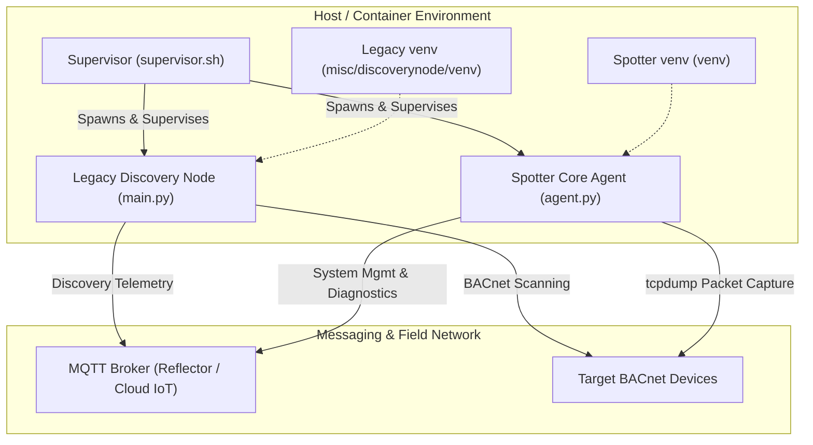
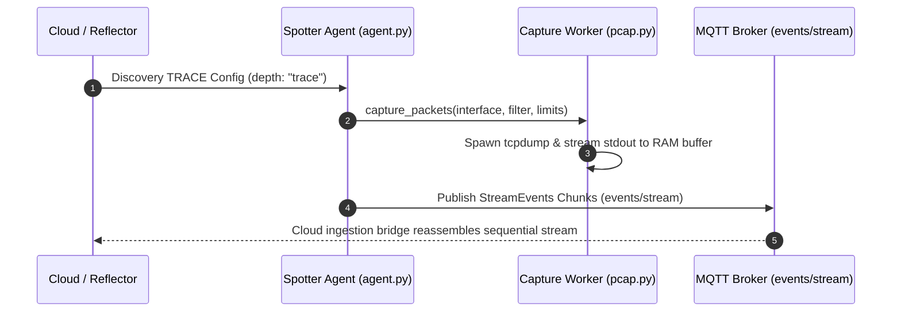

# UDMI Spotter Agent

The **UDMI Spotter Agent** is the next-generation edge node for Operational Technology (OT) building automation networks within the UDMI ecosystem. Designed as an all-in-one edge platform, Spotter consolidates field network discovery, automated point mapping, remote ephemeral packet captures (PCAP), and Over-The-Air (OTA) updates into a single unified node.

---

## Technical Architecture

To facilitate a seamless transition toward a fully unified edge node, Spotter currently employs a **dual-process supervised runtime model**. This architecture guarantees immediate functional parity with existing discovery deployments while expanding advanced diagnostic capabilities:

### 1. Dual-Process Supervisor & Co-Existence Model

A lightweight Bash process supervisor ([supervisor.sh](container/supervisor.sh)) orchestrates two isolated Python execution environments within a single container or host deployment:

* **Legacy Discovery Node ([main.py](../../misc/discoverynode/src/main.py))**: Executes core BACnet network scanning, BACnet object point mapping (`DiscoveryPoint`), and discovery event publishing (`events/discovery`) during the transition phase.
* **Spotter Core Agent ([agent.py](src/agent.py))**: Handles UDMI `SystemManager` and `TraceDiscoveryManager` state, device health & resource metrics (`spotter_cpu_usage_ratio`, `spotter_memory_bytes`), remote diagnostic trace captures (`config.discovery` with `depth: "trace"`), and modular OTA staging via `clientlib`.



### 2. Ephemeral PCAP & Streaming MQTT Pipeline

Spotter processes diagnostic packet capture triggers sent declaratively over the UDMI discovery configuration channel (`config.discovery.families` with `depth: "trace"`):

1. **Capture Worker ([pcap.py](src/pcap.py))**: Spawns `tcpdump` with configurable interface filters, enforcing strict execution bounds (maximum duration and byte quotas).
2. **Streaming MQTT Egress Transport**:
   - **Zero-Disk Streaming**: Packets are buffered dynamically in volatile memory (RAM) and sequentially published as reliable base64 chunks (`StreamEvents`) over the universal streaming MQTT event topic (`events/stream`).
   - **Zero Secret Distribution**: Leverages the existing mTLS hardware key/certificate connection directly, avoiding cloud storage credentials or external outbound HTTP rules at the edge.



---

## Directory Structure

| Path | Description |
| :--- | :--- |
| **[bin/spotter](../../bin/spotter)** | Unified CLI orchestrator for starting (local/container) and stopping instances |
| **[bin/run_spotter_tests](bin/run_spotter_tests)** | Unified verification test runner for unit and integration suites |
| **[src/agent.py](src/agent.py)** | Main Spotter agent entry point, discovery trace router, and OTA handler |
| **[src/pcap.py](src/pcap.py)** | Safe `tcpdump` wrapper yielding binary streams with duration and size caps |
| **[src/metrics.py](src/metrics.py)** | Multi-provider observability metrics exporter (Prometheus & UDMI telemetry) |
| **[src/logger.py](src/logger.py)** | Structured single-line JSON log formatter & W3C traceparent context generator |
| **[container/supervisor.sh](container/supervisor.sh)** | Dual-process supervisor script managing process signaling and cleanup |
| **[container/Dockerfile](container/Dockerfile)** | Multi-stage Docker image build specification |
| **[spotter_config.json](spotter_config.json)** | Sample configuration file for endpoint and BACnet parameters |
| **[GEMINI.md](GEMINI.md)** | Detailed testing standards, execution matrices, and triage guidelines |
| **[spotter_plan.md](spotter_plan.md)** | Phase-by-phase engineering plan and technical parity specification |

---

## Quick Start & Usage

Use the unified orchestrator script [bin/spotter](../../bin/spotter) located in the project root:

### 1. Launch Spotter

* **Local Development (from Site Model)**:
  ```bash
  ./bin/spotter sites/udmi_site_model //mqtt/localhost AHU-1
  ```
* **Container Mode (using Configuration File)**:
  ```bash
  ./bin/spotter edge/spotter/spotter_config.json 1234 --mode container
  ```

### 2. Stop Running Instances

```bash
# Stop all background Spotter processes (both containers and local supervisors)
./bin/spotter stop

# Stop a specific instance by serial number
./bin/spotter stop 1234
```

---

## Verification & Testing

Spotter includes a comprehensive suite of unit and integration tests located in [tests/](tests) and [bin/](bin). Use the unified test orchestrator [run_spotter_tests](bin/run_spotter_tests) for consistent execution across environments:

```bash
# Run logical unit tests (fast, no external dependencies)
./edge/spotter/bin/run_spotter_tests unit

# Run container lifecycle, PCAP streaming, and co-existence parity integration tests
./edge/spotter/bin/run_spotter_tests integration

# Run the complete test suite (unit and integration)
./edge/spotter/bin/run_spotter_tests all
```

For complete testing procedures, target safety matrices, and logging triage guidelines, see [GEMINI.md](GEMINI.md).
