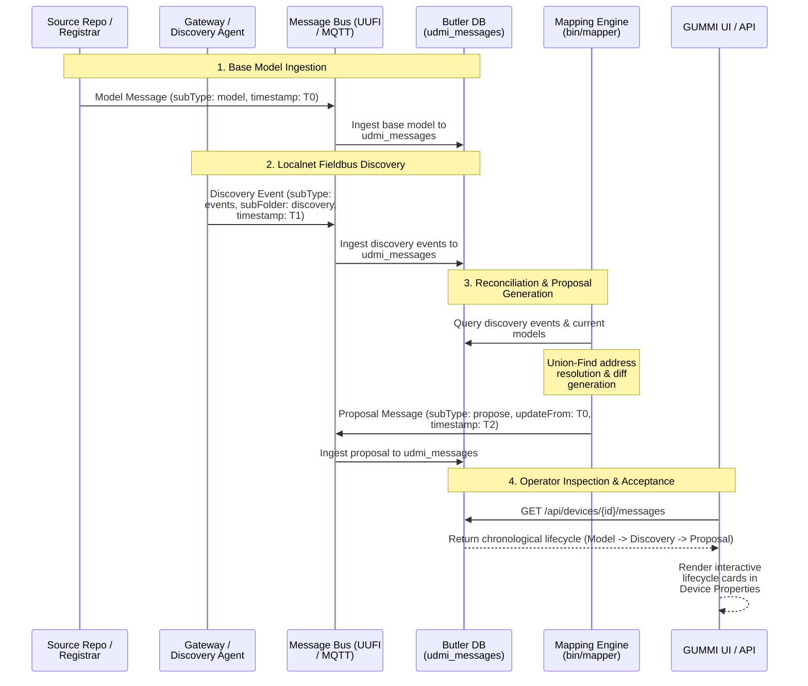

# **GUMMI Discovery & Proposal Management Flow**

## *Author: Trevor Pering, Updated: Aug 23, 2026*

This document specifies the end-to-end device onboarding and configuration reconciliation architecture in GUMMI, integrating the fieldbus discovery pipeline, Butler mapping engine, and GUMMI UI.

---

## 1. Overview & Architectural Goals

In a scaled infrastructure deployment, device integration proceeds through a multi-stage lifecycle:
1. **Authoritative Site Model**: Declarative base model representing known equipment, point mappings, and expected addresses in the source repository.
2. **Fieldbus Discovery**: On-prem scan agents (or gateways like `GAT-123`) discover live hardware on BACnet, IP, or vendor-specific buses.
3. **Reconciliation Mapping**: The Butler mapping engine (`bin/mapper` / `run_mapping()`) compares active discovery data against the base model and produces **proposals** (`subType: "propose"`).
4. **Conflict Prevention via `updateFrom`**: Proposals carry the `updateFrom` timestamp of the base model they were derived from to prevent race conditions or overwriting concurrent human edits.
5. **GUMMI Operator Visibility**: GUMMI visualizes the entire message progression (Base Model → Discovery Event → Reconciled Proposal) in the Device Properties view.

---

## 2. Sequence Diagram



---

## 3. Wire Format & Envelope Specifications

### A. Base Model Message
Published by `registrar` or loaded from repository:
```json
{
  "subType": "model",
  "subFolder": "system",
  "deviceRegistryId": "ZZ-TRI-FECTA",
  "deviceId": "AHU-22",
  "publishTime": "2026-08-20T10:15:30Z",
  "source": "registrar",
  "payload": {
    "version": "1.5.7",
    "timestamp": "2026-08-20T10:15:30Z",
    "system": {
      "location": { "site": "US-SFO-XYY", "room": "Room-204", "floor": "Floor-2" },
      "serial_no": "SN-AHU-22"
    },
    "localnet": {
      "families": {
        "vendor": { "addr": "0x65" }
      }
    }
  }
}
```

### B. Discovery Event
Published by on-prem gateway or discovery node:
```json
{
  "subType": "events",
  "subFolder": "discovery",
  "deviceRegistryId": "ZZ-TRI-FECTA",
  "deviceId": "GAT-123",
  "publishTime": "2026-08-23T14:00:00Z",
  "source": "pubber",
  "payload": {
    "version": "1.5.7",
    "timestamp": "2026-08-23T14:00:00Z",
    "generation": "2026-08-23T14:00:00Z",
    "family": "vendor",
    "addr": "0x68",
    "families": {
      "vendor": { "addr": "0x68" },
      "bacnet": { "addr": "10022" },
      "ipv4": { "addr": "192.168.1.122" }
    }
  }
}
```

### C. Reconciliation Proposal
Published by `bin/mapper` with `updateFrom`:
```json
{
  "subType": "propose",
  "subFolder": "localnet",
  "deviceRegistryId": "ZZ-TRI-FECTA",
  "deviceId": "AHU-22",
  "publishTime": "2026-08-23T14:05:00Z",
  "updateFrom": "2026-08-20T10:15:30Z",
  "source": "butler",
  "transactionId": "TXN-map-01",
  "payload": {
    "version": "1.5.7",
    "timestamp": "2026-08-23T14:05:00Z",
    "families": {
      "vendor": { "addr": "0x68" },
      "bacnet": { "addr": "10022" },
      "ipv4": { "addr": "192.168.1.122" }
    }
  }
}
```

---

## 4. Conflict Prevention Semantics (`updateFrom`)

* **Optimistic Locking**: The `updateFrom` envelope property records the exact `timestamp` of the model message that the proposal was calculated against.
* **Validation at Reconciler**: When an operator or automated workflow applies the proposal, the backend compares `updateFrom` against the target device's active `metadata.json` timestamp:
  * **Match**: The proposal is cleanly applied without conflicts.
  * **Mismatch**: Indicates that the device configuration was modified in the source repository while discovery/mapping was running. The proposal is flagged for operator review rather than blindly overwriting intermediate edits.
* **New Unmatched Devices**: For newly discovered devices (e.g. `UNK-1`), `updateFrom` is empty (`""`).

---

## 5. Database Schema (`udmi_messages`)

Butler captures message traffic into PostgreSQL table `udmi_messages`:

```sql
CREATE TABLE IF NOT EXISTS udmi_messages (
    id SERIAL PRIMARY KEY,
    timestamp TIMESTAMPTZ,
    registry_id TEXT,
    device_id TEXT,
    sub_type TEXT,
    sub_folder TEXT,
    payload JSONB,
    attributes JSONB
);
```

---

## 6. GUMMI UI Integration & Testing

1. **REST Endpoints**:
   * `GET /api/devices/{registry_id}/{device_id}/messages`: Returns the chronological message history for the selected device.
   * `POST /api/mapping/run`: Triggers the mapping demo scenario and seeds the database with the lifecycle records.
2. **Interactive UI View**:
   * Navigate to **Device Properties** -> **Message Lifecycle (Model → Discovery → Proposal)**.
   * Click **⚡ Seed Mapping Lifecycle** to dynamically generate and visualize proposals.
3. **Automated Testing**:
   * Run `bin/test_gummi` to execute the standalone pytest suite ([`gummi/tests/test_mapping.py`](file:///home/peringknife/udmi/gummi/tests/test_mapping.py)).
