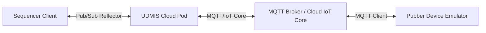

# UDMI Component Architecture and Message Flow Guide

This guide provides a complete mapping of all UDMI (Universal Device Management Interface) components, their individual roles, and the data pathways that connect them. Understanding these boundaries is critical for debugging distributed failures.

---

## 1. Architectural Component Overview

The UDMI ecosystem consists of four core components interacting asynchronously across different networking boundaries:

### 1. The Sequencer (`validator`)
*   **Role:** The automated test harness that drives validation. It connects as an administrative client to the cloud messaging layer.
*   **Execution Model:** Runs sequential tests (e.g., `broken_config`, `system_last_update`) by modifying the target device's configuration and waiting for the device to publish its corresponding state changes.
*   **Behavior:** Initiates a session-wide **Base Transaction ID** (e.g., `RC:12a3b4`) and attaches incrementing suffixes to every transaction. It times out if expected changes do not propagate within set limits (usually 60 seconds).

### 2. UDMIS (`udmis`)
*   **Role:** The cloud-side middleware pod. It acts as a bridge, translator, and control plane router.
*   **Execution Model:** Listens to reflector messages from the Sequencer and routes them to the physical cloud registry/device provider. It also intercepts telemetry, config updates, and state acknowledgments coming from devices, translating them to and from standard UDMI envelopes.
*   **Key Routing Feature:** Employs a dynamic routing provider resolver (`DynamicIotAccessProvider`). It maintains a global registry affinity cache in-memory to resolve reply pathways.

### 3. The MQTT Broker / IoT Provider
*   **Role:** The ingestion and message transport layer.
*   **Execution Model:** Can be an emulator (like Mosquitto broker on `localhost`) or a cloud service (like Google Cloud IoT Core, ClearBlade, etc.). 
*   **Impact:** Manages the pub/sub channels and topic queues. Note that messaging ordering is **not guaranteed** on distributed Pub/Sub channels.

### 4. Pubber (`pubber`)
*   **Role:** The reference virtual device emulator.
*   **Execution Model:** Simulates a physical building device (e.g., AHU, VAV). It connects via MQTT, listens to `/config` updates, acts on them (simulating firmware delays or telemetry state changes), and publishes `/state` and `/event` messages.
*   **Physical Device vs. Emulator:** When tests run against actual hardware, Pubber is replaced by the real physical gateway/controller, meaning Pubber logs won't be present in the support packages.

---

## 2. Logical Data Pathways

UDMI messages are divided into three primary schemas, all transmitted as JSON payloads within standard envelopes:

### 1. Configuration (`config`)
*   **Flow:** `Sequencer` $\rightarrow$ `UDMIS` $\rightarrow$ `Broker` $\rightarrow$ `Pubber/Device`
*   **Purpose:** Administrative commands sent to the device (e.g., changing logging levels, scanning points, resetting the device).
*   **Schema Path:** `schema/config.json`

### 2. State (`state`)
*   **Flow:** `Pubber/Device` $\rightarrow$ `Broker` $\rightarrow$ `UDMIS` $\rightarrow$ `Sequencer`
*   **Purpose:** The device's current structural state, published automatically upon boot, or as an acknowledgment echo within 10 seconds of receiving any config update.
*   **Schema Path:** `schema/state.json`

### 3. Events (`event`)
*   **Flow:** `Pubber/Device` $\rightarrow$ `Broker` $\rightarrow$ `UDMIS` $\rightarrow$ `Sequencer` (validation queue)
*   **Purpose:** Continuous telemetry updates, such as sensor readings (`pointset`), log messages (`system`), or debug files (`blobset`).
*   **Schema Path:** `schema/pointset.json`, `schema/system.json`

---

## 3. Component Mapping Reference

When triaging a failure, treat these paths as **primary entry points and control pipelines** to start your investigation. Bugs and failures can also originate in shared utility libraries, specific test sequence definitions, or structural schemas.

### 1. Core Framework Pipelines (Primary Entry Points)
*   **Sequencer Engine Framework:** `validator/src/main/java/com/google/daq/mqtt/sequencer/`
    *   `SequenceRunner.java`: Orchestrates test execution and teardown.
    *   `SequenceBase.java`: Core wait loops, assertions, and configuration synchronization logic.
*   **UDMIS Pod Infrastructure:** `udmis/src/main/java/com/google/bos/udmi/service/`
    *   `pod/UdmiServicePod.java`: Pod entry point and messaging pipeline initialization.
    *   `processor/ReflectProcessor.java`: Manages reflection message validation and transaction routing.
    *   `core/DynamicIotAccessProvider.java`: Resolves transport providers and maintains dynamic routing caches.
*   **Pubber Emulator:** `pubber/src/main/java/daq/pubber/`
    *   `Pubber.java`: Manages MQTT connection cycles, command polling, and emulator loops.
    *   `Configuration.java`: Parses incoming configuration JSON updates and triggers state echoes.

### 2. Test-Specific Logic
*   **Test Sequence Files:** `validator/src/main/java/com/google/daq/mqtt/sequencer/sequences/`
    *   Contains individual test definitions (e.g., `ConfigSequences.java`, `PointsetSequences.java`, `SystemSequences.java`).
    *   *Failure Clue:* If a test asserts a sequence of actions unique to that test case, look directly inside these subclasses.

### 3. Shared Code & Schema Boundaries
*   **Common Utilities & Data Models:** `common/src/main/java/com/google/daq/mqtt/util/`
    *   Contains shared tools, environment parsing, cryptography, and JSON parsing helpers.
    *   *Failure Clue:* Look here for parsing errors, message envelope construction failures, or cryptographic signature mismatches.
*   **UDMI JSON Schemas:** `schema/`
    *   Houses standard UDMI definitions (e.g., `config.json`, `state.json`, `pointset.json`).
    *   *Failure Clue:* Schema violations and validation errors usually point to mismatching properties or illegal types defined in these schemas.

