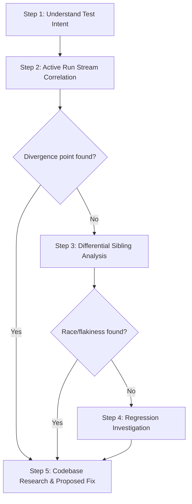

# Progressive Sequential Triage Flow

This guide outlines the mandatory, logical, and progressive steps that the Mantis Triage Agent must follow during failure investigation. By progressing from basic log correlation to codebase research, and escalating to differential baseline analysis only when needed, you prevent recursive codebase loops and ensure highly logical root-cause isolation.

---

## The 5-Step Progressive Triage Pipeline

You MUST execute your diagnostic queries in this exact chronological order:

### STEP 1: UNDERSTAND TEST INTENT
- Start by reading the local test execution details to understand the specific intent of the failing test.
- **CRITICAL SEMANTIC 1: Intentional Failures & Corrupted Configs.**
  - Tests like `broken_config` or `extra_config` intentionally dispatch invalid, malformed, or out-of-schema JSON configuration payloads to verify that the device/gateway catches and reports the parsing error.
  - In these tests, the resulting `JsonParseException` (`Unexpected character 'b'`), `Level.ERROR` logs, and configuration schema violations are **fully expected and intentional**. Do NOT treat these expected exceptions as bugs!
- **CRITICAL SEMANTIC 2: Options & Expected Capability Failures.**
  - Pubber is started with specific testing option flags (e.g., `badLevel`, `badCategory`) defined in `etc/test_itemized.in`.
  - Under these options, specific schema violations (such as log levels being `0` which is below the minimum `100`) and capability checks (like `Logging` or `Status` checks) are **expected to fail**. These are recorded as expected failures/skips in the golden files (`etc/*.out`).
- **CRITICAL SEMANTIC 3: Stable Outcome vs. Sync Timeout.**
  - If an `ALPHA` capability fails, the test can still cleanly pass the `STABLE` outcome (completing part of the sequence, e.g. `8/10`).
  - If the test terminates with `STABLE 0/10` due to a `Failed waiting until config update synchronized: last_config not synced in state` or `Timeout waiting for initial device state`, this is a **real, unexpected infrastructural failure** (such as a deadlocked transport channel or a dropped state packet), NOT an expected test output!
- If you need codebase context to clarify the test's design, perform a single targeted read of the test sequence definition file (e.g., `DiscoverySequences.java` or `SystemSequences.java` under `validator/src/`) to verify what actions are expected.

### STEP 2: ACTIVE RUN STREAM CORRELATION
- Correlate all provided active log streams within the time-padded window (Sequencer logs, UDMIS logs, Gateway/Mosquitto log events, Pubber/Device logs).
- Align all logs chronologically based on their ISO timestamps.
- Trace all asynchronous request/response transactions across component boundaries using correlation transaction IDs (such as `RC:xxxxxx` session base keys).
- Ascertain if every Sequencer action had the appropriate, timely reaction from UDMIS and from the Emulator Device.
- **Rule**: Normally, you should be able to identify a clear divergence point or failure symptom here. If a problem (logic bug, unexpected error, or bad packet) is apparent, **stop the sequential sweep** and proceed directly to **Step 5 (Codebase Research & Proposed Fix)** to reason about the code. Do not run unnecessary sister-run queries.

### STEP 3: DIFFERENTIAL SIBLING RUN ANALYSIS (IF BUG IS NOT APPARENT)
- If the active logs do not reveal any obvious coding bugs, refer to the `## Reference Successful Run Details` section to see sibling runs where the exact same test passed.
- Perform a side-by-side, chronological comparison of the failed run trace against the successful run trace.
- Identify exactly where the failed run trace diverged from the successful run baseline (e.g., did a state packet arrive out-of-order? did a network response arrive too late?).
- Use this differential log correlation data to reason about hidden race conditions, temporal dependencies, or flakiness in the multithreaded channels.

### STEP 4: REGRESSION INVESTIGATION (IF SIBLING RUNS ARE STALE)
- If a successful baseline run is available but is old/stale, a recent codebase commit might have introduced a regression. You may query recent git commits using `git_read_operations` to inspect recent path changes.
- **CRITICAL SINGLE-RUN EXCEPTION:** If only a single run is under triage and **NO** successful sibling baseline is available (marked as `[No successful reference runs...]`), this step must be bypassed completely. You are strictly FORBIDDEN from calling `git_read_operations` as git history checks are meaningless without a baseline to compare against. Focus entirely on logs and codebase grep instead.

### STEP 5: CODEBASE RESEARCH & PROPOSED FIX
- Once the defect is isolated, search for the corresponding logic blocks in the source files (e.g. `SequenceBase.java`, `ReflectProcessor.java`, `MessagePublisher.java`) using the codebase investigation techniques in `evidence_gathering.md`.
- Formulate your concise, drop-in source code proposed fix (presented as a standard unified diff block) that resolves the defect.
