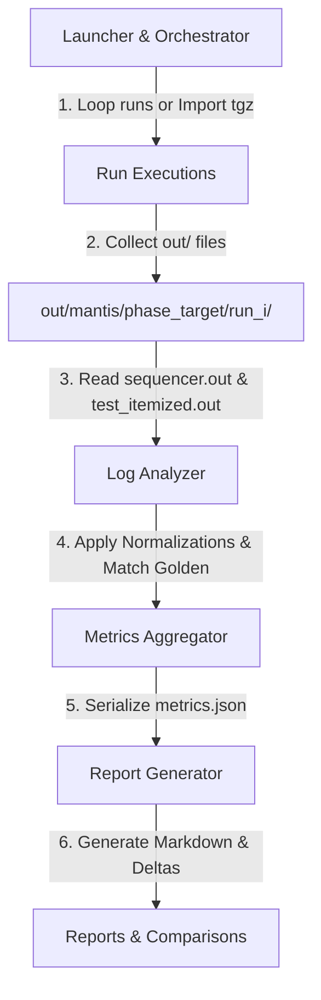

# 🦗 Claws of Stability: Mantis Raptorial Claws Technical Spec

This document serves as the technical specification and engineering source of truth for **Mantis Raptorial Claws** (the stability and flakiness tracker of Project Mantis).

---

## 1. Goal & Overview

The goal of **Mantis Raptorial Claws** is to grasp, execute, and measure the stability of the UDMI test suite over multiple iterations. It detects flaky tests (tests that pass or fail inconsistently across runs) in both local sandbox environments and sharded GitHub Actions CI environments.

---

## 2. Architecture & System Design

Raptorial Claws consists of four modular components working in harmony:



### 2.1. Component Overview:
1. **Launcher (`bin/measure`)**:
   A bash script that manages virtualenv activation, checks requirements, establishes file execution permissions, and executes the Python core.
2. **Orchestrator (`src/orchestrator.py`)**:
   The controller. Manages the local iteration loop (cleaning pubbers/caches between runs) or scans/processes downloaded GitHub support bundles.
3. **Analyzer (`src/analyzer.py`)**:
   The brain. Loads golden reference baselines, normalizes dynamic fields in run outputs, and categorizes results as "Expected Behavior" (Pass) or "Unexpected Behavior" (Actual Failure).
4. **Reporter (`src/reporter.py`)**:
   The voice. Produces markdown reports showing aggregated flakiness ratios. Auto-generates stabilization comparison reports when running the `after` phase with `before` data present.

---

## 3. Core Algorithmic Rules

### 3.1. Actual Failures vs. Intended Failures
In the UDMI test suite, some failure scenarios are part of the expected test design. To accurately classify stability, Mantis compares run results directly to **Golden Baselines** (`etc/sequencer.out` and `etc/test_itemized.out`):

- **Normalizations**:
  Before doing any comparison, Mantis applies regex-based normalizations:
  - Replaces variable ISO timestamps (`202[-0-9T:]+Z`) with `'TIMESTAMP'`.
  - Redacts variable error details in pipeline errors (`Pipeline type event error: While processing message .*`) keeping only the prefix and `REDACTED`.
- **Sequential Occurrence-Based Matching**:
  Because the same test case can run multiple times under different parameters (e.g. `broken_config` or `valid_serial_no`), Mantis keeps track of the occurrence index of each test. The $n$-th occurrence of a test in a run is compared exactly to the $n$-th occurrence of that test in the golden baseline.
- **Pass vs Actual Fail**:
  - If the normalized result matches the corresponding normalized baseline result (even if the outcome is `fail` or `skip`), the test is marked as **Pass (Expected Behavior)**.
  - If there is any mismatch or a test is missing, it is marked as an **Actual Failure (Instability / Regression)**.

---

## 4. Implementation Specifications

### 4.1. Input Arguments
| Argument | Type | Default | Description |
| :--- | :--- | :--- | :--- |
| `--target` | `string` | **Required** | The target system specification (e.g. `//mqtt/localhost`, `//gbos/bos-platform-dev/faucetsdn`). |
| `--iterations` | `int` | `10` | Number of local iterations to run. |
| `--phase` | `"before"` or `"after"` | `"before"` | Exercise stage (used for report folders and auto-comparison triggering). |
| `--suite` | `"sequencer"`, `"itemized"`, `"both"` | `"both"` | Which suite to run. |
| `--tests` | `string` | `None` | Comma-separated list of specific sequencer tests to run (saves execution time). |
| `--github-dir` | `string` | `None` | Folder containing `udmi-support_*.tgz` archives downloaded from GitHub runs (triggers CI Import mode). |
| `--output-dir` | `string` | `out/mantis` | Folder where all iteration logs and final reports are saved. |

### 4.2. Data Structures
Aggregated test metrics are serialized to JSON under `metrics_<target>_<phase>.json`:
```json
{
  "sequencer:system:valid_serial_no:0": {
    "test_suite": "sequencer",
    "type": "RESULT",
    "category": "system",
    "test_name": "valid_serial_no",
    "occurrence": 0,
    "total_runs": 10,
    "pass_count": 8,
    "fail_count": 2,
    "raw_pass": 8,
    "raw_fail": 2,
    "raw_skip": 0,
    "pass_rate": 80.0,
    "flaky": true,
    "expected_outcome": "pass",
    "expected_reason": "Sequence complete"
  }
}
```

---

## 5. Verification & Smoke Test Details

During engineering, the tracker was verified locally against `//mqtt/localhost` in two phases:

### 5.1. Phase 1: Before Phase Smoke Test
- **Command**:
  ```bash
  mantis/bin/measure --target //mqtt/localhost --iterations 2 --phase before --suite sequencer --tests valid_serial_no
  ```
- **Behavior**:
  - Built components.
  - Executed `bin/test_sequencer clean nocheck` and `bin/test_sequencer alpha nocheck` for 2 loops.
  - Extracted results, normalized timestamps, and generated `out/mantis/flakiness_report_before_mqtt_localhost.md`.
  - Recorded 7 test cases as 100% stable matching golden.

### 5.2. Phase 2: After Phase Smoke Test & Comparison
- **Command**:
  ```bash
  mantis/bin/measure --target //mqtt/localhost --iterations 2 --phase after --suite sequencer --tests valid_serial_no
  ```
- **Behavior**:
  - Completed loops successfully.
  - Discovered `metrics_mqtt_localhost_before.json` in the output directory.
  - Instantly calculated deltas and compiled `out/mantis/stability_comparison_mqtt_localhost.md`.
