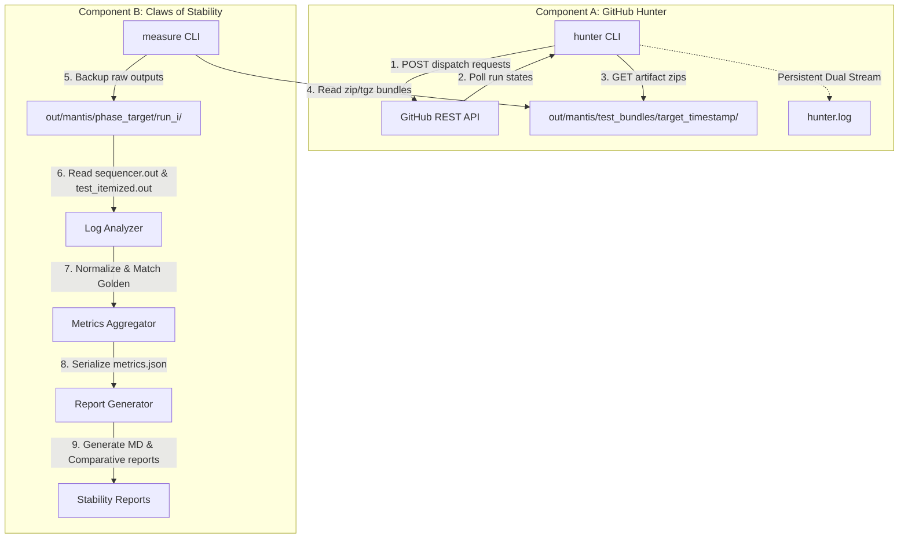

# 🦗 Claws of Stability: Mantis Raptorial Claws Technical Spec

This document serves as the technical specification and engineering source of truth for **Mantis Raptorial Claws** (the stability and flakiness tracker of Project Mantis).

---

## 1. Goal & Overview

The goal of **Mantis Raptorial Claws** is to grasp, execute, and measure the stability of the UDMI test suite over multiple iterations. It detects flaky tests (tests that pass or fail inconsistently across runs) in both local sandbox environments and sharded GitHub Actions CI environments.

Following the Unix philosophy of clean separation of concerns, the stability tracking workflow is split into two independent components:
1. **GitHub Hunter (`hunter`)**: A standalone automation utility to trigger, monitor, and download parallel CI runs.
2. **Raptorial Claws Tracker (`measure`)**: A flakiness metrics engine that computes overall stability ratios and compares phase deltas.

---

## 2. Architecture & System Design

---

## 3. Core Algorithmic Rules

### 3.1. Actual Failures vs. Intended Failures
In the UDMI test suite, some failure scenarios are part of the expected test design. To accurately classify stability, Mantis compares run results directly to **Golden Baselines** (`etc/sequencer.out` and `etc/test_itemized.out`):

- **Normalizations**:
  Before doing any comparison, Mantis applies regex-based normalizations:
  - Replaces variable ISO timestamps (`202[-0-9T:]+Z`) with `'TIMESTAMP'`.
  - Redacts variable error details in pipeline errors (`Pipeline type event error: While processing message .*`) keeping only the prefix and `REDACTED`.
- **Sequential Occurrence-Based Matching**:
  Because the same test case can run multiple times under different parameters, Mantis keeps track of the occurrence index of each test. The $n$-th occurrence of a test in a run is compared exactly to the $n$-th occurrence of that test in the golden baseline.
- **Pass vs Actual Fail**:
  - If the normalized result matches the corresponding normalized baseline result (even if the outcome is `fail` or `skip`), the test is marked as **Pass (Expected Behavior)**.
  - If there is any mismatch or a test is missing, it is marked as an **Actual Failure (Instability / Regression)**.

---

## 4. Implementation Specifications

### 4.1. GitHub Hunter (`hunter`) Specifications
- **Authentication**: Authenticates with the GitHub REST API using a Personal Access Token (PAT) loaded from the `GITHUB_TOKEN` environment variable.
- **Git Auto-Discovery**: Parses `git remote -v` to resolve the repository owner and name. Runs `git branch --show-current` to identify the active branch.
- **Parallel Dispatch**: Fires $N$ parallel POST requests to `/dispatches` on the manual `testing.yml` workflow, passing the custom `target_project` as an input.
- **Resilient Tracking**: Fetches the baseline latest run ID before dispatching, then tracks only the newly spawned workflow runs (with IDs greater than the baseline).
- **Live Polling Console**: Displays real-time counts of Queued, In-Progress, Successful, Failed, and Cancelled runs.
- **Timestamped Defaults**: If `--output-dir` is not specified, it automatically generates a unique, non-overlapping timestamped directory:  
  `out/mantis/test_bundles/<target_clean>_%Y%m%d_%H%M%S/`
- **Persistent Logging (Tee Stream)**:
  All print statements and console logs are mirrored live to `hunter.log` inside the timestamped directory using a custom Python unbuffered dual-output stream (`Tee`).
- **Default Background Mode (Safe Daemon)**:
  To safeguard against terminal window closure or SSH disconnections during long-running 30-40 minute CI jobs, **the launcher wrapper runs in the background by default** using `nohup` and unbuffered redirects (`python3 -u`). It prints the background PID and tail instructions, allowing developers to safely disconnect.
- **Verbose Mode (`--verbose`)**:
  Disables default backgrounding, executing the Python hunter in the foreground interactive terminal, showing the live dispatch triggers and polling status logs.

### 4.2. Raptorial Claws Tracker (`measure`) Specifications
- **Input Loading**: Can run a local execution loop OR load sharded zip/tgz bundles from a folder specified by `--bundles-dir`.
- **Cache Isolation**: For local loops, wipes execution caches and forcefully terminates lingering pubber processes to prevent cross-run side effects.
- **Data Aggregation**: Aggregates outcomes into pass rates and flags tests with pass rates between $0\%$ and $100\%$ as **Flaky**.
- **Before vs After Deltas**: Reads the target's baseline metrics when running in the `after` phase to produce an impact comparison table calculating exact improvement/regression stats.

---

## 5. Verification & Smoke Test Details

During engineering, the automated standalone components were successfully verified:

1. **Argument Parsing Help Check**:
   - Command `mantis/bin/hunter --help` and `mantis/bin/measure --help` both execute cleanly, verifying imports, file structures, and standard library arguments.
2. **Environment Validation Check**:
   - Running `mantis/bin/hunter` without `GITHUB_TOKEN` exits gracefully with an explicit exit code 1 and diagnostic instructions.
3. **Default Background Mode Verification**:
   - Running `GITHUB_TOKEN=dummy_token mantis/bin/hunter` creates the output folder, launches in the background by default, prints the PID and log tail details, and outputs execution exceptions live to `hunter.log`.
4. **Foreground Verbose Mode Verification**:
   - Running `GITHUB_TOKEN=dummy_token mantis/bin/hunter --verbose` runs cleanly in the foreground terminal, displaying error diagnostics instantly without detaching.
