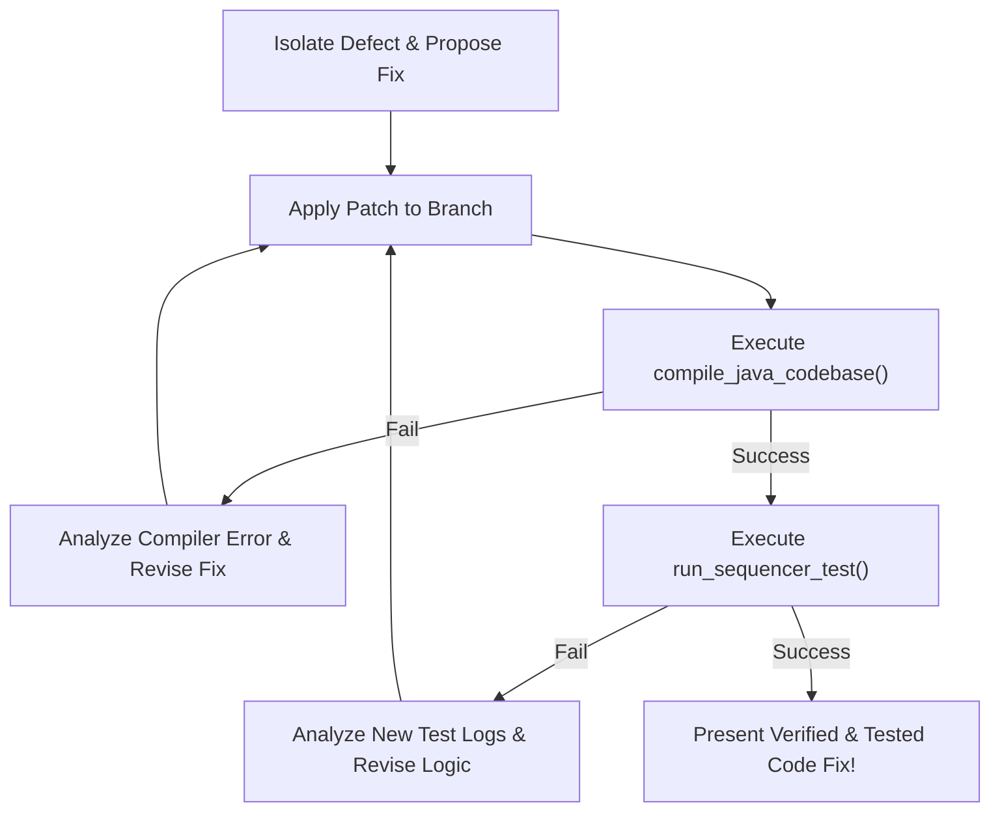

# Presentation: Evolution of an AI Debugging Agent
## *Iterative Lessons in Systems Engineering for the Mantis Diagnostic Harness* 🦗👁️

This document compiles a highly technical, premium-grade set of talking points and slide outlines for a presentation to a Software Engineering (SWE) group. It chronicles the real-world defects we saw, the structural breakthroughs we engineered, and the general design principles established while building and refining the **Mantis Triage & Diagnostic Harness** (`mantis/diagnose`).

---

## Slide 1: The Vision — Automated Distributed Defect Triage

### 📌 The Core Problem:
* Debugging distributed, asynchronous test suites is a major developer tax.
* When parallel sequencer tests fail, engineers are forced to comb through multiple interleaved log streams (Validator Sequencer console, Pubber device emulators, UDMIS cloud message processors, and MQTT brokers) across sharded execution runners.
* Diffs are ineffective because timestamps, runtime thread names, and transaction hashes vary on every run.

### 🏆 The Mantis Goal:
* Build a completely automated, zero-configuration triage predator:
  1. **Ingest & Unpack**: Automatically consume manually downloaded support packages.
  2. **Evaluate**: Side-by-side compare logs against Golden Baselines to calculate flakiness.
  3. **Diagnose**: Bind an AI debugging agent equipped with git history mining, codebase searches, and log correlation tools to isolate the exact defect breakpoint.
  4. **Fix**: Propose a validated, tested code modification directly to the developer.

### 🔊 Speaker Notes:
* *"Building a production-grade diagnostic agent is not a prompt-engineering exercise. It is a hard systems-engineering challenge. Pleading with LLMs in prompt templates is fragile and does not scale."*
* *"Over several iterations, we saw consistent agent failure modes: cognitive overload, context confusion, rate-limit exhaustions, and silent sharding log overwrites."*
* *"We solved these issues by applying core software design principles (Decoupling, Pipeline Segregation, Context Stripping, and Manual Loop Interception). Let's walk through the case studies and architectural breakthroughs."*

---

## Slide 2: Case Study 1 — Monolithic Overload & The Multi-Stage Split

### 📌 Technical Challenge:
* **The Anti-Pattern:** Tasking a single LLM agent with reading raw logs, harvesting chronology, executing codebase searches, analyzing concurrency logic, and writing code fixes in a single, massive conversational turn loop.
* **The Failure Mode (Cognitive Overload):** The model frequently skipped logging intermediate chronological steps, got distracted by verbose stack traces, jumped to premature conclusions, or prematurely exited using safety guardrails.

### 🛠️ The Architectural Fix:
* **The Two-Stage Sequential Pipeline Split:** Decouple **data harvesting** from **deep diagnostics**:

```
┌───────────────────────────────┐      timeline.md      ┌────────────────────────────────┐
│  Stage 1: Timeline Harvester   │ ───────────────────▶ │    Stage 2: Defect Analyst     │
└───────────────────────────────┘                       └────────────────────────────────┘
 - Sole Purpose: Chronology      - strictly objective    - Sole Purpose: Diagnostics & Fix
 - Banned from speculation       - saved to disk         - Reads timeline verbatim
 - Low-overhead log tools                                - Deep code grep & Git tools
```

* **Why it works:** Decoupling concerns saves token bandwidth and maximizes model accuracy. The Timeline Harvester focuses 100% of its capacity on objective chronology. The Defect Analyst then inherits this clean timeline verbatim, freeing its reasoning capacity to focus entirely on codebase research and unified diff patching.

---

## Slide 3: Case Study 2 — Context Confusion & Python Context Stripping

### 📌 Technical Challenge:
* **The Problem:** To perform "Differential Analysis," the agent is supplied with successful baseline logs (golden sibling reference runs) to compare side-by-side against the failed active execution traces.
* **The Failure Mode (Context Confusion):** When both failed active logs and successful baseline logs were passed in the initial prompt payload, the Harvester merged them. It took timestamps from the successful sibling run (which passed) and injected them into the timeline of the failed run, incorrectly claiming that the failed run succeeded.

### 🛠️ The Architectural Fix:
* **Python-Level Context Stripping:** Instead of pleading with the model in the prompt to ignore the reference details during timeline harvest, we physically strip the context in Python before feeding the payload to Stage 1:
```python
# Physically remove sibling details from Harvester input
clean_payload = prompt_payload.split("## Reference Successful Run Details")[0]
```
* **Why it works:** Cognitive noise is eliminated at the source. By physically stripping the successful baseline from the Harvester's input, it is mathematically impossible for the model to confuse timestamps, guaranteeing a 100% accurate timeline.

---

## Slide 4: Case Study 3 — Shard Overwrites & The Smart Collision Copier

### 📌 Technical Challenge:
* **The Problem:** To speed up executions, UDMI tests are sharded across parallel virtual machine runners (e.g. Shard 5 executes `broken_config` and fails at `16:04:17`, Shard 9 executes a skipped occurrence at `16:02:22`). When consolidating these parallel shards into a single run backup folder, if multiple shards execute the same test ID, they collide on:
  `devices/AHU-1/tests/broken_config/sequence.log`
* **The Failure Mode (Silent Overwrites):** Legacy copy scripts resolved collisions by keeping the larger file size. Because the skipped/passing run had standard logging warnings, it was evaluated as larger, **silently overwriting the failing log with the passing log**, completely blinding the triage agent from the defect.

### 🛠️ The Architectural Fix:
* **Smart Collision Copier (`smart_copy_sequence_logs`)**:
  We implemented a recursively walking merge copier. When `sequence.log` collisions occur, it reads both files and applies a priority heuristic:
```python
src_has_fail = "RESULT fail" in src_content or "ERROR" in src_content
dest_has_fail = "RESULT fail" in dest_content or "ERROR" in dest_content

if src_has_fail and not dest_has_fail:
    shutil.copy2(src_file, dest_file) # Keep the failure!
elif len(src_content) > len(dest_content):
    shutil.copy2(src_file, dest_file) # Keep the longer/more detailed log!
```
* **Why it works:** This guarantees that critical failed execution traces are always preserved and never lost due to parallel shard overwrites.

---

## Slide 5: Case Study 4 — Zero-Configuration CLI & Metadata Auto-Discovery

### 📌 Technical Challenge:
* **The Problem:** Early versions of the diagnostics tool required the developer to supply verbose inputs: `--target //mqtt/localhost`, `--site-dir sites/udmi_site_model`, and `--run-dir mantis/out/.../run_1`.
* **The Failure Mode:** High developer friction. If a developer manually downloaded a raw support bundle from CI, they had to extract it, resolve the site model metadata manually, locate the device ID, and pass 4 different flags to trigger triage.

### 🛠️ The Architectural Fix:
* **Zero-Configuration Metadata Discovery**:
  We updated the entrypoint main scripts to auto-discover target specifications, site models, and device IDs directly from directory name conventions and extracted file trees:
  * **Target Spec**: Auto-detected by parsing directory path segments (e.g., `staging_mqtt` ➔ `//staging/mqtt`).
  * **Site Model**: Auto-matched by scanning `sites/` for target prefixes.
  * **Device ID**: Discovered dynamically by scanning `out/devices/` folders inside the run.
  * **Unified Path Resolution**: Supports both standard extracted directories (`run_1/out/devices/`) and local active workspace folders (`devices/`).

---

## Slide 6: Case Study 5 — The Developer Entrypoint: Unified One-Command Triage

### 📌 Technical Challenge:
* **The Problem:** Developers had to run Step 1 (Stability metric evaluator) and Step 2 (AI diagnostics triage) as completely separate shell script processes.
* **The Failure Mode:** High context-switching tax. If a developer wanted to triage a single manually downloaded zip bundle, they had to run the evaluator, find the metrics output, locate the failure name, and then run the diagnose script.

### 🛠️ The Architectural Fix:
* **Unified Triage Utility (`bin/triage <bundle_path>`)**:
  Created the single master entrypoint wrapper. It accepts a zip, tgz, or directory, automatically sets up a workspace, processes telemetry logs, and triggers diagnostics end-to-end.
* **Targeted Test Triage (`-t` / `--test`)**:
  Added targeted execution. Developers can pass `-t broken_config` to bypass metrics scanning, isolate only that test case's occurrences, and run AI diagnostics instantly.

---

## Slide 7: Case Study 6 — Progressive Disclosure & The Agent Skills SDK

### 📌 Technical Challenge:
* **The Problem:** The agent is guided by custom engineering guidelines (progressive triage flows, log correlation maps, evidence gathering rules). Tasking the agent with reading these long instruction documents consumed massive context tokens on *every single request*.
* **The Failure Mode:** Fast token-window bloat, leading to rate limiting and high conversational cost.

### 🛠️ The Architectural Fix:
* **Asynchronous Skill Registry**:
  We programmatically integrated the official **Agent Skills SDK** (`agentskills-core` and `agentskills-fs`).
* **Folder-Based Skills Structure**:
  Restructured guidelines into compliant folders containing YAML frontmatter `SKILL.md` files:
  ```yaml
  ---
  name: progressive-triage-flow
  description: The mandatory progressive step-by-step debugging workflow.
  ---
  ```
* **XML Catalog Injection & Progressive Disclosure**:
  The harness batch-registers the skills folder on startup, injecting a lightweight XML catalog:
  ```xml
  <available_skills>
    <skill>
      <name>progressive-triage-flow</name>
      <description>The mandatory progressive step-by-step debugging workflow.</description>
    </skill>
  </available_skills>
  ```
* **Why it works:** The system prompt remains exceptionally lightweight. The agent reads the catalog, and dynamically decides when to use its `read_file_lines` tool to progressively disclose and read the full detailed instruction file *only when needed*.

---

## Slide 8: Case Study 7 — Inside the Black Box: Manual Loop Interception

### 📌 Technical Challenge:
* **The Problem:** Standard GenAI automatic function calling executes tool-calling loops entirely in the background, returning only the final output.
* **The Failure Mode:** Developers are left in the dark. They see no progress, cannot see the agent's reasoning, and cannot verify if the agent got stuck in a loop. Additionally, rapid tool requests easily trigger `429 RESOURCE_EXHAUSTED` rate limits.

### 🛠️ The Architectural Fix:
* **Manual Turn Interception (`types.Content` loop)**:
  We disabled automatic function calling and manually orchestrated the conversational history:
```python
while loop_count < max_loops:
    response = client.models.generate_content(model="gemini-3.1-pro-preview", contents=history, config=config)
    
    # Capture and log agent thoughts live!
    for part in response.candidates[0].content.parts:
        if part.text:
            print(f"\n🧠 [Agent Thought]:\n{part.text.strip()}\n")
```
* **Live Console Output**: Prints the agent's thoughts and decisions (`🤖 [Agent Decision]: Calling tool '<name>' with args: ...`) in real-time!
* **Double-Layered Rate Limit Protection**:
  * **Pacing Throttler**: Sleeps for **4 seconds** between turns.
  * **Exponential Backoff**: Catches `429` exceptions and retries up to 5 times (4s, 8s, 16s, 32s, 64s).

---

## Slide 9: General Systems Engineering Principles for AI Agents

> [!IMPORTANT]
> **Principle 1: Programmatic Harness Validation over Prompt Pleading**
> Do not rely solely on prompt instructions to enforce output formats or prevent early loop-bailing. Enforce them programmatically inside the Python driver harness (e.g., intercept bailing and append a reminder to history). The driver harness must act as a strict validator of the agent's runtime state.

> [!TIP]
> **Principle 2: Physical Context Stripping over Prompt Ignoring**
> If an LLM gets confused by a segment of context during a specific phase, do not plead with it in the prompt to ignore it. **Strip it physically in Python.** Keep the prompt context clean and highly specialized for each execution block.

> [!WARNING]
> **Principle 3: Generalized Comparative Axioms over Hardcoding Ignore Lists**
> Avoid hardcoding lists of specific errors or legacy messages to ignore. Instead, provide the model with relational rules (such as side-by-side baseline comparative subtraction) to let it organically filter out noise.

> [!NOTE]
> **Principle 4: Progressive Disclosure for Token Optimizations**
> Avoid stuffing large instruction sets or schemas into the system prompt. Map them as portable, registered Skills, and inject a lightweight XML catalog. Let the agent dynamically choose when to read them from the disk.

---

## Slide 10: The Roadmap — Sandboxed Active Verification Loops

The future of Mantis is shifting the agent from a **Passive Reader** to an **Active Verifier**:



* **Active Code Compilation**: Binding `compile_java_codebase()` and `run_sequencer_test()` tools directly to the agent.
* **The Self-Correction Loop**: The agent writes the patch to the workspace, compiles it, checks for errors, runs the test case, and iterates recursively until the test successfully passes—delivering a **100% tested and verified code fix** directly to the developer.
