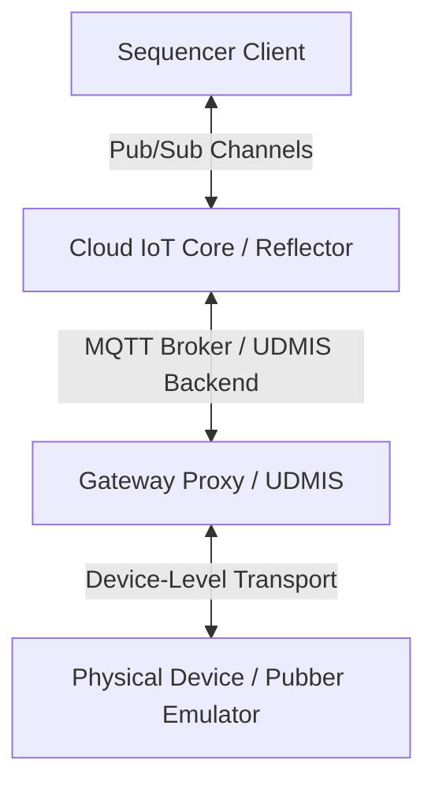

# UDMI Telemetry Correlation & Chronological Log Debugging Guide
**Submodule**: `mantis/docs/` | **Target**: Triage Engineers & Mantis AI Triage Agent

This document outlines the formal engineering patterns, logs architectures, and logical trace signatures necessary to diagnose failures in UDMI-compliant systems.

---

## 1. Distributed Telemetry Architecture & Logs Catalog

A UDMI test run generates asynchronous logs across multiple decoupled layers of the distributed system. 



### 1.1. The Log Streams
1. **Local Sequencer log.md (`sequence.md`)**:
   - High-level, human-readable markdown execution steps.
   - Documents precise steps, expected vs actual states, and assertion checkpoints.
2. **Local Sequencer Console Log (`sequence.log`)**:
   - Detailed developer-level execution log showing outgoing configurations, incoming state/events updates, and local synchronisation checks.
3. **Global UDMIS Service Log (`udmis.log`)**:
   - Trace logs of the global broker backend.
   - Documents message sharding, target/reflector mapping, and database updates.
4. **Global Pubber Log (`pubber.log`)**:
   - Internal device/emulator console traces (absent on physical staging devices).
   - Documents config handler updates, state updates, and internal exception stack traces.

---

## 2. The Binding Key: Session Base Transaction ID (`RC:XXXXXX`)

Every Sequencer test case initiates a unique **Session Base Transaction ID** (e.g., `RC:564a12`).
- This transaction ID is propagated inside the payload envelope of every config update issued during the test run.
- When UDMIS or the Device acknowledges a configuration update, it must echo back the transaction ID.
- **Log Correlation Rule**: Search for the transaction ID (`RC:xxxxxx`) across all global log files (`sequence.log`, `udmis.log`, `pubber.log`) to filter out unrelated background traffic and reconstruct the precise sequence of events.

---

## 3. Common Failure Signatures & RCA Archetypes

### 3.1. The Distributed Config-State Regression Race
- **Symptom**: Sequencer times out waiting for `last_start` or pointset synchronization.
- **Signature**:
  - Outgoing config transaction `RC:xxxxxx.00000004` sets `last_start = 1970-01-01T00:01:13Z`.
  - UDMIS receives physical boot state from the device, updates registry config version to true boot time (`2026-05-13T14:16:09Z`), and publishes reflected config `PS:xxxxxxxxx`.
  - Pub/Sub delivers the messages **out-of-order**: The Sequencer processes the *newer* reflected config first (setting local expected to `2026`), then processes the *older* reset config echo second (reverting expected to `1970`).
  - **Evidence (Console logs)**:
    ```text
    DEBUG Received command config/update as PS:xxxxxx -> Set last_start expected to 2026-05-13T14:16:09Z
    DEBUG Received command config/update as RC:xxxxxx -> Set last_start expected to 1970-01-01T00:01:13Z
    NOTICE Saw last_start synchronized false: state/2026-05-13T14:16:09Z =? config/1970-01-01T00:01:13Z
    ```
- **Fix**: Apply a temporal guard rail in `SequenceBase.java`'s `setLastStart()` or equivalent updater to prevent regressing expected timestamps backward:
  ```java
  if (current != null && use != null && use.before(current)) {
      return; // Safe temporal guard rail
  }
  ```

### 3.2. Proxy Concurrency Silent Thread Crash
- **Symptom**: Gateway proxy successfully receives and acknowledges a pointset update, but suddenly stops publishing all subsequent `state/update` packets. Telemetry (`events/pointset`) continues to arrive correctly.
- **Signature**:
  - Concurrent read/write mutations throw `java.util.ConcurrentModificationException` inside standard `java.util.HashMap` collections in the proxy state publisher.
  - In Java executors (`CatchingScheduledThreadPoolExecutor`), this uncaught exception is silently swallowed and cancels subsequent executions of the state-publishing thread.
- **Fix**: 
  - Re-assign point map instantiations to thread-safe subclasses or synchronize mutating methods.
  - Update `afterExecute` hook inside executors to correctly extract and log `Future` runtime errors:
    ```java
    if (t == null && r instanceof java.util.concurrent.Future<?>) {
      try {
        java.util.concurrent.Future<?> future = (java.util.concurrent.Future<?>) r;
        if (future.isDone()) future.get();
      } catch (Exception e) {
        t = e.getCause();
      }
    }
    ```

### 3.3. Missing State Validation Error Reporting
- **Symptom**: Extraneous point test case fails because no error/validation status is generated.
- **Signature**:
  - `metadata.json` definitions for points are missing or diverged.
  - Points are omitted from sharded state payloads without writing validation anomalies under `state.pointset.points.<point_name>.status`.
- **Fix**: Ensure target points in UDMIS or Pubber are correctly validated against their schema models, throwing standard `pointset.point.invalid` errors under the status fields.
