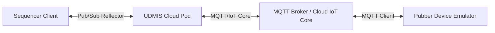

# UDMI Component Architecture and Data Flow Guide

UDMI (Universal Device Management Interface) is a distributed, asynchronous
system. Debugging it requires understanding the boundaries between components
and how data flows across them. Use this guide to contextualize log events and
target your codebase research.

---

## 1. Architectural Component Overview

The ecosystem consists of four core components interacting across network
boundaries:

### 1. The Sequencer (`validator/`)

* **Role:** The test harness orchestrator. Acts as an administrative client.
* **Behavior:** Initiates a session-wide **Base Transaction ID** (e.g.,
  `RC:12a3b4`) and attaches incrementing suffixes. It mutates expected states
  and sets synchronization wait loops (timeouts).
* **Heuristic:** If the Sequencer times out, do not assume the device failed.
  The failure could be a dropped packet in transit, a queue limit hit, or an
  out-of-order delivery that the Sequencer failed to handle gracefully.

### 2. UDMIS (`udmis/`)

* **Role:** The cloud-side middleware and routing pod.
* **Behavior:** Bridges reflection messages from the Sequencer to the physical
  device broker. It translates standard UDMI envelopes and manages dynamic
  routing to different providers (e.g., Google IoT, ClearBlade).
* **Heuristic:** UDMIS is highly multithreaded. Treat it as a primary suspect
  for race conditions involving shared state caches, routing affinity hijacks,
  and concurrent envelope mutations.

### 3. Pubber (`pubber/`)

* **Role:** The reference virtual device emulator (simulating building hardware
  like AHUs).
* **Behavior:** Connects via MQTT, receives `/config`, and publishes `/state` (
  acknowledgments) and `/event` (telemetry).
* **Heuristic:** When tests run against actual physical hardware, Pubber is
  bypassed. In these "black-box" scenarios, you must deduce device behavior
  entirely from how UDMIS and the Sequencer react to incoming packets.

---

## 2. Logical Data Pathways

Messages travel in standard JSON envelopes across three primary schemas:

1. **Configuration (`config`):**

* *Flow:* `Sequencer` $\rightarrow$ `UDMIS` $\rightarrow$ `Broker` $\rightarrow$
  `Pubber/Device`
* *Purpose:* Administrative commands (e.g., setting scan rates, resetting
  endpoints).

2. **State (`state`):**

* *Flow:* `Pubber/Device` $\rightarrow$ `Broker` $\rightarrow$
  `UDMIS` $\rightarrow$ `Sequencer`
* *Purpose:* Device's structural state, published automatically or as an
  acknowledgment echo.

3. **Events (`event`):**

* *Flow:* `Pubber/Device` $\rightarrow$ `Broker` $\rightarrow$
  `UDMIS` $\rightarrow$ `Sequencer`
* *Purpose:* Telemetry updates (e.g., `pointset` sensor readings, `system`
  logs).

---

## 3. Codebase Mapping & Investigation Strategy

When you isolate a divergence point in the timeline, use this map to target your
`grep_codebase` searches. Do not restrict your investigation to just one
layer—bugs often live at the interfaces between these boundaries.

### 1. Core Framework & State Machines

* **Sequencer Engine:** `validator/src/main/java/com/google/daq/mqtt/sequencer/`
* Target `SequenceBase.java` when investigating wait loops, assertions, and
  config sync logic.

* **UDMIS Routing Infrastructure:**
  `udmis/src/main/java/com/google/bos/udmi/service/`
* Target `processor/ReflectProcessor.java` for message validation and
  propagation tracing.
* Target `core/DynamicIotAccessProvider.java` for issues involving dropped cloud
  routes or provider resolution.

* **Pubber Emulator:** `pubber/src/main/java/daq/pubber/`
* Target `Pubber.java` for MQTT connection cycles and loop timers.

### 2. Schema and Serialization

* **Shared Models & Parsers:** `common/src/main/java/com/google/daq/mqtt/util/`
* Target this directory when investigating JSON parsing exceptions, missing
  envelope fields, or cryptographic signature mismatches.

* **Investigating Schema Violations:** * If a schema validation fails, **do not
  just check the static definitions in `schema/**`. You must find the Java class
  responsible for *constructing* the payload (e.g., a state publisher) and
  verify if it is missing a required property or casting a type incorrectly.
