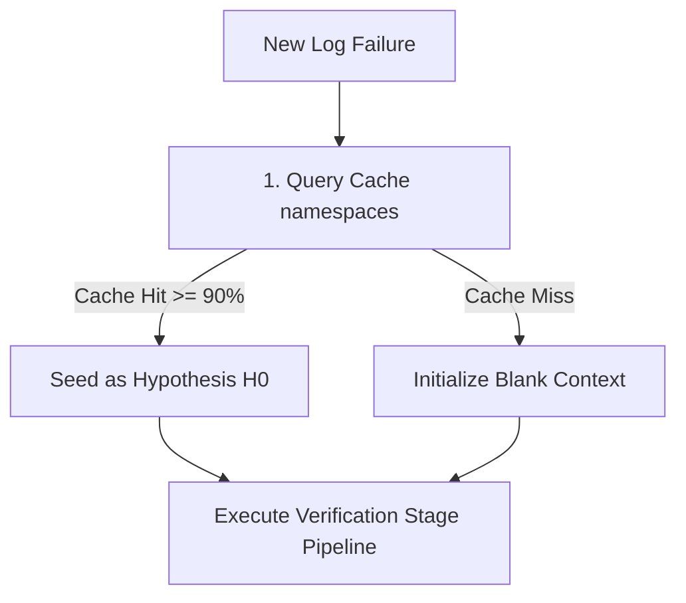

# Mantis Namespaced & Tiered Semantic Cache Specification

To support multi-tenant deployments and secure execution inside massive monorepos, Mantis utilizes a **Namespaced, Tiered Semantic Cache**. 

This system prevents PII and Access Control List (ACL) leaks across teams, ensures fast zero-shot resolution for recurring bugs, and enables infrastructure teams to broadcast global triage patterns.

---

## 1. Directory-Namespaced Partitioning

The vector database does not search across all historic issues globally. Instead, entries are indexed and scoped by **directory namespaces**:
* When a developer runs a local or CI triage job, the orchestrator automatically detects the workspace root (e.g., `projects/myproject/src` or `udmi`).
* The local directory name is used as the target namespace.
* All cache read and write actions are partitioned by this namespace:
  ```json
  {
    "failure_text": "[<TIMESTAMP>] [ERROR] pubber: MQTT Connection Down",
    "embedding": [0.12, 0.45, -0.9],
    "triage_report": "Root Cause: MQTT Broker crashed...",
    "namespace": "udmi",
    "timestamp": "2026-06-12T10:00:00Z"
  }
  ```

---

## 2. Tiered Resolution Cascade (Cascading Lookups)

If a failure occurs, Mantis performs a sequential cascading lookup to balance security with shared intelligence:



1. **Hypothesis Seeding (H0)**: If a similarity match exceeds the threshold (default: `90%`), the cached report is extracted and injected into the pipeline context as **Hypothesis H0**. The dynamic analyst stage is instructed to verify whether the historical root cause is currently active in the workspace instead of bypassing tests.
2. **Global Fallback**: Lookups partition across Private and Global namespaces. If private search misses, global namespaces are checked for H0 candidates before falling back to full blank-context LLM reasoning.

---

## 3. Template Extraction & Log Normalization

To ensure that ephemeral variables (timestamps, transaction IDs, memory addresses) do not cause vector distance misses, Mantis normalizes logs into clean templates before generating embeddings:

### 3.1. Normalization Conversions
* **Timestamps**: Stripped and replaced with `<TIMESTAMP>`.
* **Hex Numbers**: Memory addresses and pointer locations are replaced with `<HEX>`.
* **UUIDs**: Replaced with `<UUID>`.
* **Integers/Decimals**: Standard numbers are replaced with `<NUM>`.

### 3.2. Example
* **Raw Log Entry**:
  `[2026-06-12 10:00:00.080] [ERROR] pubber: Failed to bind port 0x7ffd2a1`
* **Normalized Template**:
  `[<TIMESTAMP>] [ERROR] pubber: Failed to bind port <HEX>`
* **Result**:
  A subsequent run encountering `[2026-06-15 11:20:15.500] [ERROR] pubber: Failed to bind port 0x1e2ba3` will normalize to the identical template string, producing a **100% semantic match** and returning the correct triage report instantly.
