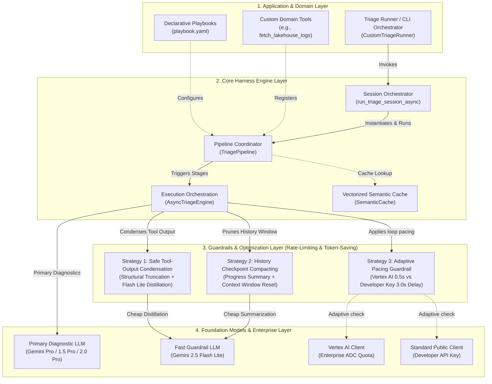

# Generic AI Triage Harness Integration Guide

This document outlines how to decouple, reuse, and integrate the core **Generic AI Triage Harness** (`mantis/src/triage/harness/`) into any non-UDMI software project (such as web servers, microservices, distributed databases, or data lake pipelines) to build a custom, playbook-driven AI diagnostic debugger.

As a reference model, we walk through using both the pre-built generic tool belt and a custom playbook to triage a **generic FLOE Data Lake** partition schema mismatch and ingestion pipeline failure.

---

## 1. Core Harness Architecture

Following clean **Object-Oriented & Single Responsibility Principles**, the code under `mantis/src/triage/harness/` is 100% decoupled from any UDMI specifications, schemas, or network topologies. It is a generic orchestrator that acts as the engine for playbook pipelines.

### 1.1. Layered System Architecture

The harness operates across four distinct layers to coordinate playbook configurations, tools execution, prompt engineering, and token optimization:



### 1.2. Core Harness Pillars
1. **`Playbook`**: A declarative YAML schema parsing pipeline models, maximum loop checks, and sequential execution stages (e.g., Log Harvesting, Defect Analysis, Review).
2. **`AsyncTriageEngine`**: An autonomous execution loop that handles calling the GenAI client, executing tool calling loops, validating required headers in responses, and retrying on failures.
3. **`SemanticCache`**: A vectorized caching system using Google Gemini Text Embeddings to store past successful diagnostic runs, delivering zero-shot triage on duplicate issues in milliseconds.

---

## 2. Guardrails & Performance Optimizations 🚀🛡️

To prevent `429 (RESOURCE_EXHAUSTED)` rate-limit traps and reduce the cost and latency of diagnostic loop executions, the `AsyncTriageEngine` features three embedded high-performance guardrails:

### 2.1. Strategy 1: Safe Tool-Output Condensation
Standard developer operations tools (like codebase grep, file readers, or log scrapers) can yield huge return payloads (often >40,000 characters). Appending these directly to chat history quickly triggers token count errors. 
* **Two-Tier Token Reduction**:
  1. **Structural Truncation**: If a tool return output exceeds 25,000 characters or 120 lines, the engine automatically truncates middle lines, retaining structural context (first 50 lines + last 50 lines).
  2. **LLM Distillation**: The engine feeds the truncated output into `gemini-2.5-flash-lite` with strict instructions to extract *only* critical lines of code, failing stack traces, method declarations, and paths, throwing away all boilerplate. This reduces token footprint by up to **95%** before it is appended to the history.

### 2.2. Strategy 2: History Checkpoint Compacting
In deep playbook loops, chat history accumulates intermediate logs and multiple redundant tool calls, causing token bloat. 
* **Active Context Compaction**: Every 5 tool execution turns, the engine triggers an active context compaction.
* It instructs `gemini-2.5-flash-lite` to review the entire diagnostic session and compile a **Consolidated Progress Checkpoint** (retaining retrieved classes, log files evaluated, hypotheses eliminated, and directories searched).
* The engine then resets the `history` array *in-place*, keeping only the initial prompt and the progress checkpoint. This effectively "flushes" intermediate tool output bloat and resets the token context window.

### 2.3. Strategy 3: Adaptive Pacing Guardrail
To support both high-speed enterprise workloads and cost-effective developer environments, the engine applies adaptive delays:
* **Enterprise Mode (Vertex AI)**: Leverages high enterprise RPM/TPM allocations (Active when `MANTIS_USE_VERTEXAI=true`), pacing tool loops at a fast **0.5-second** delay.
* **Standard Mode (Developer Key)**: Detects standard public API developer key usage, applying a **3.0-second** delay between loop iterations to guarantee complete compliance with free-tier rate limits.

---

## 3. Pre-built Generic Tool Belt (`ToolBelt`)

To accelerate integration, the harness provides an out-of-the-box **`ToolBelt`** class under `triage/harness/tools.py`. 

Any project can instantly equip its GenAI agent with a powerful suite of repository exploration, log correlation, codebase research, and git auditing tools simply by instantiating this class with custom workspace scoping.

### 2.1. Pre-built Tool APIs:
The following tools are implemented within `ToolBelt` and can be bound directly as GenAI functions:

1. **`list_directory(directory_path)`**:
   - Lists directories and files within the workspace.
   - Uses an ultra-fast **in-memory directory tree cache** built at startup, ignoring build/compiled artifacts.
2. **`grep_codebase(pattern)`**:
   - Searches the entire codebase for a specified string pattern or regex.
   - Uses ultra-fast `git grep` as the primary strategy, falling back to standard `grep` on non-git repos.
3. **`read_file_lines(filepath, start_line, end_line)`**:
   - Reads specific line ranges from a single file, or performs **batch reads** across multiple files in a single call.
4. **`git_read_operations(repo_path, command, args)`**:
   - Runs safe, read-only git commands (`git log`, `git show`, `git diff`, `git status`, `git branch`, `git blame`).
   - **Security Guardrail**: Automatically blocks any modifying commands (e.g., `checkout`, `commit`, `reset`) and dangerous shell characters.
5. **`grep_file(pattern, filepath)`**:
   - Searches for a transaction ID or text pattern in a specific targeted file.
6. **`expand_log_window(filepath, center_timestamp, window_seconds)`**:
   - Extracts log entries from a file within a padded window (e.g. $\pm 30$ seconds) around a target timestamp.
7. **`read_method_definition(filepath, method_name)`**:
   - Uses balanced brace parsing (for Java) or indentation parsing (for Python) to extract a complete method/function definition in a single call, bypassing chunked line-by-line reading.

### 2.2. Instantiating the `ToolBelt` for Your Project:
You configure the tool scopes, exclusions, and search paths during instantiation:

```python
from triage.harness.tools import ToolBelt

custom_tool_belt = ToolBelt(
    workspace_root="/path/to/your/project",
    search_dirs=["src/main", "configs"],                    # Code search directories
    exclude_dirs=["dist", "tests/fixtures"],                # Folders to ignore
    exclude_files=["*.log", "*.md"],                        # File types to ignore
    include_files=["*.py", "*.go", "*.yaml"]                # File types to include
)

# Get the tools map to register with GenAI Pipeline
my_tools = custom_tool_belt.get_tools_map()
```

### 2.3. How UDMI Mantis Uses `ToolBelt`:
In Project Mantis, the implementation layer simply configures and exports the bound methods in `triage/impl/tools.py` as follows:

```python
from ..harness.tools import ToolBelt

_udmi_tool_belt = ToolBelt(
    workspace_root=UDMI_ROOT,
    search_dirs=["validator/src", "udmis/src", "pubber/src", "common/src", "schema"],
    exclude_dirs=["bridgehead"],
    include_files=["*.java", "*.py", "*.yaml"]
)

# Bind functions for export
grep_codebase = _udmi_tool_belt.grep_codebase
read_file_lines = _udmi_tool_belt.read_file_lines
git_read_operations = _udmi_tool_belt.git_read_operations
# ...
```

---

## 4. Step-by-Step Integration Guide (FLOE Data Lake Example)

In addition to using the pre-built `ToolBelt`, you can write custom domain-specific tools to extend the agent's capabilities.

### Step 1: Define Your Playbook (`playbook.yaml`)
Create a playbook configuration detailing the sequential stages, Gemini models, and rules for your system triage:

```yaml
metadata:
  name: "FLOE Data Lake Ingestion Triage Pipeline"
  description: "Declarative playbook to triage Spark/Flink ingestion timeouts and Parquet partition schema regressions."
  version: "1.0.0"

pipeline:
  default_model: "gemini-3.1-pro-preview"
  flash: "gemini-2.5-flash-lite"
  max_loops: 15                # Maximum GenAI tool calls per stage
  max_revisions: 2             # Maximum critic rewrite attempts
  concurrency: 4

stages:
  log_harvesting:
    enabled: true
    model: flash
    system_instruction: |
      You are FLOE Log Harvester. Compile a clear chronological timeline of the Spark streaming engine events.
      Output only the markdown header '## 1. Chronological Ingestion Timeline'.
    headers:
      - "## 1. Chronological Ingestion Timeline"
    tools:
      - fetch_lakehouse_logs

  schema_analysis:
    enabled: true
    system_instruction: |
      You are a Senior Data Lake Reliability Engineer. Trace Parquet partition schema evolutions and catalog conflicts.
      You MUST call `query_partition_schema` to inspect actual file schemas on GCS/S3.
      Output must include the header '## 1. Executive Defect Summary'.
    headers:
      - "## 1. Executive Defect Summary"
    tools:
      - fetch_lakehouse_logs
      - check_catalog_status
      - query_partition_schema
```

> [!IMPORTANT]
> **Playbook Stage Headers**: If a stage config defines `headers:`, the `AsyncTriageEngine` will strictly audit the GenAI response. If the required headers are absent, the engine automatically forces an internal system retry, instructing the model to re-format its output accordingly.

---

### Step 2: Define Your Custom Python Tools
The GenAI agent discovers your system by calling python functions you expose. The harness automatically registers their docstrings, arguments, and return types as GenAI Function Declarations:

```python
def fetch_lakehouse_logs(pipeline_id: str, lines_count: int = 100) -> str:
    """
    Retrieves Spark or Flink execution logs for a specific ingestion pipeline.
    
    Args:
        pipeline_id: The unique execution UUID of the ingestion pipeline.
        lines_count: Number of tailing logs lines to retrieve. Default is 100.
    """
    # Implement GCS/S3 or Spark history client API call here...
    return "[2026-06-02 09:00:01] SparkTask_ERROR: SchemaMismatchException: Table partition 'dt=20260602' contains incompatible type for column 'order_amount' (Expected: DOUBLE, Found: STRING)."

def check_catalog_status(table_name: str) -> str:
    """
    Queries the Apache Iceberg/Hive catalog metadata status for a given table.
    
    Args:
        table_name: Target data lake table name to check.
    """
    return f"Iceberg Catalog: ACTIVE. Table '{table_name}' current schema version: v14. Column 'order_amount' is registered as DOUBLE."

def query_partition_schema(partition_path: str) -> str:
    """
    Reads Parquet metadata headers directly from a GCS/S3 bucket partition block.
    
    Args:
        partition_path: Fully-qualified storage URI path of the parquet block (e.g. 'gs://lake/orders/dt=20260602/').
    """
    return "Parquet Schema: { 'order_id': INT64, 'order_amount': BYTE_ARRAY (UTF-8 STRING), 'currency': BYTE_ARRAY (UTF-8 STRING) }"
```

---

### Step 3: Instantiate and Execute the Session
Import the session orchestrator, subclass `TriagePipeline` to register your custom tools, and run the triage session:

```python
import asyncio
from pathlib import Path
from typing import Dict, Callable, Optional
from google import genai
from triage.harness.pipeline import TriagePipeline, run_triage_session_async

# 1. Subclass TriagePipeline to inject custom domain tools or deterministic hooks
class FloeTriagePipeline(TriagePipeline):
    async def run_dynamic_pipeline_async(
        self,
        target_id: str,
        prompt_payload: str,
        available_tools: Dict[str, Callable],
        **kwargs
    ) -> str:
        # Register custom tools to the active available tools map
        custom_tools = {
            "fetch_lakehouse_logs": fetch_lakehouse_logs,
            "check_catalog_status": check_catalog_status,
            "query_partition_schema": query_partition_schema,
        }
        merged_tools = {**available_tools, **custom_tools}
        return await super().run_dynamic_pipeline_async(
            target_id=target_id,
            prompt_payload=prompt_payload,
            available_tools=merged_tools,
            **kwargs
        )

async def run_lake_triage():
    # 2. Setup input payload (details about the specific ingestion failure)
    prompt_payload = """
    ## Ingestion Failure Metadata
    - **Pipeline ID**: pl-ingest-orders-v2-94281
    - **Table**: orders_lakehouse
    - **Partition Path**: gs://floe-lake-prod/orders/dt=20260602/
    - **Timestamp**: 2026-06-02 09:00:00 UTC
    - **Failure Class**: SparkSchemaMismatchException
    """

    out_dir = Path("out/floe/pipelines/pl-ingest-orders-v2-94281/")
    
    # 3. Execute the session using the generic session orchestrator
    final_RCA_report = await run_triage_session_async(
        prompt_payload=prompt_payload,
        target_id="pl-ingest-orders-v2-94281",
        workspace_root="/path/to/floe/project",
        playbook_path=Path("playbook.yaml"),
        out_dir=str(out_dir),
        pipeline_class=FloeTriagePipeline,
        metadata={"pipeline_id": "pl-ingest-orders-v2-94281", "table": "orders_lakehouse"}
    )

    print(f"\n🎉 Diagnostics complete! Final RCA summary:\n{final_RCA_report}")

if __name__ == "__main__":
    asyncio.run(run_lake_triage())
```

---

## 5. Intermediate Stage Outputs & Cache Layout

When running `run_triage_session_async(..., out_dir=str(out_dir))`, the harness automatically handles saving stage reports and utilizing cache hits:

### 4.1. Output Folder Structure
All stage-specific markdown files are created under your specified `out_dir` automatically, preserving intermediate outputs for audits:

```
out/floe/pipelines/pl-ingest-orders-v2-94281/
├── stage_log_harvesting.md      # Chronological timeline constructed by Stage 1
├── stage_schema_analysis.md     # Full root cause analysis generated by Stage 2
└── semantic_cache.json          # Shared Cosine-Similarity caching baseline
```

### 4.2. Vectorized Cache Hits
If a duplicate ingestion schema error occurs, the `SemanticCache` intercepts the run at startup:
- Computes the cosine similarity between the new failure log and cached logs.
- If similarity exceeds the default threshold, it immediately returns the cached `stage_schema_analysis.md` report.
- Bypasses all subsequent playbook stages and GenAI pipeline calls, saving token usage and delivering a complete diagnosis in milliseconds.
