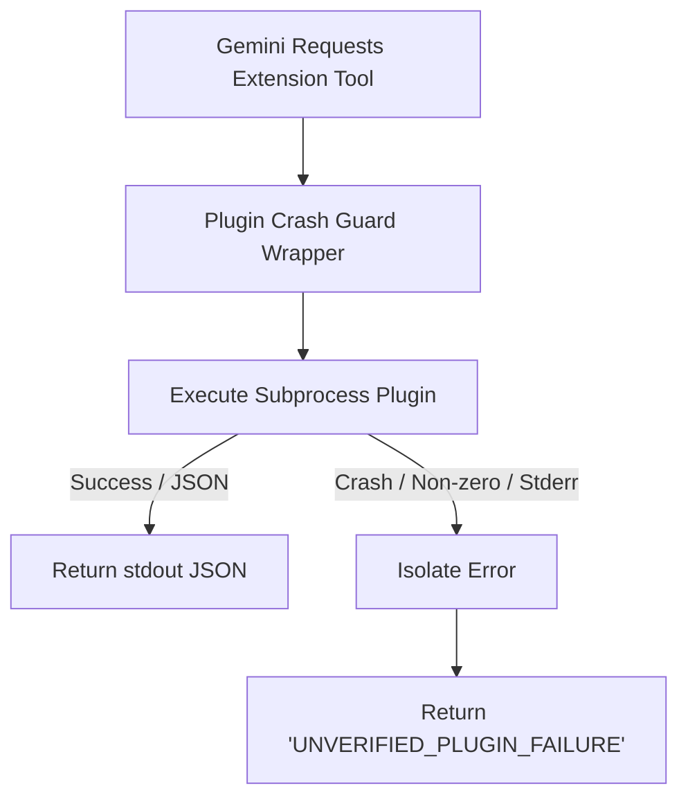

# Plugin Safety & Crash Isolation Specification

Mantis provides robust, non-blocking **Plugin Crash Guards** to shield the orchestration pipeline from unstable, unverified, or crashing third-party extensions.

---

## 1. Dynamic Extension Binding

Custom scripts (Go, Python, Java, C++) are registered inside the playbook under the `extensions` mapping. 

When a pipeline stage executes, Mantis resolves the required tool list and binds these extensions to the runtime tool Belt automatically:

```yaml
extensions:
  run_udmi_sequencer_validator:
    command: ["/usr/bin/python3", "plugins/validator.py"]
    description: "Validates local sequences against telemetry schema"
```

---

## 2. Process Crash Isolation

A third-party plugin might crash, trigger memory faults, write garbage to `stdout`, or exit with a non-zero exit code. 

If this happens, instead of propagating the exception upward and aborting the entire diagnostic run, Mantis intercepts the failure inside the **Plugin Crash Guard wrapper**:



1. **Standard Returns**: On successful completion, the plugin's parsed JSON output is returned directly.
2. **Failure Resolution**: If the plugin crashes, raises a subprocess exception, or exits with a status code `!= 0`, the wrapper catches the crash.
3. **Structured Failure payload**: The wrapper returns a standardized JSON structure:
   ```json
   {
     "status": "UNVERIFIED_PLUGIN_FAILURE",
     "error": "Plugin subprocess ['/bin/false'] failed with exit code 1."
   }
   ```
4. **Log Warning**: The engine logs a warning to `stderr` describing the crash for system administrators, but the analyst agent is allowed to proceed and evaluate alternative diagnostic routes.
