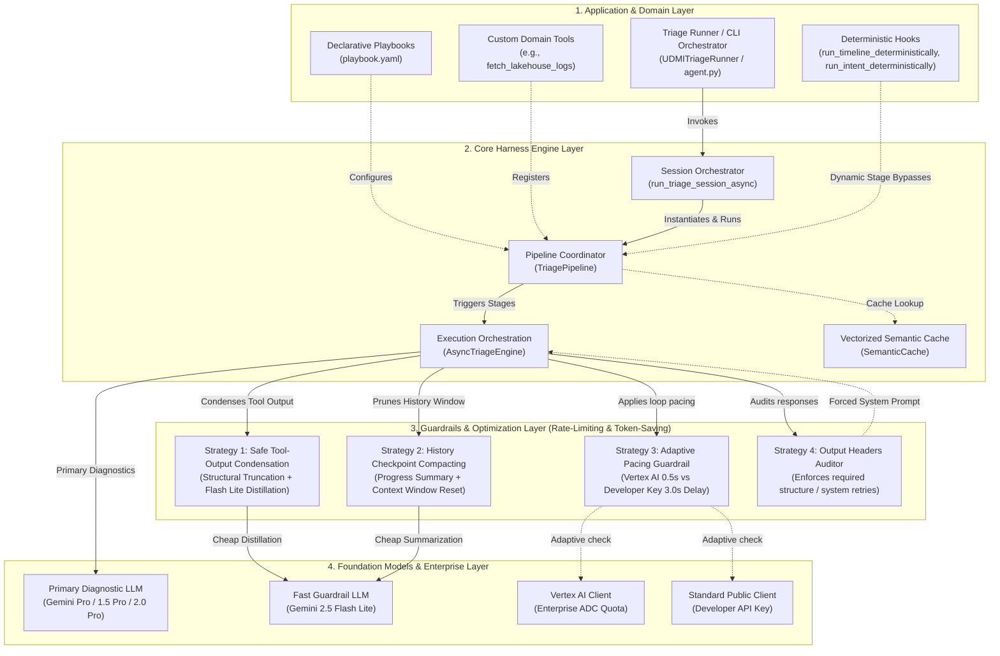

# High-Level Design (HLD): Mantis Triage & Diagnostic Infrastructure

This document serves as the high-level design specification and engineering architectural reference for the **Mantis AI Triage Infrastructure**. 

The infrastructure is designed around clean **Single Responsibility Principles**, cleanly decoupling a reusable, domain-agnostic **Generic AI Triage Harness** from project-specific diagnostic implementations (such as the reference UDMI implementation).

---

## 1. Executive Summary & Design Philosophy

When distributed software pipelines, microservices, or complex IoT test suites experience regressions or flaky failures, developer time is often lost to manual log harvesting, log timeline reconstruction, and searching codebases for corresponding stack trace sources.

Mantis solves this by operating as an autonomous, playbook-driven, tool-equipped AI agent infrastructure. Its core philosophies are:
* **Decoupled Engine Architecture**: The core GenAI loop, semantic caches, rate limits, history compactions, and required formatting audits are 100% domain-agnostic and reusable.
* **Deterministic Hybrid Integration**: When structures (like chronological logs or test code definitions) can be parsed deterministically, Mantis extracts them programmatically to save tokens and prevent LLM hallucinations.
* **Multi-Stage Playbooks**: Diagnostics are broken into distinct sequential stages (e.g., Log Timeline Harvesting, Design Intent Extraction, Root-Cause Analysis, Peer Critique) rather than performing single-turn reasoning.
* **Zero-Shot Semantic Caching**: Common failures (e.g., connection timed out, configuration schema mismatch) are cached as vectorized embeddings. Duplicate failures resolve in milliseconds without invoking expensive GenAI models.

---

## 2. Layered Architecture & Component Topology

The Mantis infrastructure separates concerns into four clear layers to manage playbooks, tool execution, performance optimizations, and backend GenAI orchestration:



---

## 3. Core Architecture Pillars

### 3.1. Pipeline Coordinator (`TriagePipeline`)
The `TriagePipeline` ([pipeline.py](../src/engine/pipeline.py)) is the primary orchestrator. It manages the execution of individual diagnostic stages sequentially, accumulates context, and resolves tools dynamically configured for each stage.

Key capabilities:
* **Skills Initialization**: Loads and compiles localized markdown prompt guidelines (`SKILL.md` files) across multiple directories specified inside `skills_dirs` or the Playbook configuration using a unified `SkillRegistry` mapping.
* **Programmatic Skills Registration**: Exposes a `register_custom_skill(self, name, content)` API to inject dynamic prompts or instructions at runtime.
* **Deterministic Bypasses**: Automatically scans subclasses for hooks matching `run_<stage_name>_deterministically` and invokes them, bypassing LLM calls when a deterministic Python implementation returns a valid output.
* **State Management**: Maintains a runtime `context` map containing inputs, metadata, and outputs from previous stages. It resolves instructions dynamically by substituting context placeholders (e.g. `{target_id}`).

### 3.2. Execution Orchestrator (`AsyncTriageEngine`)
The `AsyncTriageEngine` ([engine.py](../src/engine/engine.py)) drives the autonomous tool-calling loop, manages API retries, limits active concurrency via Semaphores, and applies critical guardrails to prevent token-count failures or API rate violations.

Key capabilities:
* **Automatic Function Calling with Thoughts**: Intercepts tool executions. If the model attempts to call a tool without outputting text reasoning beforehand, the engine injects a system warning, forcing the model to record its hypothesis first.
* **Retry of Transient Failures**: Automatically catches transient API errors (429, 503, 500, overload warnings) and applies exponential backoff delays.
* **Concurrency Semaphore**: Limits the total number of parallel active model calls across multi-triage operations.

### 3.3. Vectorized Semantic Similarity Cache (`SemanticCache`)
The `SemanticCache` ([cache.py](../src/engine/config/cache.py)) acts as a localized vector similarity database. 

```
                       [New Failure Triage Request]
                                    │
                       (Extract Failure Log Snippet)
                                    │
                       [Get Gemini Vector Embedding]
                                    │
                      ┌─────────────┴─────────────┐
                      ▼                           ▼
            [Query Cache Entries]       [No Similar Entries]
                      │                           │
          (Cosine Similarity >= 0.90)              │
                      │                           │
            ┌─────────┴─────────┐                 ▼
            ▼                   ▼           [Execute GenAI]
       [Cache Hit]         [Cache Miss]     [Playbook Pipeline]
            │                   │                 │
     (Return Cached)     [Execute GenAI]     (Cache Output)
     (Triage Report)     [Playbook Pipeline]      │
            │                   │                 ▼
            ▼                   ▼              [Done]
     [Report Delivered in Milliseconds]
```

Key capabilities:
* **Similarity Matching**: Generates embeddings via Gemini Embedding APIs and evaluates Cosine Similarity.
* **Threshold Guard**: If the similarity score of a new failure log matches a cached entry at $\ge 0.90$ (customizable), it returns the cached triage report instantly.
* **Atomic JSON Persistence**: Saves updates atomically by writing to temporary files and renaming them, preventing corruption during parallel writes.

---

## 4. Declarative Playbooks & Custom Stages

Playbooks are defined in simple YAML files, allowing reliability engineers to declare diagnostic workflows without modifying core Python code.

### 4.1. Playbook YAML Schema
A playbook configures the default models, loops, dynamic skill directories, and individual sequential stages:

```yaml
metadata:
  name: "Systems Log Triage Playbook"
  description: "Declarative playbook configuration for triaging system regressions."
  version: "1.0.0"

pipeline:
  default_model: "gemini-2.0-pro-exp"
  flash: "gemini-2.5-flash-lite"
  max_loops: 15                # Max tool executions per stage
  max_revisions: 2             # Max critic revision loops
  concurrency: 3
  skills:                      # Target prompt directories to import
    - "./custom_skills"
    - "/opt/shared/skills"

stages:
  timeline:
    enabled: true
    model: flash               # Uses fast model for harvesting
    system_instruction: |
      You are a Timeline Harvester. Construct a chronological event timeline.
      You MUST output the header '## 1. Detailed Timeline of Events'.
    headers:
      - "## 1. Detailed Timeline of Events"
    tools:
      - grep_file
      - read_file_lines

  triage_analysis:
    enabled: true
    system_instruction: |
      You are a Defect Analyst. Examine the timeline for target: {target_id}.
      Identify root cause. Output header '## Root Cause Analysis'.
    headers:
      - "## Root Cause Analysis"
    tools:
      - grep_codebase
      - read_file_lines
      - lookup_symbol

  peer_critique:
    enabled: true
    type: critique              # Declares this as review stage
    target_stage: triage_analysis # Sets target of review
    system_instruction: |
      You are a Peer Critique Reviewer. Check the analysis draft for logical inconsistencies.
```

* **Playbook-Relative Skills Resolution**: Skill paths configured in the playbook (e.g., `../skills`) are resolved relative to the playbook file's parent directory, rather than the shell's active working directory, making playbooks portable.

### 4.2. Playbook Diagnostic Linting (Warning)
If a playbook has stages enabled but does not define any stage with `type: critique` (or a stage named `critique`), the Triage Coordinator logs a non-blocking diagnostic warning at startup, alerting the developer that skipping peer-review feedback passes may increase diagnostic hallucinations.

### 4.3. Output Headers Auditing
If a stage defines required `headers:`, the `AsyncTriageEngine` scans the final model output. If the required headers are missing:
1. It appends a system reminder prompt to the chat history: `System Reminder: Incomplete response. You must output using headers: ...`
2. It triggers another iteration of the tool loop, forcing the model to format the response correctly.
3. If the loop count is exhausted, the engine makes a final, clean, tool-deactivated generation pass explicitly telling the model to synthesize the final markdown.

---

## 5. Collaborative Analyst-Critic Loop

Rather than accepting the first generated root cause, the engine coordinates a multi-agent **Analyst-Critic Loop** to review theories for logical inconsistencies.

```
       [Accumulated Context: Timeline & Intent]
                         │
                         ▼
             [Defect Analyst Stage] 🔍
             (Uses codebase exploration tools)
                         │
                         ▼
               [Draft Root Cause Report]
                         │
                         ▼
             [Peer Critique Reviewer] ⚖️
             (Independent System Instruction)
                         │
                Is the draft sound?
             ┌───────────┴───────────┐
             ▼                       ▼
       [Approved]               [Rejected]
             │                       │
      (Output Report)        (Inject critique notes)
             │                       │
             ▼                       ▼
          [Done]           [Analyst Stage Pass N]
                             (Revise RCA theory)
```

1. **Analyst Stage**: The analyst receives the timeline, intent, and codebase tools. It creates a draft Root Cause Analysis (RCA).
2. **Critique Stage**: An independent agent runs with a low temperature (e.g., 0.2) and a strict system instruction. It checks the analyst's draft for logical jumps, incorrect timestamps, or insufficient evidence.
3. **Verdict Evaluation**:
   * If the critic outputs `STATUS: APPROVED`, the pipeline finishes.
   * If the critic outputs `STATUS: REJECTED` along with a list of feedback details, the pipeline inserts the feedback as a system message.
   * The pipeline triggers a revised Analyst Stage. The analyst reads the critique feedback and uses codebase tools to re-verify findings. This loop repeats up to `max_revisions`.

---

## 6. Pre-Built Generic Tool Belt & Skills Customization

### 6.1. Generic Tool Belt (`ToolBelt`)
The harness provides a pre-built `ToolBelt` class ([tools.py](../src/engine/tools.py)) exposing critical debugging APIs:

| Tool Name | Arguments | Behavior |
| :--- | :--- | :--- |
| `list_directory` | `directory_path: str = "."` | Lists files/directories using a fast in-memory tree cache. |
| `grep_codebase` | `pattern: str` | Searches codebase using `git grep` (falls back to `rg` or `grep`). |
| `read_file_lines`| `filepath`, `start_line`, `end_line` | Reads line ranges from single or batch files. |
| `git_read_operations` | `repo_path`, `command`, `args` | Runs safe read-only git tasks (`log`, `show`, `diff`, `status`, `branch`, `blame`). Blocks mutations. |
| `grep_file` | `pattern`, `filepath` | Searches pattern in a specific file. |
| `expand_log_window`| `filepath`, `center_timestamp`, `window_seconds` | Extracts lines around a timestamp using time arithmetic. |
| `read_method_definition`| `filepath`, `method_name` | Extracts full function blocks via brace (Java) or indentation (Python) parsing. |
| `lookup_symbol` | `symbol_name` | Locates exact declaration files/lines (classes, methods, defs). |

### 6.2. Custom Localized Skills
Rather than bloating system instructions, engineers can drop markdown files under a `/skills` folder. 
Each `SKILL.md` contains localized prompt guidelines:

```markdown
---
name: Java Thread Leak Analysis
description: Guidelines on tracing active thread counts and unclosed pools
---
### Tracing unclosed ExecutorServices:
When reviewing test failures, if you see thread exceptions:
1. Search for `ExecutorService` declarations.
2. Verify if a `shutdown()` block is present in the `finally` statement.
3. Check sequence logs to see if thread terminations were logged.
```
The pipeline automatically compiles these files into a unified **Skill Library Context** appended to the primary system prompts.

---

## 7. Extending the Harness (UDMI Reference Model)

To extend the generic harness for a specific project, developers follow a clean inherit-and-initialize pattern:

### 7.1. Custom Pipeline Subclassing
Inherit from `TriagePipeline` and implement deterministic handlers to bypass LLM generation for specific stages where raw parsing suffices:

```python
from triage.harness.pipeline import TriagePipeline

class UDMITriagePipeline(TriagePipeline):
    
    def run_timeline_deterministically(self, prompt_payload: str) -> Optional[str]:
        # Parse logs from prompt_payload using regex
        raw_logs = self._extract_raw_logs(prompt_payload)
        if raw_logs:
            # Build and return chronological markdown table
            return build_deterministic_timeline_table(raw_logs)
        return None

    def run_intent_deterministically(self, target_id: str, prompt_payload: str) -> Optional[str]:
        # Extract target test source code directly from validator sequences folder
        test_code = load_java_test_definition(target_id)
        # Load golden test outcome baselines
        baselines = load_etc_outcomes(target_id)
        return f"Test Definition:\n{test_code}\n\nGolden Baselines:\n{baselines}"
```

### 7.2. Creating custom CLI wrappers
Expose a custom launcher script ([runner.py](../src/app/runner.py)) that:
1. Reads test results directories.
2. Identifies failing tests and extracts time windows from sequence log files.
3. Slices sibling logs (e.g. `pubber.log`, `udmis.log`) inside those time bounds.
4. Generates a combined prompt payload.
5. Invokes `run_triage_session_async` with a customized playbook and a localized toolbelt.

---

## 8. Embedded System Guardrails & Optimizations

To prevent rate-limit crashes and manage costs, the core engine enforces three high-performance optimization layers:

### 8.1. Strategy 1: Safe Tool-Output Condensation
Standard codebase searches or log files can return very large payloads (exceeding 40,000 characters), which bloat context windows.
* **Structural Truncation**: Payloads exceeding 25,000 characters are truncated down to the first 50 and last 50 lines automatically.
* **LLM Distillation**: The truncated output is processed via a fast, cheap model (`gemini-2.5-flash-lite`) using a strict prompt to extract only method signatures, error lines, paths, and stack traces, discarding boilerplate. This reduces token size by **up to 95%** before insertion into chat history.

### 8.2. Strategy 2: History Checkpoint Compacting
In deep playbook loops, chat history accumulates redundant intermediate results.
* Every 5 turns, the engine triggers context compaction.
* It uses a cheap model to summarize current diagnostic findings (e.g., directories searched, classes inspected, hypotheses ruled out).
* The engine resets the `history` array in-place, keeping only the initial prompt and the summary checkpoint.

### 8.3. Strategy 3: Adaptive Pacing Guardrails
* **Enterprise Mode (`MANTIS_USE_VERTEXAI=true`)**: Routes requests through Google Cloud Vertex AI using GCP Application Default Credentials, enabling high-rate quotas. Loop delay is set to a fast **0.5-second** pace.
* **Developer Key Mode**: Detects standard public API key usage. Applies a **3.0-second** loop delay to stay within public API rate limits.
