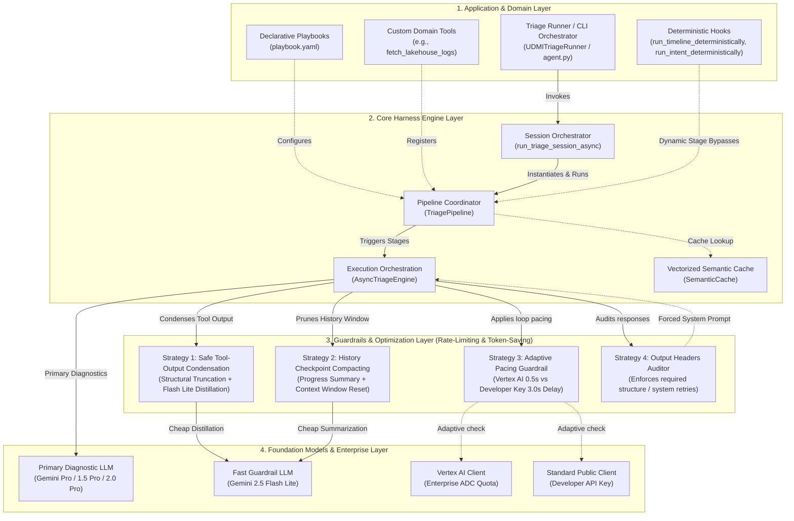
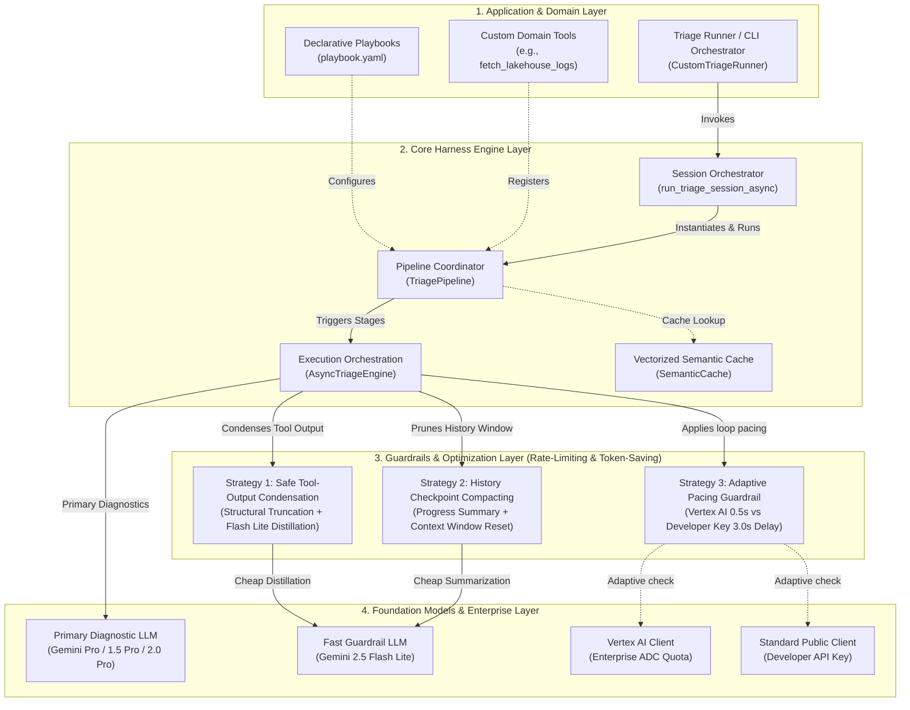
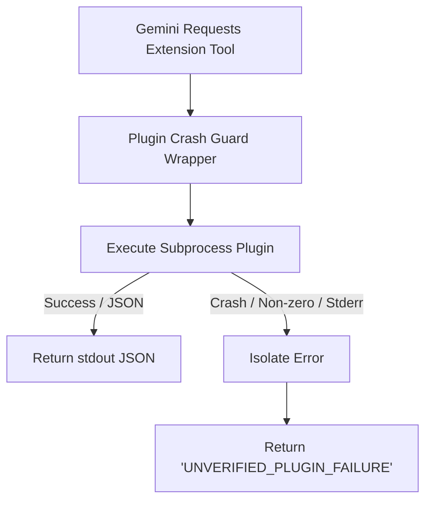
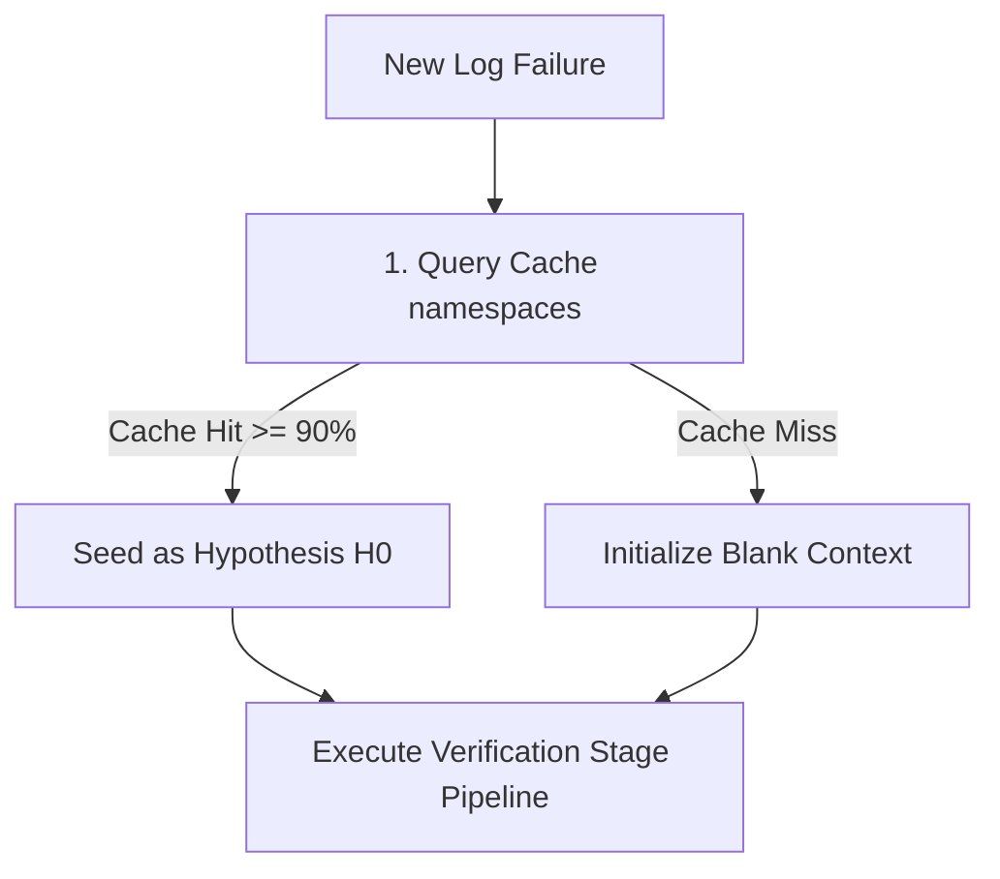

# High-Level Design (HLD): Mantis Triage & Diagnostic Infrastructure

This document serves as the high-level design specification and engineering architectural reference for the **Mantis AI Triage Infrastructure**. 

The infrastructure is designed around clean **Single Responsibility Principles**, cleanly decoupling a reusable, domain-agnostic **Generic AI Triage Harness** from project-specific diagnostic implementations (such as the reference UDMI implementation).

---

## 1. Executive Summary & Design Philosophy

When distributed software pipelines, microservices, or complex IoT test suites experience regressions or flaky failures, developer time is often lost to manual log harvesting, log timeline reconstruction, and searching codebases for corresponding stack trace sources.

Mantis solves this by operating as an autonomous, playbook-driven, tool-equipped AI agent infrastructure. Its core philosophies are:
* **Decoupled Engine Architecture**: The core GenAI loop, semantic caches, rate limits, history compactions, and required formatting audits are 100% domain-agnostic and reusable.
* **Deterministic Hybrid Integration**: When structures (like chronological logs or test code definitions) can be parsed deterministically, Mantis extracts them programmatically to save tokens and prevent LLM hallucinations.
* **Multi-Stage Playbooks**: Diagnostics are broken into distinct sequential stages (e.g., Log Timeline Harvesting, Design Intent Extraction, Root-Cause Analysis, Peer Critique) rather than performing single-turn reasoning.
* **Zero-Shot Semantic Caching**: Common failures (e.g., connection timed out, configuration schema mismatch) are cached as vectorized embeddings. Duplicate failures resolve in milliseconds without invoking expensive GenAI models.

---

## 2. Layered Architecture & Component Topology

The Mantis infrastructure separates concerns into four clear layers to manage playbooks, tool execution, performance optimizations, and backend GenAI orchestration:



---

## 3. Core Architecture Pillars

### 3.1. Pipeline Coordinator (`TriagePipeline`)
The `TriagePipeline` ([pipeline.py](../src/engine/pipeline.py)) is the primary orchestrator. It manages the execution of individual diagnostic stages sequentially, accumulates context, and resolves tools dynamically configured for each stage.

Key capabilities:
* **Skills Initialization**: Loads and compiles localized markdown prompt guidelines (`SKILL.md` files) across multiple directories specified inside `skills_dirs` or the Playbook configuration using a unified `SkillRegistry` mapping.
* **Programmatic Skills Registration**: Exposes a `register_custom_skill(self, name, content)` API to inject dynamic prompts or instructions at runtime.
* **Deterministic Bypasses**: Automatically scans subclasses for hooks matching `run_<stage_name>_deterministically` and invokes them, bypassing LLM calls when a deterministic Python implementation returns a valid output.
* **State Management**: Maintains a runtime `context` map containing inputs, metadata, and outputs from previous stages. It resolves instructions dynamically by substituting context placeholders (e.g. `{target_id}`).

### 3.2. Execution Orchestrator (`AsyncTriageEngine`)
The `AsyncTriageEngine` ([engine.py](../src/engine/engine.py)) drives the autonomous tool-calling loop, manages API retries, limits active concurrency via Semaphores, and applies critical guardrails to prevent token-count failures or API rate violations.

Key capabilities:
* **Automatic Function Calling with Thoughts**: Intercepts tool executions. If the model attempts to call a tool without outputting text reasoning beforehand, the engine injects a system warning, forcing the model to record its hypothesis first.
* **Retry of Transient Failures**: Automatically catches transient API errors (429, 503, 500, overload warnings) and applies exponential backoff delays.
* **Concurrency Semaphore**: Limits the total number of parallel active model calls across multi-triage operations.

### 3.3. Vectorized Semantic Similarity Cache (`SemanticCache`)
The `SemanticCache` ([cache.py](../src/engine/config/cache.py)) acts as a localized vector similarity database. 

```
                       [New Failure Triage Request]
                                    │
                       (Extract Failure Log Snippet)
                                    │
                       [Get Gemini Vector Embedding]
                                    │
                      ┌─────────────┴─────────────┐
                      ▼                           ▼
            [Query Cache Entries]       [No Similar Entries]
                      │                           │
          (Cosine Similarity >= 0.90)              │
                      │                           │
            ┌─────────┴─────────┐                 ▼
            ▼                   ▼           [Execute GenAI]
       [Cache Hit]         [Cache Miss]     [Playbook Pipeline]
            │                   │                 │
     (Return Cached)     [Execute GenAI]     (Cache Output)
     (Triage Report)     [Playbook Pipeline]      │
            │                   │                 ▼
            ▼                   ▼              [Done]
     [Report Delivered in Milliseconds]
```

Key capabilities:
* **Similarity Matching**: Generates embeddings via Gemini Embedding APIs and evaluates Cosine Similarity.
* **Threshold Guard**: If the similarity score of a new failure log matches a cached entry at $\ge 0.90$ (customizable), it returns the cached triage report instantly.
* **Atomic JSON Persistence**: Saves updates atomically by writing to temporary files and renaming them, preventing corruption during parallel writes.

---

## 4. Declarative Playbooks & Custom Stages

Playbooks are defined in simple YAML files, allowing reliability engineers to declare diagnostic workflows without modifying core Python code.

### 4.1. Playbook YAML Schema
A playbook configures the default models, loops, dynamic skill directories, and individual sequential stages:

```yaml
metadata:
  name: "Systems Log Triage Playbook"
  description: "Declarative playbook configuration for triaging system regressions."
  version: "1.0.0"

pipeline:
  default_model: "gemini-2.0-pro-exp"
  flash: "gemini-2.5-flash-lite"
  max_loops: 15                # Max tool executions per stage
  max_revisions: 2             # Max critic revision loops
  concurrency: 3
  skills:                      # Target prompt directories to import
    - "./custom_skills"
    - "/opt/shared/skills"

stages:
  timeline:
    enabled: true
    model: flash               # Uses fast model for harvesting
    system_instruction: |
      You are a Timeline Harvester. Construct a chronological event timeline.
      You MUST output the header '## 1. Detailed Timeline of Events'.
    headers:
      - "## 1. Detailed Timeline of Events"
    tools:
      - grep_file
      - read_file_lines

  triage_analysis:
    enabled: true
    system_instruction: |
      You are a Defect Analyst. Examine the timeline for target: {target_id}.
      Identify root cause. Output header '## Root Cause Analysis'.
    headers:
      - "## Root Cause Analysis"
    tools:
      - grep_codebase
      - read_file_lines
      - lookup_symbol

  peer_critique:
    enabled: true
    type: critique              # Declares this as review stage
    target_stage: triage_analysis # Sets target of review
    system_instruction: |
      You are a Peer Critique Reviewer. Check the analysis draft for logical inconsistencies.
```

* **Playbook-Relative Skills Resolution**: Skill paths configured in the playbook (e.g., `../skills`) are resolved relative to the playbook file's parent directory, rather than the shell's active working directory, making playbooks portable.

### 4.2. Playbook Diagnostic Linting (Warning)
If a playbook has stages enabled but does not define any stage with `type: critique` (or a stage named `critique`), the Triage Coordinator logs a non-blocking diagnostic warning at startup, alerting the developer that skipping peer-review feedback passes may increase diagnostic hallucinations.

### 4.3. Output Headers Auditing
If a stage defines required `headers:`, the `AsyncTriageEngine` scans the final model output. If the required headers are missing:
1. It appends a system reminder prompt to the chat history: `System Reminder: Incomplete response. You must output using headers: ...`
2. It triggers another iteration of the tool loop, forcing the model to format the response correctly.
3. If the loop count is exhausted, the engine makes a final, clean, tool-deactivated generation pass explicitly telling the model to synthesize the final markdown.

---

## 5. Collaborative Analyst-Critic Loop

Rather than accepting the first generated root cause, the engine coordinates a multi-agent **Analyst-Critic Loop** to review theories for logical inconsistencies.

```
       [Accumulated Context: Timeline & Intent]
                         │
                         ▼
             [Defect Analyst Stage] 🔍
             (Uses codebase exploration tools)
                         │
                         ▼
               [Draft Root Cause Report]
                         │
                         ▼
             [Peer Critique Reviewer] ⚖️
             (Independent System Instruction)
                         │
                Is the draft sound?
             ┌───────────┴───────────┐
             ▼                       ▼
       [Approved]               [Rejected]
             │                       │
      (Output Report)        (Inject critique notes)
             │                       │
             ▼                       ▼
          [Done]           [Analyst Stage Pass N]
                             (Revise RCA theory)
```

1. **Analyst Stage**: The analyst receives the timeline, intent, and codebase tools. It creates a draft Root Cause Analysis (RCA).
2. **Critique Stage**: An independent agent runs with a low temperature (e.g., 0.2) and a strict system instruction. It checks the analyst's draft for logical jumps, incorrect timestamps, or insufficient evidence.
3. **Verdict Evaluation**:
   * If the critic outputs `STATUS: APPROVED`, the pipeline finishes.
   * If the critic outputs `STATUS: REJECTED` along with a list of feedback details, the pipeline inserts the feedback as a system message.
   * The pipeline triggers a revised Analyst Stage. The analyst reads the critique feedback and uses codebase tools to re-verify findings. This loop repeats up to `max_revisions`.

---

## 6. Pre-Built Generic Tool Belt & Skills Customization

### 6.1. Generic Tool Belt (`ToolBelt`)
The harness provides a pre-built `ToolBelt` class ([tools.py](../src/engine/tools.py)) exposing critical debugging APIs:

| Tool Name | Arguments | Behavior |
| :--- | :--- | :--- |
| `list_directory` | `directory_path: str = "."` | Lists files/directories using a fast in-memory tree cache. |
| `grep_codebase` | `pattern: str` | Searches codebase using `git grep` (falls back to `rg` or `grep`). |
| `read_file_lines`| `filepath`, `start_line`, `end_line` | Reads line ranges from single or batch files. |
| `git_read_operations` | `repo_path`, `command`, `args` | Runs safe read-only git tasks (`log`, `show`, `diff`, `status`, `branch`, `blame`). Blocks mutations. |
| `grep_file` | `pattern`, `filepath` | Searches pattern in a specific file. |
| `expand_log_window`| `filepath`, `center_timestamp`, `window_seconds` | Extracts lines around a timestamp using time arithmetic. |
| `read_method_definition`| `filepath`, `method_name` | Extracts full function blocks via brace (Java) or indentation (Python) parsing. |
| `lookup_symbol` | `symbol_name` | Locates exact declaration files/lines (classes, methods, defs). |

### 6.2. Custom Localized Skills
Rather than bloating system instructions, engineers can drop markdown files under a `/skills` folder. 
Each `SKILL.md` contains localized prompt guidelines:

```markdown
---
name: Java Thread Leak Analysis
description: Guidelines on tracing active thread counts and unclosed pools
---
### Tracing unclosed ExecutorServices:
When reviewing test failures, if you see thread exceptions:
1. Search for `ExecutorService` declarations.
2. Verify if a `shutdown()` block is present in the `finally` statement.
3. Check sequence logs to see if thread terminations were logged.
```
The pipeline automatically compiles these files into a unified **Skill Library Context** appended to the primary system prompts.

---

## 7. Extending the Harness (UDMI Reference Model)

To extend the generic harness for a specific project, developers follow a clean inherit-and-initialize pattern:

### 7.1. Custom Pipeline Subclassing
Inherit from `TriagePipeline` and implement deterministic handlers to bypass LLM generation for specific stages where raw parsing suffices:

```python
from triage.harness.pipeline import TriagePipeline

class UDMITriagePipeline(TriagePipeline):
    
    def run_timeline_deterministically(self, prompt_payload: str) -> Optional[str]:
        # Parse logs from prompt_payload using regex
        raw_logs = self._extract_raw_logs(prompt_payload)
        if raw_logs:
            # Build and return chronological markdown table
            return build_deterministic_timeline_table(raw_logs)
        return None

    def run_intent_deterministically(self, target_id: str, prompt_payload: str) -> Optional[str]:
        # Extract target test source code directly from validator sequences folder
        test_code = load_java_test_definition(target_id)
        # Load golden test outcome baselines
        baselines = load_etc_outcomes(target_id)
        return f"Test Definition:\n{test_code}\n\nGolden Baselines:\n{baselines}"
```

### 7.2. Creating custom CLI wrappers
Expose a custom launcher script ([runner.py](../src/app/runner.py)) that:
1. Reads test results directories.
2. Identifies failing tests and extracts time windows from sequence log files.
3. Slices sibling logs (e.g. `pubber.log`, `udmis.log`) inside those time bounds.
4. Generates a combined prompt payload.
5. Invokes `run_triage_session_async` with a customized playbook and a localized toolbelt.

---

## 8. Embedded System Guardrails & Optimizations

To prevent rate-limit crashes and manage costs, the core engine enforces three high-performance optimization layers:

### 8.1. Strategy 1: Safe Tool-Output Condensation
Standard codebase searches or log files can return very large payloads (exceeding 40,000 characters), which bloat context windows.
* **Structural Truncation**: Payloads exceeding 25,000 characters are truncated down to the first 50 and last 50 lines automatically.
* **LLM Distillation**: The truncated output is processed via a fast, cheap model (`gemini-2.5-flash-lite`) using a strict prompt to extract only method signatures, error lines, paths, and stack traces, discarding boilerplate. This reduces token size by **up to 95%** before insertion into chat history.

### 8.2. Strategy 2: History Checkpoint Compacting
In deep playbook loops, chat history accumulates redundant intermediate results.
* Every 5 turns, the engine triggers context compaction.
* It uses a cheap model to summarize current diagnostic findings (e.g., directories searched, classes inspected, hypotheses ruled out).
* The engine resets the `history` array in-place, keeping only the initial prompt and the summary checkpoint.

### 8.3. Strategy 3: Adaptive Pacing Guardrails
* **Enterprise Mode (`MANTIS_USE_VERTEXAI=true`)**: Routes requests through Google Cloud Vertex AI using GCP Application Default Credentials, enabling high-rate quotas. Loop delay is set to a fast **0.5-second** pace.
* **Developer Key Mode**: Detects standard public API key usage. Applies a **3.0-second** loop delay to stay within public API rate limits.


---

# Generic AI Triage Harness Integration Guide

This document outlines how to decouple, reuse, and integrate the core **Generic AI Triage Harness** (`mantis/src/triage/harness/`) into any non-UDMI software project (such as web servers, microservices, distributed databases, or data lake pipelines) to build a custom, playbook-driven AI diagnostic debugger.

As a reference model, we walk through using both the pre-built generic tool belt and a custom playbook to triage a **generic FLOE Data Lake** partition schema mismatch and ingestion pipeline failure.

---

## 1. Core Harness Architecture

Following clean **Object-Oriented & Single Responsibility Principles**, the code under `mantis/src/triage/harness/` is 100% decoupled from any UDMI specifications, schemas, or network topologies. It is a generic orchestrator that acts as the engine for playbook pipelines.

### 1.1. Layered System Architecture

The harness operates across four distinct layers to coordinate playbook configurations, tools execution, prompt engineering, and token optimization:



### 1.2. Core Harness Pillars
1. **`Playbook`**: A declarative YAML schema parsing pipeline models, maximum loop checks, and sequential execution stages (e.g., Log Harvesting, Defect Analysis, Review).
2. **`AsyncTriageEngine`**: An autonomous execution loop that handles calling the GenAI client, executing tool calling loops, validating required headers in responses, and retrying on failures.
3. **`SemanticCache`**: A vectorized caching system using Google Gemini Text Embeddings to store past successful diagnostic runs, delivering zero-shot triage on duplicate issues in milliseconds.

---

## 2. Guardrails & Performance Optimizations 🚀🛡️

To prevent `429 (RESOURCE_EXHAUSTED)` rate-limit traps and reduce the cost and latency of diagnostic loop executions, the `AsyncTriageEngine` features three embedded high-performance guardrails:

### 2.1. Strategy 1: Safe Tool-Output Condensation
Standard developer operations tools (like codebase grep, file readers, or log scrapers) can yield huge return payloads (often >40,000 characters). Appending these directly to chat history quickly triggers token count errors. 
* **Two-Tier Token Reduction**:
  1. **Structural Truncation**: If a tool return output exceeds 25,000 characters or 120 lines, the engine automatically truncates middle lines, retaining structural context (first 50 lines + last 50 lines).
  2. **LLM Distillation**: The engine feeds the truncated output into `gemini-2.5-flash-lite` with strict instructions to extract *only* critical lines of code, failing stack traces, method declarations, and paths, throwing away all boilerplate. This reduces token footprint by up to **95%** before it is appended to the history.

### 2.2. Strategy 2: History Checkpoint Compacting
In deep playbook loops, chat history accumulates intermediate logs and multiple redundant tool calls, causing token bloat. 
* **Active Context Compaction**: Every 5 tool execution turns, the engine triggers an active context compaction.
* It instructs `gemini-2.5-flash-lite` to review the entire diagnostic session and compile a **Consolidated Progress Checkpoint** (retaining retrieved classes, log files evaluated, hypotheses eliminated, and directories searched).
* The engine then resets the `history` array *in-place*, keeping only the initial prompt and the progress checkpoint. This effectively "flushes" intermediate tool output bloat and resets the token context window.

### 2.3. Strategy 3: Adaptive Pacing Guardrail
To support both high-speed enterprise workloads and cost-effective developer environments, the engine applies adaptive delays:
* **Enterprise Mode (Vertex AI)**: Leverages high enterprise RPM/TPM allocations (Active when `MANTIS_USE_VERTEXAI=true`), pacing tool loops at a fast **0.5-second** delay.
* **Standard Mode (Developer Key)**: Detects standard public API developer key usage, applying a **3.0-second** delay between loop iterations to guarantee complete compliance with free-tier rate limits.

---

## 3. Pre-built Generic Tool Belt (`ToolBelt`)

To accelerate integration, the harness provides an out-of-the-box **`ToolBelt`** class under `triage/harness/tools.py`. 

Any project can instantly equip its GenAI agent with a powerful suite of repository exploration, log correlation, codebase research, and git auditing tools simply by instantiating this class with custom workspace scoping.

### 2.1. Pre-built Tool APIs:
The following tools are implemented within `ToolBelt` and can be bound directly as GenAI functions:

1. **`list_directory(directory_path)`**:
   - Lists directories and files within the workspace.
   - Uses an ultra-fast **in-memory directory tree cache** built at startup, ignoring build/compiled artifacts.
2. **`grep_codebase(pattern)`**:
   - Searches the entire codebase for a specified string pattern or regex.
   - Uses ultra-fast `git grep` as the primary strategy, falling back to standard `grep` on non-git repos.
3. **`read_file_lines(filepath, start_line, end_line)`**:
   - Reads specific line ranges from a single file, or performs **batch reads** across multiple files in a single call.
4. **`git_read_operations(repo_path, command, args)`**:
   - Runs safe, read-only git commands (`git log`, `git show`, `git diff`, `git status`, `git branch`, `git blame`).
   - **Security Guardrail**: Automatically blocks any modifying commands (e.g., `checkout`, `commit`, `reset`) and dangerous shell characters.
5. **`grep_file(pattern, filepath)`**:
   - Searches for a transaction ID or text pattern in a specific targeted file.
6. **`expand_log_window(filepath, center_timestamp, window_seconds)`**:
   - Extracts log entries from a file within a padded window (e.g. $\pm 30$ seconds) around a target timestamp.
7. **`read_method_definition(filepath, method_name)`**:
   - Uses balanced brace parsing (for Java) or indentation parsing (for Python) to extract a complete method/function definition in a single call, bypassing chunked line-by-line reading.

### 2.2. Instantiating the `ToolBelt` for Your Project:
You configure the tool scopes, exclusions, and search paths during instantiation:

```python
from triage.harness.tools import ToolBelt

custom_tool_belt = ToolBelt(
    workspace_root="/path/to/your/project",
    search_dirs=["src/main", "configs"],                    # Code search directories
    exclude_dirs=["dist", "tests/fixtures"],                # Folders to ignore
    exclude_files=["*.log", "*.md"],                        # File types to ignore
    include_files=["*.py", "*.go", "*.yaml"]                # File types to include
)

# Get the tools map to register with GenAI Pipeline
my_tools = custom_tool_belt.get_tools_map()
```

### 2.3. How UDMI Mantis Uses `ToolBelt`:
In Project Mantis, the implementation layer simply configures and exports the bound methods in `triage/impl/tools.py` as follows:

```python
from ..harness.tools import ToolBelt

_udmi_tool_belt = ToolBelt(
    workspace_root=UDMI_ROOT,
    search_dirs=["validator/src", "udmis/src", "pubber/src", "common/src", "schema"],
    exclude_dirs=["bridgehead"],
    include_files=["*.java", "*.py", "*.yaml"]
)

# Bind functions for export
grep_codebase = _udmi_tool_belt.grep_codebase
read_file_lines = _udmi_tool_belt.read_file_lines
git_read_operations = _udmi_tool_belt.git_read_operations
# ...
```

---

## 4. Step-by-Step Integration Guide (FLOE Data Lake Example)

In addition to using the pre-built `ToolBelt`, you can write custom domain-specific tools to extend the agent's capabilities.

### Step 1: Define Your Playbook (`playbook.yaml`)
Create a playbook configuration detailing the sequential stages, Gemini models, and rules for your system triage:

```yaml
metadata:
  name: "FLOE Data Lake Ingestion Triage Pipeline"
  description: "Declarative playbook to triage Spark/Flink ingestion timeouts and Parquet partition schema regressions."
  version: "1.0.0"

pipeline:
  default_model: "gemini-3.1-pro-preview"
  flash: "gemini-2.5-flash-lite"
  max_loops: 15                # Maximum GenAI tool calls per stage
  max_revisions: 2             # Maximum critic rewrite attempts
  concurrency: 4

stages:
  log_harvesting:
    enabled: true
    model: flash
    system_instruction: |
      You are FLOE Log Harvester. Compile a clear chronological timeline of the Spark streaming engine events.
      Output only the markdown header '## 1. Chronological Ingestion Timeline'.
    headers:
      - "## 1. Chronological Ingestion Timeline"
    tools:
      - fetch_lakehouse_logs

  schema_analysis:
    enabled: true
    system_instruction: |
      You are a Senior Data Lake Reliability Engineer. Trace Parquet partition schema evolutions and catalog conflicts.
      You MUST call `query_partition_schema` to inspect actual file schemas on GCS/S3.
      Output must include the header '## 1. Executive Defect Summary'.
    headers:
      - "## 1. Executive Defect Summary"
    tools:
      - fetch_lakehouse_logs
      - check_catalog_status
      - query_partition_schema
```

> [!IMPORTANT]
> **Playbook Stage Headers**: If a stage config defines `headers:`, the `AsyncTriageEngine` will strictly audit the GenAI response. If the required headers are absent, the engine automatically forces an internal system retry, instructing the model to re-format its output accordingly.

---

### Step 2: Define Your Custom Python Tools
The GenAI agent discovers your system by calling python functions you expose. The harness automatically registers their docstrings, arguments, and return types as GenAI Function Declarations:

```python
def fetch_lakehouse_logs(pipeline_id: str, lines_count: int = 100) -> str:
    """
    Retrieves Spark or Flink execution logs for a specific ingestion pipeline.
    
    Args:
        pipeline_id: The unique execution UUID of the ingestion pipeline.
        lines_count: Number of tailing logs lines to retrieve. Default is 100.
    """
    # Implement GCS/S3 or Spark history client API call here...
    return "[2026-06-02 09:00:01] SparkTask_ERROR: SchemaMismatchException: Table partition 'dt=20260602' contains incompatible type for column 'order_amount' (Expected: DOUBLE, Found: STRING)."

def check_catalog_status(table_name: str) -> str:
    """
    Queries the Apache Iceberg/Hive catalog metadata status for a given table.
    
    Args:
        table_name: Target data lake table name to check.
    """
    return f"Iceberg Catalog: ACTIVE. Table '{table_name}' current schema version: v14. Column 'order_amount' is registered as DOUBLE."

def query_partition_schema(partition_path: str) -> str:
    """
    Reads Parquet metadata headers directly from a GCS/S3 bucket partition block.
    
    Args:
        partition_path: Fully-qualified storage URI path of the parquet block (e.g. 'gs://lake/orders/dt=20260602/').
    """
    return "Parquet Schema: { 'order_id': INT64, 'order_amount': BYTE_ARRAY (UTF-8 STRING), 'currency': BYTE_ARRAY (UTF-8 STRING) }"
```

---

### Step 3: Instantiate and Execute the Session
Import the session orchestrator, subclass `TriagePipeline` to register your custom tools, and run the triage session:

```python
import asyncio
from pathlib import Path
from typing import Dict, Callable, Optional
from google import genai
from triage.harness.pipeline import TriagePipeline, run_triage_session_async

# 1. Subclass TriagePipeline to inject custom domain tools or deterministic hooks
class FloeTriagePipeline(TriagePipeline):
    async def run_dynamic_pipeline_async(
        self,
        target_id: str,
        prompt_payload: str,
        available_tools: Dict[str, Callable],
        **kwargs
    ) -> str:
        # Register custom tools to the active available tools map
        custom_tools = {
            "fetch_lakehouse_logs": fetch_lakehouse_logs,
            "check_catalog_status": check_catalog_status,
            "query_partition_schema": query_partition_schema,
        }
        merged_tools = {**available_tools, **custom_tools}
        return await super().run_dynamic_pipeline_async(
            target_id=target_id,
            prompt_payload=prompt_payload,
            available_tools=merged_tools,
            **kwargs
        )

async def run_lake_triage():
    # 2. Setup input payload (details about the specific ingestion failure)
    prompt_payload = """
    ## Ingestion Failure Metadata
    - **Pipeline ID**: pl-ingest-orders-v2-94281
    - **Table**: orders_lakehouse
    - **Partition Path**: gs://floe-lake-prod/orders/dt=20260602/
    - **Timestamp**: 2026-06-02 09:00:00 UTC
    - **Failure Class**: SparkSchemaMismatchException
    """

    out_dir = Path("out/floe/pipelines/pl-ingest-orders-v2-94281/")
    
    # 3. Execute the session using the generic session orchestrator
    final_RCA_report = await run_triage_session_async(
        prompt_payload=prompt_payload,
        target_id="pl-ingest-orders-v2-94281",
        workspace_root="/path/to/floe/project",
        playbook_path=Path("playbook.yaml"),
        out_dir=str(out_dir),
        pipeline_class=FloeTriagePipeline,
        metadata={"pipeline_id": "pl-ingest-orders-v2-94281", "table": "orders_lakehouse"}
    )

    print(f"\n🎉 Diagnostics complete! Final RCA summary:\n{final_RCA_report}")

if __name__ == "__main__":
    asyncio.run(run_lake_triage())
```

---

## 5. Intermediate Stage Outputs & Cache Layout

When running `run_triage_session_async(..., out_dir=str(out_dir))`, the harness automatically handles saving stage reports and utilizing cache hits:

### 4.1. Output Folder Structure
All stage-specific markdown files are created under your specified `out_dir` automatically, preserving intermediate outputs for audits:

```
out/floe/pipelines/pl-ingest-orders-v2-94281/
├── stage_log_harvesting.md      # Chronological timeline constructed by Stage 1
├── stage_schema_analysis.md     # Full root cause analysis generated by Stage 2
└── semantic_cache.json          # Shared Cosine-Similarity caching baseline
```

### 4.2. Vectorized Cache Hits
If a duplicate ingestion schema error occurs, the `SemanticCache` intercepts the run at startup:
- Computes the cosine similarity between the new failure log and cached logs.
- If similarity exceeds the default threshold, it immediately returns the cached `stage_schema_analysis.md` report.
- Bypasses all subsequent playbook stages and GenAI pipeline calls, saving token usage and delivering a complete diagnosis in milliseconds.


---

# Mantis Declarative Playbook Specification

Mantis uses a declarative YAML configuration format called a **Playbook** to control active pipeline stages, specify target GenAI models, customize system instructions, limit loops, register toolsets, and define custom log parsing extensions.

---

## 1. Playbook Schema Overview

A playbook YAML contains four primary sections:
1. `metadata`: Descriptive tags (name, version, target app context).
2. `pipeline`: Global execution variables (default model, loop bounds, timeout policies).
3. `extensions`: Custom log parsing patterns and plugin runner commands.
4. `stages`: Step-by-step diagnostic agent configs (timeline, intent, analysis, critique).

```yaml
metadata:
  name: "Sample Triage Playbook"
  description: "Declarative guidelines for system triage"
  version: "1.0.0"

pipeline:
  default_model: "gemini-3.5-pro"
  max_loops: 8
  fail_open_timeout_seconds: 45

extensions:
  log_parser:
    type: "regex"
    pattern: '^(?P<timestamp>\S+) \[(?P<severity>\w+)\] (?P<tag>\w+): (?P<message>.*)$'
    timestamp_format: "%Y-%m-%dT%H:%M:%S.%fZ"

stages:
  timeline:
    enabled: true
    model: "gemini-3.5-flash-lite"
    system_instruction: "Construct a chronological sequence from the raw logs."
    headers:
      - "## Chronological Sequence"
    tools:
      - read_file_lines
  analysis:
    enabled: true
    model: "gemini-3.5-pro"
    tools:
      - list_directory
      - grep_codebase
  critique:
    enabled: true
    type: "critique"
    target_stage: "analysis"
```

---

## 2. Parameter Definitions

### 2.1. `pipeline` Configuration Keys
* **`default_model`** (*string*): The default Gemini model to route stages to if no stage-specific override model is set. (Must target `gemini-3.5-pro`, `gemini-3.5-flash`, or `gemini-3.5-flash-lite`).
* **`max_loops`** (*integer*): Safety execution boundary. The maximum number of iterative tool execution runs allowed in the analysis phase before terminating. (Prevents infinite loops).
* **`fail_open_timeout_seconds`** (*integer*): Maximum time budget allowed for any external tool or model query before continuing with partial results.

### 2.2. `extensions` (Extensibility Hooks)
* **`log_parser`** (*object*):
  * **`type`**: Currently supporting `"regex"`.
  * **`pattern`**: A Python-compatible regular expression string containing named capture groups. Supported groups:
    * `(?P<timestamp>...)`: The timestamp string. (Required).
    * `(?P<severity>...)`: Log severity/level (e.g. `ERROR`, `WARNING`, `INFO`).
    * `(?P<tag>...)`: Component tag or logger name (e.g. `pubber`, `db`).
    * `(?P<message>...)`: The primary message payload string.
  * **`timestamp_format`** (*string*, optional): A `strptime`-compatible format string to parse the custom timestamp.

### 2.3. `stages` Configuration Keys
Each stage under `stages` maps to a specific GenAI execution step:
* **`enabled`** (*boolean*): Set `false` to completely skip execution of this stage.
* **`model`** (*string*, optional): Route this stage to a specific model (e.g., `gemini-3.5-flash-lite` for timelines, `gemini-3.5-pro` for deep analysis).
* **`system_instruction`** (*string*, optional): System-level prompt injected in the model context to enforce specific formatting or domain rules.
* **`tools`** (*array*, optional): List of allowed codebase tools this stage is permitted to invoke. Unlisted tools are locked out (Security sandboxing).
* **`type`** (*string*, optional): The stage evaluation type. If set to `"critique"`, the stage functions as a sanity checker.
* **`target_stage`** (*string*, optional): (Required if `type` is `"critique"`). Specifies which stage output this stage should critique and evaluate.


---

# Mantis Language-Agnostic Plugin Developer Guide

Mantis supports extending log parsing, content scrubbing, and code analysis tools using custom scripts or binaries written in any programming language (Go, C++, Java, Node.js, Python, or Bash). 

Plugins communicate with the host Python executor via standard subprocess channels (`stdin` and `stdout`) using serialized JSON messages.

---

## 1. The IPC Protocol (JSON over Stdin/Stdout)

When the Mantis orchestrator invokes an extension plugin:
1. It launches the configured command as a subprocess, redirecting `stdin`, `stdout`, and `stderr`.
2. It writes a single-line or block-serialized JSON payload to the subprocess's `stdin`.
3. It closes the `stdin` stream (sending EOF) to signal that all parameter inputs have been written.
4. The plugin reads the JSON parameters from `stdin`, executes its internal logic, and writes a single JSON output payload to `stdout`.
5. The plugin exits with status `0` (Success) or $\neq 0$ (Failure).

---

## 2. Input & Output Payloads

### 2.1. Standard Log Parser Plugin
* **Input JSON** (`stdin`):
  ```json
  {
    "input_file_path": "/tmp/mantis/run_trace.log",
    "byte_offset": 0,
    "byte_limit": 5000000
  }
  ```
  > [!NOTE]
  > To avoid memory bloat and execution delays over standard pipes, large payloads are never passed directly as strings. The orchestrator writes the chunk to a local workspace file and passes the reference path and byte boundaries.

* **Output JSON** (`stdout`):
  The plugin must write a JSON array of parsed, normalized log lines:
  ```json
  {
    "lines": [
      {
        "timestamp": "2026-06-12T10:00:00.000Z",
        "severity": "INFO",
        "tag": "sequencer",
        "message": "Starting test case 'system_min_loglevel'"
      },
      {
        "timestamp": "2026-06-12T10:00:01.050Z",
        "severity": "ERROR",
        "tag": "pubber",
        "message": "Connection refused by MQTT broker"
      }
    ]
  }
  ```

---

## 3. Error Handling and Stderr Contract

* **Panic Isolation**: If a plugin fails or crashes, it must write a description of the failure to `stderr` and exit with a non-zero exit code (e.g. `exit(1)`).
* **Crash Guards**: The Mantis host orchestrator will catch the non-zero exit code, capture the raw logs from the plugin's `stderr` channel, and output them to the main triage trace for the developer, marking that candidate stage or hypothesis as `UNVERIFIED_PLUGIN_FAILURE` without crashing the main run.

---

## 4. Sample Implementations

### 4.1. Go Implementation Example
Below is a simple Go-based plugin that parses JSON input, performs a task, and returns JSON output:

```go
package main

import (
	"encoding/json"
	"fmt"
	"io"
	"os"
)

type InputParams struct {
	InputFilePath string `json:"input_file_path"`
	ByteOffset    int64  `json:"byte_offset"`
	ByteLimit     int64  `json:"byte_limit"`
}

type LogLine struct {
	Timestamp string `json:"timestamp"`
	Severity  string `json:"severity"`
	Message   string `json:"message"`
}

type OutputPayload struct {
	Lines []LogLine `json:"lines"`
}

func main() {
	// 1. Read stdin
	inputBytes, err := io.ReadAll(os.Stdin)
	if err != nil {
		fmt.Fprintf(os.Stderr, "[ERROR] Failed to read stdin: %v\n", err)
		os.Exit(1)
	}

	// 2. Parse input JSON
	var params InputParams
	if err := json.Unmarshal(inputBytes, &params); err != nil {
		fmt.Fprintf(os.Stderr, "[ERROR] Invalid input JSON: %v\n", err)
		os.Exit(1)
	}

	// 3. Perform file reading/parsing locally
	file, err := os.Open(params.InputFilePath)
	if err != nil {
		fmt.Fprintf(os.Stderr, "[ERROR] Failed to open file: %v\n", err)
		os.Exit(1)
	}
	defer file.Close()

	// ... [Implementation parsing code logic here] ...

	// 4. Write output JSON to stdout
	result := OutputPayload{
		Lines: []LogLine{
			{Timestamp: "2026-06-12T10:00:00Z", Severity: "INFO", Message: "Sample parsed line"},
		},
	}
	outputBytes, _ := json.Marshal(result)
	os.Stdout.Write(outputBytes)
}
```

### 4.2. Python Script Example
A simple Python-based companion script example:

```python
import sys
import json

def main():
    try:
        # Read parameters from stdin
        params = json.load(sys.stdin)
        target_file = params.get("input_file_path")
        
        # ... process log file ...
        
        # Output JSON result
        result = {
            "lines": [
                {"timestamp": "2026-06-12T10:00:00Z", "severity": "WARNING", "message": "Example output"}
            ]
        }
        print(json.dumps(result))
    except Exception as e:
        print(f"[ERROR] Script failed: {e}", file=sys.stderr)
        sys.exit(1)

if __name__ == '__main__':
    main()
```


---

# Plugin Safety & Crash Isolation Specification

Mantis provides robust, non-blocking **Plugin Crash Guards** to shield the orchestration pipeline from unstable, unverified, or crashing third-party extensions.

---

## 1. Dynamic Extension Binding

Custom scripts (Go, Python, Java, C++) are registered inside the playbook under the `extensions` mapping. 

When a pipeline stage executes, Mantis resolves the required tool list and binds these extensions to the runtime tool Belt automatically:

```yaml
extensions:
  run_udmi_sequencer_validator:
    command: ["/usr/bin/python3", "plugins/validator.py"]
    description: "Validates local sequences against telemetry schema"
```

---

## 2. Process Crash Isolation

A third-party plugin might crash, trigger memory faults, write garbage to `stdout`, or exit with a non-zero exit code. 

If this happens, instead of propagating the exception upward and aborting the entire diagnostic run, Mantis intercepts the failure inside the **Plugin Crash Guard wrapper**:



1. **Standard Returns**: On successful completion, the plugin's parsed JSON output is returned directly.
2. **Failure Resolution**: If the plugin crashes, raises a subprocess exception, or exits with a status code `!= 0`, the wrapper catches the crash.
3. **Structured Failure payload**: The wrapper returns a standardized JSON structure:
   ```json
   {
     "status": "UNVERIFIED_PLUGIN_FAILURE",
     "error": "Plugin subprocess ['/bin/false'] failed with exit code 1."
   }
   ```
4. **Log Warning**: The engine logs a warning to `stderr` describing the crash for system administrators, but the analyst agent is allowed to proceed and evaluate alternative diagnostic routes.


---

# Structured Triage JSON Integration Specification

To enable automated remediation engines, deployment rollbacks, and ticketing systems (e.g., Jira, GitHub Issues) to parse Mantis diagnostic outcomes programmatically, Mantis outputs a structured `triage_analysis.json` file in the output directory.

---

## 1. JSON Report Schema

The JSON output conforms strictly to the following schema format:

```json
{
  "target_id": "test_failure_run_481a",
  "timestamp": "2026-06-12T11:40:00Z",
  "status": "SUCCESS",
  "verdict": "VERIFIED_DEFECT",
  "summary": "Port binding collision on pubber startup.",
  "hypotheses_evaluated": [
    {
      "title": "Broker server shutdown",
      "status": "DISPROVED",
      "evidence": "MQTT localhost broker logs show active listen threads on startup."
    },
    {
      "title": "Port collision",
      "status": "VERIFIED",
      "evidence": "pubber.log displays Address already in use error on socket bind."
    }
  ],
  "root_cause_analysis": {
    "culprit_file": "pubber/src/main/java/pubber/Pubber.java",
    "culprit_line_range": "L145-L155",
    "explanation": "Socket connection does not cleanly release port on system interrupts."
  }
}
```

---

## 2. Field Definitions

| Field Name | Type | Description |
| :--- | :--- | :--- |
| `target_id` | `string` | Unique identifier matching the analyzed run. |
| `timestamp` | `string` | ISO 8601 UTC compilation timestamp. |
| `status` | `string` | Triage state: `SUCCESS`, `PARTIAL_FAIL_OPEN` (rate limit timeout hit), or `FAILED` (no logs found). |
| `verdict` | `string` | Final verdict: `VERIFIED_DEFECT`, `FLAKY_ENVIRONMENT`, or `UNKNOWN`. |
| `summary` | `string` | Dense root-cause diagnostic synthesis summary. |
| `hypotheses_evaluated` | `array[object]` | List of hypotheses tested containing `title`, `status`, and `evidence`. |
| `root_cause_analysis` | `object` | Root cause details containing `culprit_file`, `culprit_line_range`, and `explanation`. |

---

## 3. Automation Hook Integration Example (Python)

Integration bots can load and query outcomes directly:

```python
import json
from pathlib import Path

def process_triage_result(output_dir: str):
    json_path = Path(output_dir) / "triage_analysis.json"
    if not json_path.exists():
        return

    report = json.loads(json_path.read_text(encoding="utf-8"))
    
    # If the triage failed or hit rate timeouts, route to manual review
    if report["status"] != "SUCCESS":
        route_to_human_oncall(report)
        return

    # Automatically file bug on detected defect
    if report["verdict"] == "VERIFIED_DEFECT" and report["root_cause_analysis"]:
        rc = report["root_cause_analysis"]
        create_ticketing_issue(
            title=f"[Mantis Triage] {report['summary']}",
            description=f"Explanation: {rc['explanation']}\n\nCulprit File: {rc['culprit_file']} ({rc['culprit_line_range']})"
        )
        return
```


---

# Mantis Namespaced & Tiered Semantic Cache Specification

To support multi-tenant deployments and secure execution inside massive monorepos, Mantis utilizes a **Namespaced, Tiered Semantic Cache**. 

This system prevents PII and Access Control List (ACL) leaks across teams, ensures fast zero-shot resolution for recurring bugs, and enables infrastructure teams to broadcast global triage patterns.

---

## 1. Directory-Namespaced Partitioning

The vector database does not search across all historic issues globally. Instead, entries are indexed and scoped by **directory namespaces**:
* When a developer runs a local or CI triage job, the orchestrator automatically detects the workspace root (e.g., `projects/myproject/src` or `udmi`).
* The local directory name is used as the target namespace.
* All cache read and write actions are partitioned by this namespace:
  ```json
  {
    "failure_text": "[<TIMESTAMP>] [ERROR] pubber: MQTT Connection Down",
    "embedding": [0.12, 0.45, -0.9],
    "triage_report": "Root Cause: MQTT Broker crashed...",
    "namespace": "udmi",
    "timestamp": "2026-06-12T10:00:00Z"
  }
  ```

---

## 2. Tiered Resolution Cascade (Cascading Lookups)

If a failure occurs, Mantis performs a sequential cascading lookup to balance security with shared intelligence:



1. **Hypothesis Seeding (H0)**: If a similarity match exceeds the threshold (default: `90%`), the cached report is extracted and injected into the pipeline context as **Hypothesis H0**. The dynamic analyst stage is instructed to verify whether the historical root cause is currently active in the workspace instead of bypassing tests.
2. **Global Fallback**: Lookups partition across Private and Global namespaces. If private search misses, global namespaces are checked for H0 candidates before falling back to full blank-context LLM reasoning.

---

## 3. Template Extraction & Log Normalization

To ensure that ephemeral variables (timestamps, transaction IDs, memory addresses) do not cause vector distance misses, Mantis normalizes logs into clean templates before generating embeddings:

### 3.1. Normalization Conversions
* **Timestamps**: Stripped and replaced with `<TIMESTAMP>`.
* **Hex Numbers**: Memory addresses and pointer locations are replaced with `<HEX>`.
* **UUIDs**: Replaced with `<UUID>`.
* **Integers/Decimals**: Standard numbers are replaced with `<NUM>`.

### 3.2. Example
* **Raw Log Entry**:
  `[2026-06-12 10:00:00.080] [ERROR] pubber: Failed to bind port 0x7ffd2a1`
* **Normalized Template**:
  `[<TIMESTAMP>] [ERROR] pubber: Failed to bind port <HEX>`
* **Result**:
  A subsequent run encountering `[2026-06-15 11:20:15.500] [ERROR] pubber: Failed to bind port 0x1e2ba3` will normalize to the identical template string, producing a **100% semantic match** and returning the correct triage report instantly.


---

# Outbound Rate Limiting & Fail-Open Timeout Standard

To safeguard downstream Gemini API and Vertex AI endpoints from denial-of-service, quota exhausts (429), or starvation, Mantis integrates a token-bucket rate limiter and a **Non-Blocking Fail-Open Timeout** strategy.

---

## 1. Playbook Rate Limits Configuration

Rate limits are configured globally inside the playbook yaml's `pipeline_config` block:

```yaml
metadata:
  name: "Adwords Triage Playbook"

pipeline_config:
  default_model: "gemini-3.5-pro"
  # Max request tokens allowed per minute across all active execution threads
  max_queries_per_minute: 15
  # Max loop turns per single stage (safety guardrail)
  max_loops: 15
```

* **`max_queries_per_minute`** (default: `15`): Dictates the token-bucket size and refill speed.
* If multiple concurrent triage sessions are active (e.g. CI/CD runners analyzing multiple test failure shards), they share a single thread-safe global `AsyncRateLimiter` to avoid hitting upstream tenant quotas.

---

## 2. Fail-Open Timeout Control

During high congestion or quota exhaustion, waiting to acquire a rate-limiting token might stall the CI/CD pipeline. Mantis enforces a strict **Fail-Open Policy**:

1. **Acquisition Timeout**: A request has a maximum of **45 seconds** to acquire a rate-limiting token.
2. **Crash Prevention**: If the timeout expires before a token becomes available, the pipeline raises `RateLimitTimeoutError` which is caught immediately at the pipeline execution layer.
3. **Partial Report Compilation**: The orchestrator harvests all diagnostics gathered so far (e.g. deterministic timeline steps, code searches completed), and compiles a fallback markdown summary.
4. **Clean Exit Code**: Rather than returning an error status code and halting the deployment pipeline, Mantis saves the partial report to the output directory, logs a warning on `stderr`, and **exits successfully with status code `0`**.

---

## 3. CI/CD Fail-Open Setup Example

No special pipeline guards are needed since Mantis handles fail-open timeouts natively. A standard shell call:

```bash
# Run triage in CI/CD pipeline
bin/triage --target_id="test_run_123" --workspace_root="."
# Exit code is guaranteed to be 0 even if Gemini quotas are completely exhausted!
echo "Exit status: $?"
```


---

# Mantis Authentication & Credentials Setup Guide

Mantis decouples GenAI clients from static api key variables by introducing `CredentialsProvider` interfaces. This enables developers to run diagnostics on local workstations using user identities, and automatically cascade to robot credentials in automated CI/CD pipelines.

---

## 1. Local Workstation Setup (API Key)

For local execution, Mantis uses the Google GenAI SDK. Obtain a Gemini API Key from Google AI Studio and configure it:

1. **Set Environment Variable**:
   ```bash
   export GEMINI_API_KEY="AIzaSy..."
   ```

2. **Verify Execution**:
   Run a diagnostics sweep:
   ```bash
   bin/diagnose --target_id="local_debug"
   ```

---

## 2. CI/CD & Enterprise Setup (Vertex AI)

In enterprise, monorepos, and CI/CD pipelines (e.g. GitHub Actions, Tekton, or cloud build pipelines), developers should avoid embedding long-lived API Keys. Instead, use Vertex AI authentication:

1. **Enable Vertex AI Integration**:
   Set `MANTIS_USE_VERTEXAI` to `true`:
   ```bash
   export MANTIS_USE_VERTEXAI="true"
   ```

2. **GCP Project Scoping**:
   Mantis automatically resolves active GCP project settings from standard variables:
   ```bash
   export GCP_PROJECT="your-gcp-project-id"
   export GCP_LOCATION="us-central1"
   ```

3. **Application Default Credentials (ADC)**:
   Ensure that the runner has active Application Default Credentials. 
   * **Workstation / local testing**: Run `gcloud auth application-default login`.
   * **Google Cloud CI (GKE/Cloud Build)**: Bind the Workload Identity / Service Account to the runner process. The SDK will authenticate automatically.


---

